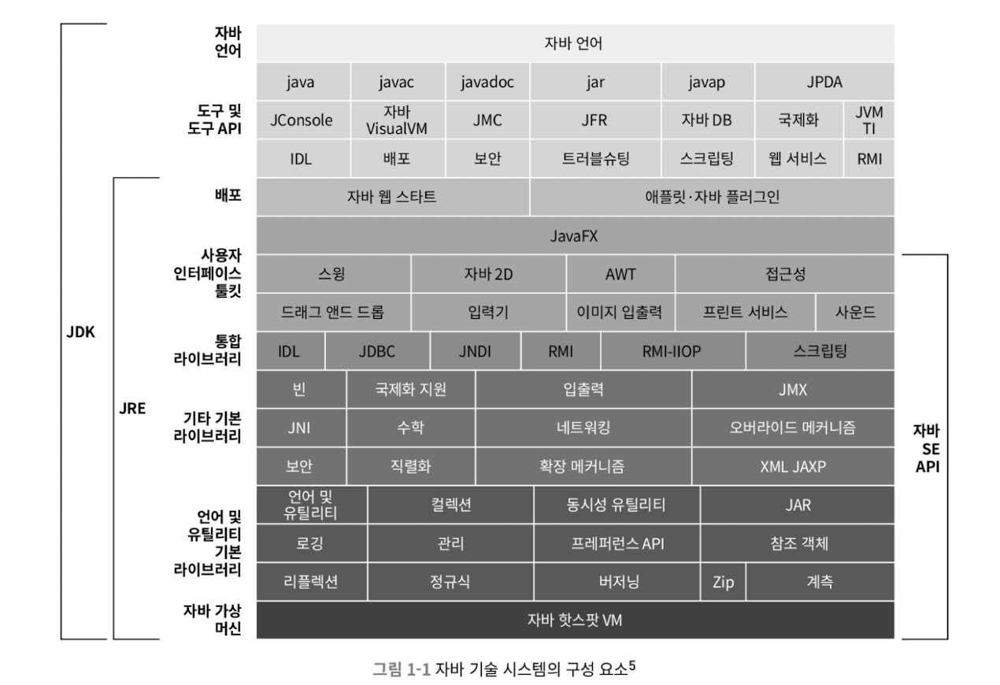

# 1장 자바 기술 시스템 소개
## 1.1 들어가며
* 하드웨어 플랫폼이라는 족쉐를 제거하여 한번 작성하면 어디서든 실행된다
* 상당히 안전한 메모리 관리 시스템을 갖춘 덕에 메모리 누스 문제와 엉뚱한 메모리를 가리키는 문제 대부분을 피할 수 있다
* 런타임에 핫코드를 감지, 컴파일하고 최적화 한다
* 표준 API 자체가 풍부하고 수많은 오픈소스 커뮤니티에서 제공하는 서드파티를 활용할 수 있다
## 1.2 자바 기술 시스템
자바 기술 시스템은 다음 요소들을 포괄한다
1. 자바 프로그램 언어
2. 자바 가상 머신 구현
3. 클래스 파일 포맷
4. 자바 클래스 라이브러리 API
5. 다른 기업과 오픈 소스 커뮤니티에서 제공하는 서드 파티 클래스 라이브러리
* 이중 1,2,4를 묶어 JDK 라고 한다.
  * 자바 프로그램의 최소한의 환경
* 자바 SE API와 자바 가상머신, 배포 기술을 묶어 JRE 라고 한다. (하단 참조)
<!-- {"width":418} -->

## 1.3 자바의 과거와 현재
* 프로젝트의 원래 목표는 가전제품 프로그램
* 자바언어의 시초 (오크)
* 기술 개발 타임라인 참조

* 오크에서 자바로 변경됨
### 1.3.2 유년기
* JDK1.1
  * JAR 파일 포맷, JDBC, 자바빈스, RMI, 내부클래스, 리플랙션
* JDK1.2
  * JIT 컴파일러 탑재
  * 컬렉션 API 드장
* JDK 1.3
  * 핫스팟 가상 머신 기본 제공
  * 수학 연산, 새로운 타이머 API
* JDK 1.4
  * 정규 표현식, 예외 연쇄, NIO, 로그 클래스, XML 파서, XSLT 변환기
* 닷넷 프레임워크의 등장
  * 자바와의 경쟁
* JDK 5 출시
  * 오토 박싱, 제네릭스, 동적 애너테이션, 열거향, 가변길이 매개 변수, foreach 순환문
### 1.3.3 오픈 소스의 세계로
* JDK 6 출시
  * 스크립트 언어 지원, 컴파일 애너테이션 처리기, 마이크로 HTTP 서버 API 제공, 자바 가상머신도 락과 동기화 구현, 가비지 클랙션과 클래스 로딩 개션
* 자바를 오픈소스로 전환
  * OPENJDK 조직 설립, JDK7의 코드가 건네짐
### 1.3.4 오라클의 품으로
* JDK7
  * 람다식 지원, 가상머신 수준에서의 모듈화 지원, 자바 가상머신은 동적 언어 지원, G1 컬렉터
  * 시장 상황상 기능을 JDK8로 대부분 미룸
* 개발주체가 오라클로 바뀌자 매우 상업적인 방식으로 빠르게 변화함
* 오라클이 썬을 인수함
### 1.3.5 모던 자바의 시작
* JDK8 출시
  * 람다식 지원
  * 자바스크립트 엔진 내장
  * 새로운 시간 및 날짜 API
  * 핫스팟에서 영구 세대 완전 제거
* JDK9
  * 개발에 난항을 겪은 직소와 함께 출기됨
### 1.3.6 기민하게
* JDK 버전을 해마다 2번 출시함, 리스트 분산을 위해
  * 자바 사용자 업데이트에 부담
* 모든 JDK 버전은 최소 3년 이상 지원된다 룰 제거
* 매 6번째 메이저 JDK 만 LTS 버전이 됨
* JDK 10 출시
  * 내부 리팩터링
  * 소스 저장소 통합
  * 가비지 컬렉터 인터페이스 통합
  * JIT 인터페이스 통합
* 안드로이드의 자바 저작권 침해 사건
* JDK 11 출시
  * JDK8을 잇는 LTS 버전
  * 타입 추론 구문의 람다 구문 지원
  * 오라클에서 라이센스를 모두 오픈소스로 변경
* JDK 12 출시
  * 셰넌도어 가비지 컬렉터 추가
* JDK 13
  * 소켓 API 재구현
* JDK 14
  * switch 문 정식 표준
* JDK 15
  * ZGC와 셰넌도어가 정식 기능으로 출시
* JDK 16
  * 레코드 클래스 도입
* JDK 17 LTS
  * 봉인된 클래스, 의사 난수 생선기 개선
* JDK 18
  * UTF-8 기본
* JDK 19
  * 외부 함수 및 메모리 API, 가상 스레드, 구조화된 동시성
* JDK 20
  * 변화 없음
* JDK 21 LTS
  * 세대구분 ZGC와 가상 스레드 도입
## 1.4 자바 가상 머신 제품군
* 조상 : 썬 클래식 VM과 이그잭트 VM
* 일인자 : 핫스팟 VM
  * JDK 의 기본 가상 머신
* 기타
  * 모바일 임베디드 VM
  * 이인자 BEA JRockit과 IBM J9 VM
  * 하드웨어와의 통합 : BEA 리퀘드와 VM과 어줄 VM
  * 도전자 : 아파치 하모니와 안드로이드 아트 VM
  * 마이크로소프트 JVM
## 1.5 자바 기술의 미래
### 1.5.1 언어 독립
그랄 VM
* 핫스팟 가상 머신 위에 구축된 크로스 언어 풀 스택 가상머신

### 1.5.2 차세대 JIT 컴파일러
JDK 10 부터 그랄 컴파일러가 추가됨
### 1.5.3 네이티브를 향한 발걸음
* 자바는 마이크로서비스 아키텍처의 특성과 반대 
  * 구동시간이 길고 최고 성능을 내기 까지 예열이 필요하다
* 최근 JDK의 대응
  * 애플리케이션 클래스 데이터 공유
    * 로딩한 클래스 정보 캐시, 다음번 구동 시간을 줄이기
  * 노옵 가비지 컬렉터인 엡실론
    * 메모리 할당만 해주고 회수는 하지 않는 컬렉터'
  * 네이티브 코드로 컴파일 해 두는 AOT 컴파일
  * 서브스트레이트 VM
    * 사전 컴파일된 네이티브 코드를 핫스팟 가상머신 없이 실행하는 기술
### 1.5.5 언어 문법의 지속적인 개선
* 지역 변수 추론 (var)
* 람다식 매개 변수로 사용할 수 있도록 지역 변수 구문 개선
