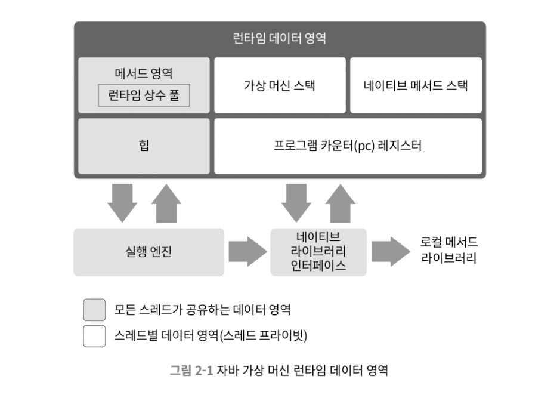

# 2장 자바 메모리 영역과 메모리 오버플로
## 2.1 들어가며
* 가상머신 메모리 관리 방식을 이해하지 못하는 한 해결하기 어렵다
* 자바 가상 머신이 관리하는 다양한 메모리 영역 소개
## 2.2 런타임 데이터 영역
* 자바 프로그램을 실행하는 동안 필요한 메모리를 몇 개의 데이터 영역으로 나눠 관리한다

### 2.2.1 프로그램 카운터
* 현재 실행 중인 스레드의 바이트코드 줄 번호 표시기
  * 바이트코드 인터프리터는 이 카운터의 값을 바꿔 다음에 실행할 바이트코드 명령얼르 선택하는 식으로 동작
* 멀티스레딩은 CPU 코어를 여러 스레드가 교대로 사용하는 방식으로 구현됨
  * 각 스레드의 카운터는 서로 영향을 주지 않는 독립된 영역에 저장됨 - 스레드 프라이빗 메모리 영역
### 2.2.2 자바 가상 머신 스택
* 프로그램 카운터처럼 자바 가상 머신 스택도 스레드 프라이빗함
* 각 메서드가 호출될 때마다 스택 프레임을 만듬
  * 지역 변수 테이블
  * 피연산자 스택
  * 동적 링크
  * 메서드 반환값 등의 정보 저장
* 스택 프레임을 가상 머신 스택에 push 하고 메서드가 끝나면 pop
* 지역변수 테이블
  * 기본 데이터 타입, 객체 참조, 반환 주소 타입을 저장함
  * 이 데이터 타입을 저장하는 공간을 지역 변수 슬롯이라 함
    * 32비트임, dobule 처럼 64비트면 슬롯 두개임
* 스택 메모리 영역에서 두가지 오류 발생 가능
  * 스레드가 요청한 스택 깊이가 가상 머신이 허용하는 깊이보다 크면 StackOverflow
  * 스택을 확장하려는 시점에 여유 메모리가 없을때 OutOfMemoeryError
### 2.2.3 네이티브 메서드 스택
* 가상머신 스택은 자바 메서드를 실행할때 사용
* 네이티브 메서드 스택은 네이티브 메서드를 실행할 때 사용
### 2.2.4 자바 힙
* 자바 애플리케이션이 사용할 수 있는 가장 큰 메모리
* 모든 스레드가 공유
* 객체 인스턴스 저장 목적, 거의 모든 객체 인스턴스가 이 영역에 할당
### 2.2.5 메서드 영역
* 자바 힙처럼 모든 스레드가 공유함, 논힙이라고도 부름
* 타입정보, 상수, 정적변수, 코드 캐시 저장
### 2.2.6 런타임 상수 풀
* 메서드 영역의 일부 상수 풀 테이블에는 클래스 버전, 필드 메서드, 인터페이스 등 클래스 파일에 포함된 설명 정보에 더해 컴파일 생성된 다양한 리터럴과 심벌 참조가 저장된다
### 2.2.7 다이렉트 메모리
* 가상머신 런타임에 속하지 않으며 자바 가상머신에 정의된 영역도 아님
* 자주 쓰이는 메모리, OOM의 원인
* DirectByteBuffer 객체를 통해 자바힙과 네이티브 힙 사이에서 데이터를 복사해 주고받지 않아도 돼 일부 시나리오에서 크게 성능 개선
## 2.3 핫스팟 가상 머신에서의 객체 들여다보기
### 2.3.1 객체 생성
* 자바 가상머신이 new 명령어에 해당하는 바이트코드를 만나면, 이 명령의 매개변수가 상수 풀 안의 클래스를 가리키는 심벌 참조인지 확인한다.
* 이 심벌 참조가 뜻하는 클래스가 로딩,해석,초기화 되었는지 확인한다.
* 준비되지 않은 클래스라면 로딩후 새 객체를 담을 메모리를 할당한다.
* 메모리를 할당하면 포인터를 여유공간 쪽으로 객체 크기만큼 이동 시킨다. 이를 **포인터 밀치기** 라고 한다.
* 여러 스레드가 동시에 객체 생성 문제
  * CAS 방식과 실패시 재시도 방식으로 원자적 수행
  * 스레드마다 다른 메모리 공간 할당
### 2.3.2 객체의 메모리 레이아웃
핫스팟 가상 머신은 객체를 세 부분으로 나눠 힙에 저장한다. (객체 헤더, 인스턴스 데이터, 길이 맞추기용 정렬 패딩)
* 객체 헤더
  * 마크워드 : 객체 자체의 런타임 데이터
    * 해시코드, GC 세대 나이, 락 상태 플래그, 스레드 점유 락, 편향된 스레드의 아이디, 편향된 시각의 트임스탬프 등
  * 클래스워드 : 객체의 클래스 메타데이터를 가리키는 클래스 포인터
    * 특정 객체가 어느 클래스의 인스턴스인지 런타임에 알 수 있음
  * 배열 길이도 객체 헤더에 저장됨
* 인스턴스 데이터
  * 객체가 실제로 담고 있는 정보
  * 타입의 필드 관련 내용, 부모 클래스 유무, 부모 클래스에서 정의한 모든 필드
* 정렬 패딩
  * 존재하지 않을 수 있으며, 자리를 확보하는 역할
### 2.3.3 객체에 접근하기
* 핸들을 이용해서 객체에 접근
  * 자바 힙에 핸들 저장용 풀이 별도로 존재함
  * 안정적인 핸들의 주소가 저장되는 장점
  * 객체의 위치가 바뀌는 상황에서도 참조 자체는 손댈 필요 없음
* 다이텍트 포인터 방식으로 객체에 접근
  * 자바 힙에 위치한 객체에서 인스턴스 데이터 뿐 아니라 타입 데이터에 접근하는 길도 제공
  * 핸들을 경유하는 오버헤드가 없어 속도가 빠른 장점
* 핫스팟은 다이렉트 포인터 방식을 이용함
## 2.4 실전: OOM 예외
### 2.4.1 자바 힙 오버플로
* 자바 힙은 객체 인스턴스 저장하는 공간
* 객체를 계속 생성하고, 접근할 경로가 살아 있다면 언젠가 힙의 용량을 넘어섬

* 메모리 문제를 해결하는 방법은 힙덤프 스냅숏 분석
  * 누수된 객체로부터 GC 루트까지의 참조 사슬 살펴보기
* 누수가 아닌경우
  * 메모리를 더 할당할 수 있는지 알아보기
  * 공간 낭비가 심한 데이터 구조를 쓰고 있지 않는지 알아보기
### 2.4.2 가상머신 스택과 네이티브 메서드 스택 오버플로
* -Xss 매개변수로 스택 메모리 용량을 줄이기
  * 결과는 StackOverflowError 발생

* 지역변수를 많이 선언해서 지역변수 테이블 크기를 키우기
  * 결과는 StackOverflowError 발생

* 위 똑같은 코드를 클래식 VM에서는 StackOverFlowError 가 아닌 OOM을 일으킨다.
  * 클래식 VM은 스택 메모리 용량을 동적으로 확장할 수 있다
### 2.4.3 메서드 영역과 런타임 상수 풀 오버플로
* String::intern() 은 네이티브 메서드임
* 문자열 상수 풀에 이 메서드가 호출된 string 객체와 똑같은 문자열이 이미 존재한다면 풀에 있떤 기존 문자열 참조를 반환함
* 같은 문자열이 없다면 String 객체에 담긴 문자열이 상수 풀에 추가되고 이 String의 참조가 반환됨

* JDK6에서 실행한 결과는 OOM: PermGen space 라고 나옴
* 런타임 상수 풀이 메서드 영역의 한 부분임을 알 수 있음
* JDK7 이상에서 실행하면 오류없이 무한루프를 돈다
  * JDK7부터 문자열 상수 풀을 자바 힙으로 옮겼다
  * 메서드 영역 제한의 의미가 없어졌다
* JDK8 부터는 영구세대가 사라졌고, 메타스페이스를 이용한다
  * 앞의 테스트와 같은 시나리오로 오버플로를 일으키기 어렵다.
> spring pool 은 jdk7 부터 perm -> heap 영역에 들어가게 되었다.
> perm 영역은 사이즈가 고정 되어 있어 oom 문제가 있었다
### 2.4.4 네이티브 다이렉트 메모리 오버플로
Unsafe를 이용하면 할당할 수 없는 크기를 계산해 오버플로를 수동으로 일으킬 수 있다. Unsafe::allocateMemory() 가 메모리를 할당하는 메소드다.
