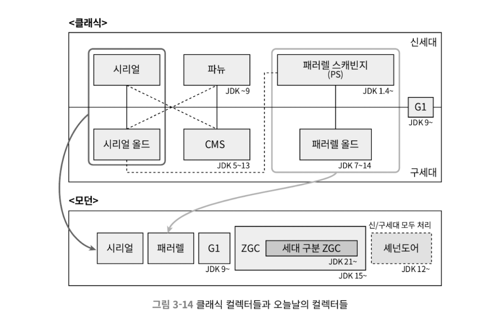

# 3장 가비지 컬렉터와 메모리 할당 전략
## 3.1. 들어가며
* 가비지컬렉터의 역사는 자바보다 오래 되었다 (1960~ 리스프)
* 각 스택 프레임에 할당되는 메모리 크기는 클래스가 만들어질때 결정된다
* 반면 자바 힙과 메서드 영역은 불확실한게 아주 많다
  * 어떤 조건 분기를 실행하느냐에 따라 메모리 요구량이 달라진다
  * 그래서 이 메모리 영역들의 할당과 회수는 동적으로 이뤄진다
## 3.2 대상이 죽었는가?
가비지 컬렉터가 힙을 청소하려면 어떤 객체가 죽었는지 판단 해야함
### 3.2.1 참조 카운팅 알고리즘
* 알고리즘
  * 객체를 가리키는 참조 카운터를 추가한다
    * 참조하는 곳이 하나 늘어날 때마다 카운터 값을 1씩 증가시킨다
  * 참조하는곳이 하나 사라질 때마다 카운터 값을 1씩 감소시킨다
  * 카운터 값이 0이 된 객체는 더는 사용될 수 없다
* 자바에서는 위 참조 카운팅을 쓰지 않는다
  * objA 와 objB를 서로 참조하게 한뒤, 외부에서 접근할길이 사라지면 (null) 메모리가 회수되고 있음
### 3.2.2 도달 가능성 분석 알고리즘
* 알고리즘
  * GC 루트라고 하는 루트 객체들을 시작 노드 집합으로 쓴다
  * 시작 노드들에서 출발하여 참조하는 다른 객체들로 탐색해 들어간다
  * 탐색 과정에서 만들어지는 경로를 참조체인이라 한다
  * 어떤 객체와 GC 루트 사이를 이어주는 참조 체인이 없다면 회수 대상이 된다.
### 3.2.3 다시 참조 이야기로
참조의 4가지 구분
* 강한 참조 : Object obj = new Object()
* 부드러운 참조 : 메모리 오버플로가 나기 직전에 두번째 회수를 위한 회수 대상, SoftReference 클래스
* 약한 참조 : 가비지 컬렉터가 동작하면 메모리가 넉넉하더라도 약한 참조는 모두 회수 대상, WeakReference 클래스
* 유령 참조 : 객체 수명에 아무런 영향을 주지 않음, 대상 객체가 회수될때 알림 받기 위해 사용 PhantomReference
### 3.2.4 살았나 죽었나?
* 도달 불가능 객체라고 해도 유예 단계가 남아있다
* GC 루트와 연결된 참조 체인을 찾지 못한 객체에는 첫번째 마킹이 이루어짐
* finalize()를 실행해야하는 객체면 F-큐라는 대기열에 추가된다
* 나중에 우선순위가 낮은 종료자 스레드를 생성해 F-큐에 들어있는 객체들의 finalize() 메서드를 실행한다
* finalize 메서드에서 아무 객체와 자신을 연결한다면 살아남을 수 있다
### 3.2.5 메서드 영역 회수하기
* 가비지 컬렉터가 메서드 영역을 반드시 청소해야 하는건 아니다 (회수 조건이 까다로워서 효율이 떨어진다.)
* 메서드 영역의 가비지 컬렉션은 두가지를 회수한다
  * 사용되지 않는 상수와 클래스
* 상수 풀에서 리터럴을 회수하는 예시
  * 문자열 java가 상수풀에 들어 있으나 값이 java 인 문자열 객체는 하나도 없는 경우, GC에서 제거 판단
* 더이상 쓰이지 않는 클래스 판단 조건
  * 클래스의 인스턴스가 모두 회수되었다
  * 클래스를 읽어 들인 클래스 로더가 회수되었다
  * 클래스에 해당하는 java.lang.Class 객체를 아무곳에서도 참조하지 않고, 리플렉션 기능으로 이 클래스의 메서드를 이용하는 곳도 전혀 없다
## 3.3 가비지 컬렉션 알고리즘
### 3.3.1 세대 단위 컬렉션 이론
* 약한 세대 가설 : 대다수 객체는 일찍 죽는다
* 강한 세대 가설 : GC에서 살아남은 횟수가 늘어날수록 더 오래 살 가능성이 커진다
* 한번 살아남은 객체는 통계적으로 잘 죽지 않으니 다른 영역에 따로 모아두고, GC 회수 빈도를 줄이면 GC 시간이 줄고 메모리 공간도 효율적
* 이에 따라 자바 힙을 여러 영역으로 나눔
  * 마이너 GC : 신세대 대상 GC
  * 메이저 GC :  구세대 대상 GC
  * 혼합 GC : 신세대와 구세대 일부를 대상 GC
  * 전체 GC : 자바 힙 전체와 메서드 영역까지 모두 GC
* 세대 단위 컬렉션 이론을 설계한 설계자들은 자바 힙을 최소 신세대와 구세대 영역으로 나눈다
  * 신세대에서는 GC 때마다 다수의 객체가 죽음
  * 살아남은 소수만 구세대로 승격됨
* 신세대에서만 GC를 하고 싶더라도 신세대에 속하지만 구세대에서 참조중인 객체도 있을 수 있다
  * 구세대 객체까지 모두 탐색해야 결과를 신뢰할 수 있다
  * 성능 면에서는 부담이 클 수 있다
  * 이 문제를 풀려면 세대 단위 컬렉션 이론에 3번째 경험 법칙을 추가해야 한다.
  * 세대간 참조 가설 : 세대간 참조의 개수는 같은 세대 안에서의 참조보다 훨씬 적다
* 신세대 객체는 세대간 참조 덕에 구세대로 승격 될 수 있다
  * 세대간 참조는 자연스럽게 사라진다
* 세대간 참조 가설을 따르면, 세대간 참조의 수는 아주 적기에 구세대 전체를 훑는건 낭비다
  * 구세대에 세대간 참조가 있는지 기록해 관리하면 된다
    * 신세대 GC가 수행될때 세대간 참조를 포함하는 객체들만 GC 루트에 추가하면 된다
### 3.3.2 마크-스윕 알고리즘
* 표시(mark) 와 쓸기(sweep) 라는 두단계로 이루어짐
* 회수할 객체들에 모두 표시한 다음, 표시된 객체들을 쓸어담음
* 반대로 살릴 객체에 표시하고, 표시하지 않은 객체를 회수
* 단점으로는 회수 대상이 많으면 마킹하는데도 비효율, 메모리 파편화 현상
### 3.3.2 마크-카피 알고리즘
* 가용 메모리를 똑같은 크기의 두 블록으로 나눠 한번에 한 블록만 사용
* 한쪽 블록이 꽉 차면 살아남은 객체들만 다른블록에 복사, 기존블록 한번에 청소
* 가용 메모리를 절반으로 줄여 낭비하는 단점
### 3.3.4 마크-컴팩트 알고리즘
* 생존한 모든 객체를 메모리 영역의 한쪽 끝으로 모은 다음, 나머지 공간을 한꺼번에 비우기
* 살아남는 객체를 이동해야 하는 단점 (stop the world)
## 3.4 핫스팟 알고리즘 상세 구현
* 루트 노드 열거
  * 도달 가능성 분석 알고리즘에서 GC 루트 집합으로부터 참조 체인 찾는 작업
  * stop the world 문제 있음
### 3.4.2 안전 지점
* 핫스팟은 OopMap을 활용하여 GC 루트들을 빠르게 열거 가능
* 문제 : 참조관계나 OopMap의 내용을 변경할 수 있는 명령어가 많음
  * 명령어 각각에 OopMap 을 넣으면 메모리를 많이 사용해야함
  * 그래서 핫스팟은 안전지점이라고 하는 특정한 위치에만 OopMap 기록
### 3.4.3 안전 지역
* 안전 지역은 일정 코드 영역에서는 참조 관계가 변하지 않음을 보장한다
### 3.4.4 기억 집합과 카드 테이블
* GC는 기억 집합이라는 데이터 구조를 두어 객체들의 세대간 참조 문제를 해결한다
* 레코드 하나가 메모리 블록 하나에 매핑되는 카드 정밀도 방식으로 기억 집합을 구현한 것을 카드 테이블이라 한다
### 3.4.5 쓰기 장벽
* 다른 세대의 객체가 현 블록 안의 객체를 참조하면 카드 테이블의 해당 원소가 더럽혀진다
* 핫스팟 가상 머신은 쓰기 장벽 기술을 이용해 카드 테이블을 관리한다
* 참조 타입에 객체가 대입되면 어라운드 어드바이스가 생성되어 대입 전후로 추가 동작을 수행한느 방식으로 쓰기 장벽을 구현한다
### 3.4.6 동시 접근 가능성 분석
* 이론적으로 도달 분석 알고리즘은 stop the world 상태에서 진행되어야함
  * OopMap과 같은 다양한 최적화 기법을 통해 매우 짧긴 함
* stop the world 상태에서 객체 그래프를 탐색해야 하는 이유
  * 삼색 표시 기법 : 방문한 객체인가 조건에 따라 흰/검/회색 칠
  * 객체그래프에 색을 칠해 가는 도중에 사용자 스레드가 참조 관계를 변경한다면?
    * 죽은 객체를 살아있다고 잘못 표시
    * 살아있는 객체를 죽었다고 표시
## 3.5 클래식 가비지 컬렉터
### 3.5.1 시리얼 컬렉터
* 가장 기초적이고 오래된 컬렉터, 단일스레드로 동작
* 회수가 완료될때 까지 모든 작업 스레드가 멈춰야함
### 3.5.2 파뉴 컬렉터
* 스레드 회수에 멀티스레드를 이용함
* 기본적으로 시리얼 컬렉터와 같음
### 3.5.3 패러럴 스캐빈지 컬렉터
* 처리량을 정밀하게 제어할 수 있도록 매개변수 제공
  * 가비지 컬렉션 정지 시간의 최댓값
  * 처리량값 (총 실행 시간 대비 가비지 컬렉션 시간의 비율)
### 3.5.4 시리얼 올드 컬렉터
* 시리얼 컬렉터의 구세대용 버전
* JDK5 와 그 이전의 PS 컬렉터와 함께 사용하기 위해 사용
### 3.5.5 패러렐 올드 컬렉터
* PS 컬렉터의 구세대용 버전
* 처리량이 중요하거나 프로세서 자원이 부족한 상황이면 PS와 패러렐 올드 조합
### 3.5.6 CMS 컬렉터
* 표시와 쓸기 단계 모두를 사용자 스레드와 동시에 수행
* 동시회수 능력 덕에 정지시간이 매우 빠름 (사용자가 참조 관계를 바꾸면 재표시 작업)
### 3.5.7 G1 컬렉터
* 가비지 우선 컬렉터
* 서버용에 집중한 컬렉터
* G1의 등장 전까지 모든 컬렉터의 회수 범위는 신세대 전체, 구세대 전체, 자바 힙 전체
* G1은 힙메모리 어느곳이든 회수 대상에 포함 (회수 집합)
* 어느 세대에 속하느냐가 아니라 어느 영역에 쓰레기가 가장 많으냐
  * 회수했을때 이득이 어디가 가장 크냐
* 정지 시간으리 기댓값을 사용자가 설정할 수 있다는 G1의 매우 큰 장점
* 애플리케이션의 메모리 할당 속도에 맞춰 회수하는 방향
  * 애플리케이션은 쓰레기를 버리고 동시에 컬렉터는 청소
  * 객체가 버려지는 속도를 컬렉터가 따라갈 수 있다면 완벽
### 3.5.8 오늘날의 가비지 컬렉터들
* 모던 자바에서 이용할 수 있는 선택지는 몇 안됨

* 신세대용과 구세대용의 구분이 사라짐
* 시리얼 컬렉터가 시리얼 올드를 흡수
* PS와 패러렐 올드가 합쳐저 패러렐이 됨
* CMS는 G1에 자리를 내어줌
* ZGC와 셰넌도어는 지연 시간 최소화를 목표로 하는 최첨단 컬렉터
  * 초기에는 신세대와 구세대를 구분하지 않음
  * jdK21부터 세대 구분 ZGC라 하여, 세대구분 모드가 추가됨
## 3.6 저지연 가비지 컬렉터
* 가비지 컬렉터를 측정하는 중요한 지표
  * 처리량
  * 지연시간
  * 메모리 사용량
* 셋이 모여 불가능의 삼각정리
  * 좋은 컬렉터라고 해도 둘만 달성 가능
* 지연시간의 중요성이 점점 커짐
  * 메모리/처리량은 하드웨어의 발전으로 커버
* 지연시간은 메모리를 늘리면 악영향
* CMS 등장 전에는 모든 과정이 stop the world
* CMS와 G1은 차례로 증분 업데이트와 시작 단계 스냅숏 기술을 적용해, 표시(mark) 단계를 동시에 수행
  * 그덕에 표시할 객체가 많아져도 일시정지 시간은 늘지 않았다
* CMS는 공간 파편화가 점점 심해지고 stop the world 로 이어짐
* G1은 리전 단위로 회수하나 동시에 수행 불가

* 셰넌도어와 ZGC는 거의 모든 과정이 동시에 수행됨
  * 이 두 컬렉터를 저지연 가비지 컬렉터라고 부름
### 3.6.1 셰넌도어
* 오라클 JDK에는 없고 다른 회사 JDK에만 존재하는 컬렉터
* 힙 크기와 상관없이 GC로 인한 일시정지를 10ms 이내로 묶는 목표
* 표시단계와 마무리 작업까지 CMS나 G1과 달리 사용자 스레드와 동시에 수행
* 셰넌도어와 G1은 힙 레이아웃 비슷, 공통점이 많고 코드 일부 공유중
* 셰년도어 역시 힙을 리전들로 쪼개 처리하며, 큰 객체 전용의 거대 리전을 지원, 회수가치가 큰 리전 먼저 회수 
* G1과 다른점
  * 동시 모으기 지원 (사용자 스레드와 동시에 수행)
  * 세대 단위 컬렉션 사용하지 않음 (신세대/구세대 리전 구분 안함)
  * 기억 집합 대신 연결 행렬로 리전간 참조관계 기록
* 동작방식
  * 최초 표시 : GC 루트에서 직접 참조하는 객체들에 표시
  * 동시 표시 : 도달가능한 모든 객체 표시
  * 최종 표시 : 보류중인 모든 표시 완료, GC루트 집합 재스캔
  * 동시 청소 : 살아있는 객체가 하나도 없는 리전 청소
  * 동시 이주 : 회수 집합 안에 살아있는 객체들을 다른 빈 리전으로 복사
  * 최초 참조 갱신 : 힙에서 옛 객체를 가리키는 모든 참조를 복사후의 새로운 주소로 수정해야 함, 동시 이주가 끝마쳤음을 보장
  * 동시 참조 갱신 : 참조 갱신을 실제로 시작, 사용자 스레드와 동시에 수행
  * 최종 참조 객신 : GC루트 집합의 참조 갱신
  * 동시 청소 : 새로운 객체를 할당할 공간을 확보
* 포워딩 포인터
  * 셰년도어가 이주를 동시에 수행할 수 있도록 하는 핵심 개념
  * 원래의 객체 레이아웃 구조 상단에 참조 필드를 하나 추가하는 개념 (우회하여 객체 접근)
  * 동시성 이슈 - CAS 기법을 써서 동시 이주중에도 객체 접근시 문제가 없도록 함, 읽기장벽과 쓰기 장벽 사용
### 3.6.2 ZGC
* 오라클이 개발한 저지연 가비지 컬렉터
  * JDK 15에 정식
  * JDK 21에는 세대 구분 ZGC
* 셰넌도어와 목표 흡사, 일시정지 시간 10ms 안쪽 목표
* 세대구분 없이 리전 기반 메모리 레이아웃 사용
* 동시 마크-컴팩트 알고리즘을 구현하기 위해 읽기 장벽, 컬러 포인터, 메모리 다중 매핑 기술 사용
* 리전 기반 메모리 레이아웃
  * ZGC의 리전은 동적으로 생성되고 파괴됨
  * 크기도 동적임
* 컬러 포인터
  * 포인터 자체에 소량의 추가 정보를 직접 저장
* 동작방식
  * 동시 표시
    * 객체 그래프를 탐색하며 도달 가능성 분석
    * ZGC의 표시는 객체가 아닌 포인터에서 이루어짐
  * 동시 재배치 준비
    * 청소해야할 리전들을 선정, 재배치 집합을 만듬
  * 동시 재배치
    * 재배치 집합 안의 생존 객체들을 새로운 리전으로 복사
  * 동시 재매핑
    * 힙 전체에서 재배치 집합에 있는 옛 객체들을 향하는 참조 전부를 갱신
* ZGC는 기억 집합을 사용하지 않음, 세대 구분도 없어서 신/구세대를 구분하기 위한 카드 테이블도 없음, 쓰기 장벽 없음
  * 대신에 객체 할당 속도를 제한하는 결과로 이어짐
### 세대 구분 ZGC
* ZGC를 확장하여 신세대와 구세대 구분
* 세대를 구분하여 수명이 짧은 젊은 객체를 더 자주 회수하는 이점
* 초기 ZGC와 셰넌도어에어 세대를 구분하지 않은 이유는 구현 복잡도
* 궁극적으로 세대 구분 ZGC만 남기는것이 현재 계획
* 세대구분 ZGC 에는 컬러포인트에 새로운 메타데이터 추가, 쓰기장벽 활용
* 다중 매핑 메모리 제거
* 이중 버퍼를 이용한 기억 집합 관리
* 밀집도 기반 리전 처리
  * 생존자 리전들은 다음번 신세대 GC에는 밀집도가 높아져, 회수 대상이 될 가능성이 커짐
  * 리전을 그대로 둔 채 노화시키는 방식
* 거대 객체 처리
  * 거대 객체도 신세대에 바로 할당함
  * 오래 살아남는다면 리전 자체가 구세대로 승격
## 3.7 적합한 가비지 컬렉터 선택하기
### 3.7.1 앱실론 컬렉터
* JDK 11에 포함됨, 가비지 컬렉션을 전혀 하지 않는 컬렉터
* 가비지 컬렉터 영향을 배제해야 하는 성능 테스트에 사용
* 가비지 컬렉터를 인터프리터/컴파일러/모니터링등의 서브 시스템들로부터 뗴어 놓기 위한 GC용 인터페이스 참조 구현
* 단 몇분 또는 몇초만 동작하는 애플리케이션에 사용
### 3.7.2 컬렉터들 간 비교 및 취사선택
* 애플리케이션의 주 목적
  * 데이터 분석 과학계산 - 처리량 중요
  * SLA 애플리케이션 - 지연시간 중요
  * 임베디드 애플리케이션 - 메모리 중요
* 최대 100MB 정도의 작은 데이터 -> 시리얼 컬렉터
* 단일 프로세서, 일시정지 제약X -> 시리얼 컬렉터
* 최대 성능이 중요, 지연시간 제약 없음 -> 패러렐 컬렉터
* 처리량보다 응답시간, 낮은 지연시간 -> G1
* 응답시간 -> 세대구분 ZGC
### 3.7.3 가상 머신과 가비지 컬렉터 로그
* 가비지 컬렉터의 태그명은 GC
* 로그 레벨 : Trace, Debug, Info, Warning, ERror, Off

## 3.8 실전: 메모리 할당과 회수 전략
* 가장 근본적인 목표는 객체의 메모리를 자동으로 할당하고 자동으로 회수하는것
* 객체 메모리 할당이란 힙에 할당한다는 뜻
* 새로 태어난 객체는 신세대에 할당, 거대객체인 경우 구세대에 할당 되기도 함
## 3.9 마치며
* GC는 많은 경우 시스템의 일시정지 시간과 처리량에서 중요한 요인으로 작용한다
* 가상 머신 메모리에 대한 지식을 쌓고 최적화 노하우를 얻고 싶다면 각 컬렉터의 동작 방식과 장단점, 매개변수들을 이해해야 한다