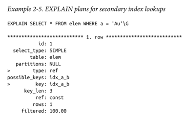
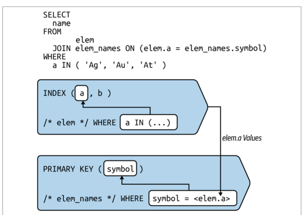

# 인덱스와 인덱싱

* 최적화는 MySQL 측면에서 하드웨어를 효율적으로 활용하게 해주는 다양한 기술과 알고리즘, 데이터 구조를 의미함
* 인덱스 없는 MySQL 성능
  * 작은 규모의 데이터만 들어올릴 수 있는 성능으로 제한됨
* 인덱스를 사용한 MySQL 성능
  * 대량의 데이터도 월등히 처리 가능

## 2-1 성능 향상과 관련 없는 딴짓

* 더 좋고 빠른 하드웨어, 스케일업부터 시작하지 마라
* 합리적인 두가지 예외 상황
  * 하드웨어 성능 부족으로 명백하게 느린 상황
    * 500GB의 데이터에 1GB의 메모리를 사용하는 경우 ->  32GB나 64GB로 늘려야 함
  * 애플리케이션 사용량이 급증, 안정성을 담보하기 위한 임시 방편인 상황
* 이러한 예외 상황이 아니면 최후의 선택, 아무것도 배우지 못함
  * 클라우드 환경에선 쉬운 하드웨어 교체가 매력적으로 다가옴

### MYSQL 튜닝

* 튜닝
  * 튜닝은 R&D이기에 일반적으로 적용할 수 있는 결과는 아닐것
  * 시스템 변수를 조정하는 행위, 구체적인 목표와 기준이 있는 실험실 수준의 작업
* 구성
  * 시스템 변수를 하드웨어와 환경에 적합한 값으로 설정하는 행위
* 최적화
  * 워크로드를 줄이거나 효율성을 높여 MYSQL 성능을 향상시키는 행위
  * 기존 하드웨어로 더 빠른 시간과 더 많은 용량 제공이 목표

튜닝은 레드헤링, 구성은 MySQL 8.0에서 자동으로 이루어짐, 우리는 최적화만 수행하면 됨

## 2-2 MySQL 인덱스: 시각적 소개

### InnoDB 테이블은 인덱스다

* 프라이머리키 id 열과, 세컨더리 인덱스 idx_a_b 가 있다
* a,b,c 열은 각 열의 이름으로 시작하는 원자 기호이다

B-트리 인덱스를 간단히 보여주면 다음과 같다

* 리프노드에 있는 4개의 인덱스 레코드 행은 처음 4개 행에 해당한다
* 프라이머리 키의 열값은 각 인덱스 레코드의 맨 위에 표시된다
* 다음 두가지만 중요하다
  * 프라이머리 키 조회는 매우 빠르고 효율적이다
  * 프라이머리 키는 MySQL 성능에서 핵심적인 역할을 한다

* 세컨더리 인덱스 idx_a_b
  * 리프노드는 프라이머리 키 값을 저장한다
  * 세컨더리 인덱스를 하용하면 전체 행을 읽기 위해 PK를 이용하여, 두번쨰 조회를 실행한다
* `select * from elem where a='AU' AND b='Be'` 쿼리 예시는 다음과 같다

1. 루트 노드에서 시작 "Au, Be" 에 대해 오른쪽으로 분기
2. 내부 노드에서 "Au, Be" 값에 대한 리프노드에서 오른쪽으로 분기
3. 프라이머리 키값 2를 얻음
4. 프라이머리키로 루트노드 검색.. 이후 비슷한 과정

MySQL의 세계에서 모든것은 프라이머리 키를 중심으로 돌아간다.

### 테이블 접근 방법

* 인덱스를 사용하여 행을 조회하는 방법은? 3가지 테이블 접근 방법중 하나
* 쿼리에 따라 인덱스 조회가 불가할 떄가 있다
  * 이떄는 인덱스 스캔, 테이블 스캔을 해야함 (단, 피해야함)

### 인덱스 조회

* 인덱스의 정렬된 구조와 접근 알고리즘 활용, 특정 행이나 행 범위를 찾는다
* 가장 빠르면서 효과적인 방법, 직접 쿼리 최적화의 본질
* 성능을 발휘하려면 모든 쿼리에서 인덱스 조회를 사용해야함

### 인덱스 스캔

* 인덱스 스캔이란? 인덱스 조회가 불가능할 때, 모든 행을 읽고 일치하지 않는 행을 필터링한다.
* 인덱스 스캔의 첫번째 유형은? 풀 인덱스 스캔
  * 인덱스 순서대로 모든 행을 읽는다
  * elem은 세컨더리 인덱스를 스캔하고 행을 순서대로 가져오는것보다, 풀 인덱스 스캔이 더 빠르다
    * `SELECT * from elem force index (a) order by a,b`
    * elem 은테이블이 작아서 프라이머리 키를 스캔하고 행을 정렬하는게 효율적이라서 그렇다

* 순서
  * SI (세컨더리 인덱스)의 첫번째값 Ag,B 읽기
  * PK에서 해당 행 찾기
  * SI의 두번째값 Al, Br 읽기
  * PK에서 해당 행 찾기
  * SI의 세번째값 Ar, Br 읽기
  * PK에서 해당 행 찾기
  * SI의 네번째값 Au, Be 읽기
  * PK에서 해당 행 찾기
* 세부사항
  * 세컨더리 인덱스를 순서대로 스캔하는 것은 순차 읽기
  * 프라이머리 키 조회는 거의 무작위 읽기

* 인덱스 스캔의 두번째 유형은? 인덱스 전용 스캔 (indexed-only scan)
  * 인덱스에서 열값을 읽기위해 커버링 인덱스가 필요함 (2-2절에서 다룸)
  * 세컨더리 인덱스에서 열값만 읽기에 커버링 인덱스가 필요함
* 풀테이블 스캔이 아닌 이상 인덱스 스캔으로 최적화 하지 마세요

### 테이블 스캔

* 프라이머리 키 순서대로 모든 행을 읽음, 인덱스 조회나 스캔을 수행할 수 없을때 유일한 옵션
* 테이블 스캔이 유리한 경우
  * 테이블이 작고 접근 빈도가 낮을 때
  * 테이블 선택도가 매우 낮을 때
* 일반적으로 성능에 굉장히 나쁨

### 맨 왼쪽 접두사 요구사항

다음은 맨왼쪽 접두사 (a), (a,b), (a,b,c) 각각을 사용한 where 절 예시

* 인덱스의 열 전체를 사용하는것이 이상적, 필수는 아님
* 인덱스를 사용하려면 쿼리가 인덱스의 맨 왼쪽 접두사를 사용해야 함

### EXPAIN: 쿼리 실행 계획

EXPAIN 명령어는 Mysql이 쿼리를 실행하는 방법을 설명함

* table
  * 테이블 이름, 참조된 서브쿼리 (Mysql이 결정한 조인 순서)
* type
  * ALL : 풀 테이블 스캔 
  * index : 인덱스 스캔
  * const, ref, range : 인덱스 조회의 접근 유형
* possible_keys
  * Mysql이 사용할 수 있는 인덱스 나열
* key
  * Mysql이 사용할 인덱스의 이름
* ref
  * 사용되는 값의 소스 나열
    * const -> a = 'Au' 는 하나의 값과 같은 상수 조건
  * 조인 순서상 이전 테이블의 열 참조
    * ref 열값과 일치하는 행을 찾음
* rows
  * 일치하는 행을 찾기 위해 조회할 예상 행의 수 추정
* Extra
  * 쿼리 실행 계획에 대한 부가 정보

### WHERE

* key: PRIMARY
  * 인덱스조회로 프라이머리 키를 사용할것임
* posible_keys : PRIMARY
  * 세컨더리 인덱스는 Mysql이 이 쿼리에서 사용할 수 없어서 나열되지 않음
* type: const
  * 모든 인덱스 열에 상수조건이 있을때 발생, 결과는 상수 행, 매우빠름
* Extra: NULL
  * 행과 일치할 필요가 없음을 의미?
    * 상수 행은 오직 하나의 행과만 일치할 수 있어서 그렇다
  * where id > 3 이라면 Extra: Using where 가 나옴
    * 일반적, where 조건으로 일치하는 행을 찾는다 
    * 접근 유형은 범위 스캔 (type: range) 이 됨
      * 즉 인덱스를 사용하여 값 범위 사이의 행을 읽음
      

* 예제 2-5 쿼리에 idx_a_b 조건이 맨 왼쪽 접두사에 대한 요구사항을 충족함
* 첫번째 쿼리는 a 열만 사용, 두번째 열은 a,b 사용
* const 접근 유형은 불가함
  * idx_a_b 가 비고유라 하나 이상의 행과 일치할 수 있음

인덱스 조회와 인덱싱되지 않은 열에 대한 EXPAIN 결과는 다음과 같음

* 인덱스를 사용하여 a 열의 조건에 대한 행을 조회하고 읽은 다음, c열의 조건과 일치하는 행을 찾음
* where 절에 일치하는건 없는데 rows 3의 의미
  * a열에 대한 인덱스 조회의 경우 참인 3개의 행을 찾았지만 c에 대해 일치하는게 없어서 그렇다

맨 왼쪽 접두사가 충족되지 않은 경우는?

* 인덱스 수행 불가 possible_keys: NULL, key:NULL
* type: ALL 테이블 풀스캔
* rows: 10 전체 행 수
* 최악의 쿼리 예시이다~

### Group By

* 값이 인덱스 순서에 따라 암묵적으로 그룹화됨
* Group By 를 최적화 하기 위해 인덱스를 사용할 수 있음
* idx_a_b 에 대해 a열은 다음과 같이 5개의 개별 그룹을 가짐

group by a에 대한 explain 계획

* `key: idx_a_b`
  * 인덱스를 사용하여 그룹화
* `Extra: Using index`
  * a열의 값만 읽음, 프라이머리 키에서 젠체 행을 읽지 않음
* `type: index`
  * 인덱스 스캔을 나타냄, 인덱스를 사용하지만 인덱스 조회는 아님
* `rows: 10`
  * where 절이 없어서 Mysql 이 모든 행을 읽음

a 열에 where 절을 추가하면?

* `Extra: Using where`
  * WHERE a != 'Ar' 을 나타냄
* `type: range`
  * != 연산자로 인해 범위 접근 유형으로 바뀜
  * 이해를 돕기위한 아래 그림 참조
  * 
* Where 절에 b 조건만 있어도 멘 왼쪽 접두사 요구사항이 충족된다.
  * 아래 그림 참조
  * 

맨 왼쪽 접두사가 없는 Group By는?

* 쿼리가 a 열에 조건이 없어도 인덱스를 사용한다?
  * Mysql 이 a 열의 인덱스를 스캔하고 있어서 맨 왼쪽 접두사가 충족됨
* group by c는 안됨
  * 인덱스에 b 열 값은 있지만 c 열 값은 없음
* Extra: Using temporary
  * 왼쪽 접두사 세트를 가지지 않아서 그렇다
  * 인덱스에서 a 열 값을 읽을때, 임시테이블 에서 b 열 값을 수집함
  * a열 값을 모두 읽은 후에는 count(*)에 의해 그룹화되고 집계된 임시 테이블에 대해 테이블 스캔

### Order By

* Mysql 은 Order By 절을 최적화하기 위해 정렬된 인덱스를 사용할 수 있음
  * 순서대로 행에 접근하기에 시간이 조금 더 걸리는 행 정렬을 피할 수 있음
* Mysql은 행정렬에는 Extra 필드에 Using filesort 를 출력함
  * 파일 정렬은 느리다는 평판이 있으나 빠름, 행정렬이 느린 응답의 근본 원인은 대체로 아님
* Order by 를 최적화 하는 첫번째 방법, 맨 왼쪽 접두사 사용
* 최적화 두번째 방법, 인덱스 상수로 맨 왼쪽 유지, 다음에 인덱스 열을 기준으로 정렬
  * 
  * WHERE 조건 a 열이 상수라서 인덱스 (a,b) 사용 가능
  * 인덱스에서 a = 'Ar' 로 이동
    * 거기에서 b열값을 순서대로 읽는다
* 최적화 세번째 방법
  * 세컨더리 인덱스에 추가된 프라이머리 키로 Order By 하기
  * 
  * 모든 세컨더리 인덱스의 끝에는 PK가 숨겨져 있기 때문
  * 위 WHERE 조건에 b를 제거하면?
    * 
    * Using filesort 가 출력됨
      * 세컨더리 인덱스에 더이상 맨 왼쪽 접두사가 없어서 숨겨진 PK 사용 불가
    * 
    * Using index condition 은 무엇일까?
      * 인덱스 컨디션 푸시 다운임
        * InnoDB 가 a='Al' 조건과 일치하는 행을 찾기 위해 idx_a_b 인덱스를 사용한다는 뜻
        * Mysql 이 자동으로 사용하기에 최적화 하지 않아도 된다
* filesort 는 정말 느릴까?
  * 백만행이 있는 테이블에 아래 쿼리를 실행 
  * 
  * 둘쨰줄에서 ... 의 차이가 8, 즉 파일정렬에 8ms 만 소요
  * 왜 파일 정렬이 느리다는 평판이 있을까?
    * sort_buffer_size 를 초과할떄 디스크의 임시 파일을 사용함
    * HDD 는 메모리보다 수십 배 느림
    * 그러나 오늘날에는 SSD가 표준임, 매우 빠름

### 커버링 인덱스

* a와 b열의 WHERE 조건은 해당 인덱스 열을 가리킴
* SELECT 절의 해당 열을 다시 가리키기도 하여 인덱스에서 이러한 열값을 읽었음을 나타냄
* 일반적으로 Mysql 은 PK에서 전체 행을 읽어버림
  * 그러나 커버링 인덱스를 사용하면 MYsql 은 인덱스에서 열값만 읽을 수 있음

### 테이블 조인

* MySQL은 테이블 조인에 인덱스를 사용함
* 조인에 사용할 두번째 테이블 생성

* 인덱스가 하나 있음, PK 는 symbol 열
* elem 테이블의 a,b,c 열 값과 일치함
* 조인 시각화 예시는 다음과 같다

* Mysql 은 a in(...) 조건에 인덱스를 사용함
* 조인 테이블에 대한 인덱스 사용의 경우 두가지 사소한 차이가 있음
  * where 절은 join..ON 절을 재적성한 것
  * symbol 열의 조건값은 elem 에서 가져옴
* explain 은 다음과 같다

조인의 경우 두번째 테이블에 2개의 새로운 세부 정보가 있다.

* type : eq_ref
  * PK 나 유니크 인덱스를 사용하는 단일 행 조회를 의미
* ref : test.elem.a
  * 참조열 elem.a 로 읽는다는 뜻
* 조인 방법중 eq_ref 가 가장 빠름, 한 행만 일치해서!
  * PK나 유니크 인덱스를 사용해야함

다음은 문법상 같은데, In 목록에서 At 라는 단일값이 제거된 경우 예시

* 완전히 새로운 EXPLAIN 출력이 나옴
* elem.a 대신 elem_names.symbols 에 대한 값으로 IN 목록을 재작성함
* elem_names.symbols 테이블의 인덱스 사용은 Ag 와 Au 의 두 값으로 조회하기 위한 범위 스캔임을 추정 가능

인덱스 없이 테이블 조인 가능, "풀 조인", 최악의 작업

* 일반적으로 MySQL은 이 쿼리 실행 계획을 선택하지 않아서 IGNORE INDEX 로 강제 실행한것
* Extra 필드의 Using join buffer (hash join) 은 Mysql 8 에 새롭게 도입된 해시 조인 알고리즘
  * 메모리 내 해싯값 테이블을 만들고, 반복되는 테이블 스캔을 수행하는 대신, 이 해시테이블을 사용해 행을 조회함
  * 해시조인으로 성능이 비약적으로 향상됨, 그러나 가능한 피하셈

