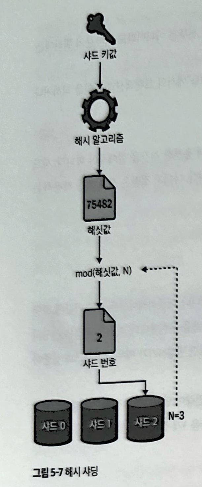

chapter5

# 5장 샤딩
* 쿼리 최적화를 해도 성능을 발휘하지 못하면 단일 인스턴스로서 한계가 왔다는 의미, 확장 해야함
* 샤딩은 여러 데이터베이스에 워크로드를 분산하여 성능을 향상시킴
* 물리적으로 분리되어 있지만 논리적로 같은 데이터베이스임
## 5-1 단일 데이터베이스를 확장하지 않는 이유
### 애플리케이션 워크로드
* 단일 서버는 전용 하드웨어에서 단일 워크로드 (쿼리, 데이터 접근패턴) 가 실행된다.
* 데이터크기는 단일 서버의 용량을 초과하는 워크로드를 유발할 수 있기에 수평으로 확장하는 이유이다.
* 데이터 크기는 늘어날수록 쿼리와 접근 패턴에 영향을 주기에, 더큰 하드드라이브를 구입해도 문제가 해결되지 않는다.
### 모의 벤치마크
* 모의 벤치마크는 현실과 같을수 없고 가짜일 수 밖에 없지만 필요함
  * 하드웨어 비교
  * 서버 최적화 비교
  * 서로 다른 데이터 스토리지 비교
  * MySQL 한계 테스트
### 쓰기
쓰기가 단일 MySQL 인스턴스에서 확장하기 어려운 이유
* 단일 쓰기 (원본) 인스턴스
  * 동시에 같은행에 여러번 쓸 수 있는 쓰기 충돌 이슈 존재
* 트랜잭션과 잠금
  * 트랜잭션을 일관성을 보장하기 위해 잠금을 사용함
  * 쓰기는 로우 락을 획득해야 함
    * 예상보다 많은 행을 잠금
  * 잠금은 잠금 경합으로 이어짐, 즉 성능이 좋은 하드웨어도 무쓸모
* 페이지 플러싱
  * MySQL이 디스크에서 변경사항을 유지하는 지연된 프로세스
  * 페이징 플러싱이 성능에 병목, 지속성 보장 위해 느림
* 쓰기 확대
  * 테이블에 10개의 세컨더리 인덱스가 있을 때, 단일 쓰기는 쓰기 작업을 10번 더 할 수 있음
* 복제
  * 고가용성을 위해 모든 쓰기 작업은 다른 인스턴스로 복제해야함
  * 비동기 복제, 반동기 복제, 그룹 복제를 지원한
이러한 5가지 이유로 단일 MySQL 인스턴스에서 쓰기 확장이 어려움
### 스키마 변경
* 큰 테이블을 변경하는건 며칠 또는 몇주가 소요될 수 있음
* 온라인 스키마 변경 도구는 며칠동안 실행되어도 애플리케이션이 문제가 없음
  * 그러나 개발자에겐 방해물이 됨
  * 필자의 경우 10억개의 행이 있는 테이블의 스키마 변경 작업 지원을 하는동안, 다른 조직의 작업 목표가 차단됨
### 작업
데이터베이스가 클수록 아래 작업이 오래 걸려 다운타임에 지장을 줌
* 백업과 복원
* 실패한 인스턴스 재구축
* MySQL 업그레이드
* MySQL 종료, 시작, 충돌 복구
따라서 규모에 맞는 샤딩이 필요함
## 5-2 바위가 아닌 조약돌
* 규모가 큰 MySQL 샤딩은 작은 인스턴스를 많이 사용하여 달성한다.
* 필자의 경우 단일 MySQL의 크기를 2TB나 4TB로 제한할 것을 조언함
  * 오늘 바로 구입할 수 있는 하드웨어 용량만을 반영
* 애플리케이션 관점
  * 일단 데이터베이스가 샤딩되면 프로그래밍 방식으로 접근, 애플리케이션에서는 샤드 수는 중요하지 않음
* 운영의 관점
  * 7TB 데이터베이스보다 500GB 데이터베이스를 관리하는 것이 훨씬 쉬움
* MySQL 성능은 바위가 아닌 조약돌처럼 작은 데이터베이스로 분할하여 운영할 떄 진정으로 무제한
## 5-3 샤딩: 간략한 소개
* 샤딩용으로 애플레이션을 새로 설계할 때
  * 마이그레이션 보다 쉽다
  * 향후 4년도안의 데이터 크기와 증가율을 추정하라
  * 데이터세트가 제한이 있는지 아니면 무제한인지 고려하라
    * 제한의 예) 매년 출시하는 A 회사의 스마트폰 수
    * 무제한의 예) 사진
  * 무제하 데이터 세트도 가급적 제한을 둬야함
    * 자주 접근하지 않는 오래된 데이터를 위한 샤딩이 될 수 있음
* 기존 애플리케이션을 샤딩으로 마이그레이션 할 떄
  * 필요한 시점이 되면 훨씬 더 어렵고 시간이 많이 걸리며 위험함
  * 1년 이상의 기간을 잡고 마이그레이션을 계획해야 함
### 샤드 키
* 애플리케이션이 프로그래밍 방식으로 데이터를 샤드에 매핑해야 함
* 이상적인 샤드키의 3가지 속성
  * 높은 카디널리티
    * 이상적인 샤드키는 카디널리티가 최대치, 샤드 전체에 고르게 분산됨
    * ex) dQw4w9WgXcQ 와 같은 고유 식별자
  * 참조 애플리케이션 엔티티
    * 이상적인 샤드키는 접근 패턴이 샤드를 교차하지 않음
    * ex) 결제목록 정보 테이블은 주로 고객이 접근하는 패턴, 고객별 샤딩이 이상적
  * 소규모
    * 샤드키는 사용량이 많음, 될수있는 한 작아야 함
### 전략
* 해시 샤딩
  * 해시 알고리즘 (정수 해싯값 생성), 나머지 연산자 (mod), 샤드수 (N) 활용
  * <!-- {"width":201} -->
  * 일관된 해싱 알고리즘
    * 샤드수 N이 변경되면 데이터와 샤드를 매핑하는데 영향을 줌
      * 75483 % 3 = 0
      * 75483 % 5 = 3
    * 일관된 해싱 알고리즘은 N에 독립된 일관된 해싯값을 출력함
  * 포인트 접근은 해시 샤딩과 잘 작동함 (하나의 행이 하나의 샤드에 매핑)
  * 해싱 알고리즘이 모든 샤드 키 값을 자동으로 매핑, 데이터 수동 재배치는 사실상 어려움
* 범위 샤딩
  * 연속적인 키값 범위를 정의하고 각 범위에 샤드를 매핑
  * <!-- {"width":446} -->
  * 키값 범위는 미리 정의해야함
  * 데이터 분산이 변경되면 리샤딩 처리를 생각해야 함
  * 해시 샤딩과 달리 범위를 변경할 수 있어 데이터를 수동으로 재배치 가능
  * 단 UUID에는 범위 샤딩이 적합하지 않음
    * 다 같은 크기의 자릿수로 하나에 몰려버림
  * 범위를 결정할 수 있고, 값의 분포를 잘알고 있는 경우에 적합함
  * 포인트 접근은 괜찮음, 범위 접근/임의 접근은 교차샤딩 문제 발생 가능
* 조회 샤딩
  * <!-- {"width":490} -->
  * 샤드에 샤드키값을 사용자 지정 매핑하는것 (즉 매핑 테이블)
  * 조회 테이블을 유지-관리해야함
  * 고유 샤드 키값의 수를 관리할 수 있는 때에는 조회 샤딩이 유용
    * ex) 수가 적고 잘 바뀌지 않는 시군구에 따른 통계
### 과제들
* 트랜잭션
  * 트랜잭션은 여러 샤드에 걸쳐 동작하지 않음
  * 2단계 커밋을 구현하는 것 외에는 해법이 없다 (비추)
* 조인
  * 여러 샤드에 걸쳐 테이블을 조인할 수 없다
  * 교차 샤드조인은 가능함, 애플리케이션에서 조인하는 것
  * 트랜잭션이 유지되지 않으니 일관적이지 않음
* 교차 샤드 쿼리
  * 애플리케이션이 둘 이상의 샤드에 접근
  * 여러 MySQL 인스턴스에 접근하는 지연시간 발생
  * 필연적으로 애플리케이션은 2개의 샤드에 접근함
    * 고객단위로 결제를 샤드에 잘 나눴더라도, 고객은 다른 고객에게 송금할때 2개의 샤드로 접근
* 리샤딩
  * 하나의 샤드를 둘 이상의 새 샤드로 나눔
  * 데이터 증가를 수용하거나 재분산에 필요
  * 한번 샤딩하고 끝날일은 없을것, 리샤딩은 필연적
* 재조정
  * 접근을 더 균등하게 분산하기 위해 데이터 재배치
  * 핫샤드를 처리하기 위해 필요
  * 해시 샤딩 : 자동으로 데이터를 샤드에 매핑하기에 재배치하는것 불가
  * 범위 샤딩 : 간단하지 않으나 범위를 재정의 하는것으로 가능
  * 조회 샤딩 : 샤드에 대한 데이터 매핑을 제어하기에 상대적으로 쉬움
* 온라인 스키마 변경
  * 모든 샤드에서 테이블을 온라인으로 변경해야 할때의 문제
  * 글을 쓰는 시점에는 오픈소스로 불가
## 5-4 대안들
### NewSQL
* NewSQL은 샤딩할 필요가 없는 SQL 데이터베이스.. 그렇다면 MySQL을 왜 쓸까?
* 성숙함
  * MySQL은 1990 년도에 등장, NewSQL은 과연?
* SQL 호환성
  * SQL을 사용하지만 호환성이 다름
* 복잡한 작업
  * NewSQL이 복잡한작업에 동작하지 않을수도
* 분산 시스템 성능
  * 분산 시스템 고유의 대기 시간으로 인해 NewSQL 데이터 스토리지가 작동하지 않을수도
* 성능 특성
  * MySQL은 맨왼쪽 접두사, 작업세트 크기로 성능과 개선방법을 이해할 수 있음
  * NewSQL은 분산 시스템, 다르게 작동할수도

### 미들웨어
* 애플리케이션과 MySQL 샤드 사이에서 작동
* 샤딩의 세부사항을 숨기거나 추상화 해줌
* 대표적인 ProxySQL은 여러 매커니즘에 의해 샤딩을 지원함
* 수동으로 샤딩하는게 불가하면 좋은 선택지

### 마이크로서비스
* 새로운 마이크로서비스와 해당 데이터베이스가 완전히 독립적, 샤딩보다 쉽다

### MySQL을 사용하지 마세요
* 샤딩의 대안을 솔직하게 평가하면 MySQL을 사용하지 말라
* 샤딩 때문에 새 애플리케이션을 설계하고 있다면 다른 솔루션을 고려, 쉬운 방법이 아님