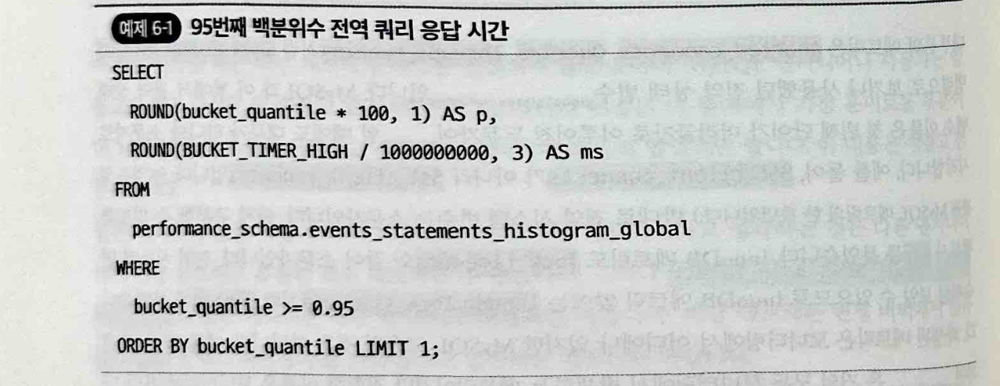

chapter6
# 6장 서버 메트릭
* MySQL 메트릭은 성능과 밀접한 관련이 있다, 시스템이 어떻게 작동하는지 측정하고 보고하는것
* MySQL을 프리즘에 비유, 메트릭은 워크로드가 MySQL 이라는 프리즘을 통과하면서 굴절되어 드러나는 스펙트럼이다.
## 6-1 쿼리 성능 대 서버 성능
서버 성능을 분석하는 3가지 이유
* 동시성과 경합
  * 동시성은 쿼리 성능을 떨어뜨리는 경합으로 이어진다
  * 모든 쿼리가 공유되고 제한된 시스템 리소스를 놓고 경쟁할때, 서버성능 분석은 MySQL이 워크로드 처리하는 방식을 확인하는데 유용함
  * 서버 성능 분석을 통해 워크로드의 쿼리가 함께 작동하는 정도를 알 수 있음
* 튜닝
  * 대부분 MySQL 튜닝은 효과가 없는 경우가 많음
  * 튜닝을 해야 한다면 서버 성능을 분석해야함
* 성능 회귀
  * 가끔은 MySQL도 틀린다. 성능회귀(버그)를 검증하는데 서버 성능 분석
## 6-2 정상과 안정
Mysql 성능에 정상이라고 물을때 이에 답할수 있는 2가지 요점
* 정상
  * 모든것이 제대로 작동하는 평상시 애플리케이션에 대해 MySQL이 보이는 모든 성능
  * "Threads_running 이 50 미만이면 정상입니다" 라는 말의 뜻
    * "제 경험으로 볼때 CPU 코어가 48개 미만이고 벤치마크 결과 MySQL 성능이 실행중인 64개 스레드 이상으로 확장하지 않는다면 Thread_running의 안정적인 값은 50 미만입니다."
    * > 벤치마크 결과를 보고 **모든것이 제대로 작동**하는 Threads_running 는 50개였다로 이해
* 안정
  * 모든 쿼리가 빠르게 응답하고 모든 메트릭이 안정적이고 정상적이며 모든 사용자가 만족하는 상태
  * MySQL에서 최대 성능을 짜내는것이 목표가 아닌 이유
    * 한계에 도달하면 성능이 불안정해진다.
    * 진정한 기술은 DB를 아무일 없이 지루한 상태로 최적화 하는것
## 6-3 핵심 성능 지표
다음의 4가지 지표는 MySQL 성능을 빠르게 측정함
* 응답 시간
  * 쿼리 응답 시간이 MySQL 성능의 핵심, 모두가 관심을 두는 유일한 지표
  * 그러나 모든 쿼리가 오류와 함께 실패하면 응답시간이 0에 가까울 정도로 빠르지만 정상은 아님
* 오류
  * 쿼리. 연결, 클라이언트, 서버와 같은 모든 오류, 0에 가까울수록 좋다
* QPS
  * QPS는 성능을 나타내지만 그 자체가 성능은 아님
  * 비정상적으로 높은 QPS는 문제일 수 있음 (다 응답시간 0으로 실패?)
* 실행 중인 스레드
  * QPS를 달성하기 위해 얼마나 노력하는지, 하나의 스레드는 하나의 쿼리, 낮을수록 좋다.
## 6-4 메트릭 필드
모든 MySQL 메트릭은 6개 클래스 가운데 하나에 속함, 이를 메트릭 필드라 부름
* 응답 시간 메트릭
  * MySQL이 응답하는데 걸리는 시간
  * 쿼리 실행을 중심으로 측정됨
  * UPDATE 문이 실제로 갱신하는것은 15단계중 1단계
    * 단계별 응답시간은 서버 성능문제를 심층 조사하는데 사용
* 속도 메트릭
  * MySQL이 개별 작업을 얼마나 빨리 완료하는지 나타냄 - QPS
  * 속도가 증가하면 사용률을 높일 수 있다.
* 사용률 메트릭
  * MySQL이 유한한 리소스를 얼마나 많이 사용하는지 나타냄
  * CPU 사용량, 메모리 사용량, 디스크 사용량
  * 모든 저장장치에는 최대 속도가 있다
    * 예를들어 디스크 IO 사용률은 최대 속도 대비 현재 속도
    * 반대로 무한속도는 최대 속도가 없어 사용률로 표현 불가
  * 사용률이 높아지면 속도가 낮아진다
* 대기 메트릭
  * 쿼리 실행중 유휴(idle) 시간을 나타낸다.
  * 경합과 일관성으로 인해 쿼리 실행이 지연되면 대기가 발생함
  * 관련 타임 아웃
    * max_execution_time
    * lock_wait_timeout
    * connect_timeout
    * wait_timeout
* 오류 메트릭
  * 오류를 나타냄
  * wait timeout 도 오류의 한 유형
* 접근 패턴 메트릭
  * 애플리케이션이 어떻게 MySQL을 사용하는지 나타냄
  * Com_select 접근 패턴 메트릭은 SELECT 문의 수를 계산
* 내부 메트릭
  * MySQL 엔지니어나 사용자는 알필요 없는 전문적 영역
  * buffer_page_read_index_ibuf_non_leaf 와 같은 메트릭
    * 변경 버퍼에서 읽은 non-leaf 인덱스 페이지 수
## 6-5 스펙트라
* 70개 이상의 MySQL 메트릭을 11개의 스펙트라로 나눔
* 메트릭 명명 규칙
  * 전역 상태 변수
    * ex) Thread_running
  * 전역 시스템 변수
    * ex) var.max_connections
  * InnoDB 메트릭
    * ex) innodb.log_lsn_checkpoint_age
  * 파생 매트릭
    * ex) replication lag
* 대부분의 메트릭은 전역 상태 변수임
* 대부분의 메트릭은 단순한 카운터(누적값), 일부만 게이지(측정치)
### 쿼리 응답시간
* 4가지 핵심 성능 지표 가운데 하나
* 성능 스키마에서 P95 전역 쿼리 응답 시간을 얻는법
  * 
### 오류
* 4가지 핵심 성능 지표 가운데 하나
* 성능 스키마에에서 모든 오류수를 얻는법
  * 
* 오류와 경고가 너무 많아서 전역 오류율이 얼마나 될지 알수 없음
  * 오류율 0을 기대하거나 달성하려 하지 마세요
* 목표는 애플리케이션의 일반 오류율을 정립하는 것
* 클라이언트의 연결 오류 메트릭
  * Aborted_clients
  * Aborted_connects
  * Connection_errors_%
* MySQL에는 문제가 되지 않는 문제
  * 애플리케이션에서 오류 발생
  * MySQL KPI는 모두 좋고 정상
    * 네트워크나 애플리케이션 문제
### 쿼리
* 쿼리와 관련된 메트릭은 MySQL이 얼마나 빨리 작동하고 어떤 유형의 작업을 수행하고 있는지 높은 level 에서 보여줌
* QPS
  * 두 Queries 측정치 차이를 초 단위 측정 시간의 차이로 나눈 값
  * 얼마나 빠르게 쿼리를 실행하는지, 전반적인 MySQL 처리량
  * 이것에 의존해서는 안됨
  * QPS는 일반적으로 쿼리나 성능의 질적으로 아무것도 나타내지 않음
    * QPS가 매우 높지만 응답시간도 길다면
      * QPS는 성능이 급격히 떨어지고 문제가 있음을 나타냄
* TPS
  * 다중 명령문 트랜잭션이 중요한 애플리케이션이라면 초당 트랜잭션이 QPS 만큼 중요함
    * 어플리케이션 작업의 적용 단위가 all or nothing 인 경우 QPS 보다 TPS가 낫다
  * 명시적인 트랜잭션 처리량
    * Com_begin
    * Com_commit
    * Com_rollback
  * 일반적으로 모든 트랜잭션은 시작되어야 하고 성공한 트랜잭션은 커밋됨
    * Com_begin과 Com_commit의 비율은 같다
    * 트랜잭션 지연 문제가 있으면 Com_begin 비율이 높다
  * com_commit 을 사용하여 TPS를 측정한다
    * 트랜잭션 처리량은 성공한 트랜잭션을 의미해서 그렇다
  * 트랜잭션 롤백은 오류를 나타내야 할 것 같지만, 정리에도 사용
    * 이전 트랜잭션이 있는 경우 닫히도록 함
  * 활성 트랜잭션 수 (innodb.trx_active_transactions)
    * BEGIN은 트랜잭션을 시작하지만 쿼리가 테이블에 접근할 떄까지 트랜잭션은 활성화되지 않음
      * 활성화 되지 않는 예 : BEGIN; SELECT NOW()
#### 읽기/쓰기
* 유형에 따라 이름이 지정된 9개의 읽기/쓰기 메트릭이 있음
  * Com_select
  * Com_delete
  * Com_delete_multi
  * Com_insert
  * Com_insert_select
  * Com_replace
  * Com_replcae_select
  * Com_update
  * Com_update_multi
* Com_select는 Select 문 수를 세는 카운터, multi 는 다중 테이블을 참조하는 쿼리
* 읽기/쓰기 메트릭은 Queries 를 구성하는 쿼리의 중요한 유형과 처리량을 나타냄
* Queries 는 SHOW, FLUSH, GRANT 등과 같은 다른 유형의 SQL 문을 설명하기에 읽기와 쓰기 백분율은 100%가 아님
  * 나머지 백분율이 의심스럽게 높으면 다른 Com_ 메트릭을 조사
#### 관리
* 관리 메트릭을 확인하려면 일반적으로 데이터베이스 관리자만 사용할 수 있는 명령 이용
  * Com_flush
  * COm_kill
  * Com_purge
  * Com_admin_command
#### SHOW
* MySQL에는 40개가 넘은 SHOW 문이 있음
  * 그중 상당수는 Com_show_ 메트릭에 해당
* 해롭지 않음
  * MySQL을 변경하거나 데이터를 수정하지 않음
* 그러나 MySQL 에서 스레드, 시간과 리소스 사용
* Show 명령도 중단될 수 있다
  * SHOW)_GLOBALS_STATUS 는 사용량이 많은 서버에서 1초 이상 걸릴 수 있다

```
• Com.show_databases
• Com_show_engine_status
• Com.show_errors
• Com_show.processlist
• Com_show.slave.stalus
• Com.show.status
• Com_show_table.status
• Com_show_tables
• Com.show_variables
• Com.show.Warnings
```

### 스레드와 연결
* Threads_running
  * 4가지 핵심 성능 지표 가운데 하나
  * 활성 쿼리실행과 직접연결됨
    * MySQL이 얼마나 열심히 일하는지 알려줌
    * CPU 코어 개수는 이를 효과적으로 제한함
* 스레드와 연결은 직접 관련되므로 하나의 스펙트럼
  * MySQL은 클라이언트 연결당 하나의 스레드 실행
* 스레드와 연결에 가장 중요한 4가지 메트릭
  * Connections
  * Max_used_connections
  * Threads_connected
  * Threads_running
* Connections
  * 성공과 실패를 포함한 MySQL에 대한 연결 시도 횟수
  * 애플리케이션 연결 pool의 안정성을 나타냄
* Max_used_connections
  * var.max_connections를 백분율로 나타낸 연결 사용률
  * var.max_connections의 기본값은 151, 낮은편
    * 애플리케이션당 연결 풀의 크기 100, 3개면 300
  * 수천개의 MySQL 커넥션이 필요하다는건 잘못된 생각
    * 대부분은 수백개의 연결이면 충분
    * 수천개의 연결이 필요하면 샤딩 권고
    * > php 는 커넥션 풀 관리가 안되서 RPS만큼 커넥션 필요
  * 100% 연결 사용률은 피해야 한다
    * 높은 커넥션은 커넥션 누수같은 외부 문제이거나 버그일때가 많음
    * 커넥션이 부족해지면 애플리케이션이 중단됨
* Threads_connected
  * 클라이언트가 연결/끊어지면 Threads_connected 게이지 메트릭이 증가/감소
* Threads_running
  * CPU 코어 수와 관련된 암시적 사용률
  * Threads_running이 수백, 수천으로 급증해도 
    * 성능은 CPU 코어수의 약 두배 수준인 훨씬 낮은 값에서 급격히 떨어짐
    * 하나의 CPU 코어가 하나의 스레드를 실행하기 때문
    * 30미만으로 매우 낮아야 정상, 적을수록 좋다
    * 낮은 Threads_running 으로 높은 QPS를 달성하려면 빠른 쿼리 응답 시간을 달성해야 함
### 임시 개체
* MySQL이 행 정렬, 대규모 조인 등 다양한 목적으로 사용하는 임시 파일과 테이블
  * Created_tmp_disk_tables
  * Created_tmp_tables
  * Created_tmp_files
* Group By 같이 임시 테이블이 필요한 경우
  * 메모리에 쓰는 Created_tmp_tables 가 증가
  * 메모리 내 임시테이블 크기가 var.tmp_table_size 보다 커지면?
    * 디스크에 쓰고 Created_tmp_disk_tables 가 증가
### 준비된 명령문 (prepared statements)
* 2가지 메트릭
  * Com_stmt_prepare
  * Com_stmt_execute
* Com_stmt_execute 는 Com_stmt_prepare 보다 커야함
  * 나쁜 경우는 1:1이거나 이에 가까운 경우임
    * 하나의 쿼리가 두번 MySQL에 전달되고 있다는 뜻
      * 한번은 실행준비
      * 한번은 구문 종료
* Go 언어용 MySQL 드라이버는 준비된 명령문으로 SQL 인젝션을 방어함


* 준비된 명령문 한도
  * 열린 준비된 명령문의 수 = var.max_prepared_stmt_count
  * 기본값 16,382개
  * prepared_stmt_count 가 var.max_prepared_stmt_count 에 도달하면 애플리케이션 중단
### 잘못된 SELECT
* 4가지 메트릭은 성능에 좋지 않은 SELECT 문의 발생을 카운트함
  * Select_scan
  * Selecl_full_join
  * Select_full_range_join
  * Select_range_check
* Selecl_full_join 보다 Select_full_range_join 이 낫다
  * 범위를 제한함
* Select_range_check
  * Select_full_range_join과 비슷하지만 더 나쁨
  * `select * from t1, t2 where t1.id > t2.id`
    * t1과 t2를 순서대로 조인할때 t2에 대한 범위 검사를 한다
    * MySQL이 t1 값을 미리 알수 없기에 t1의 모든 값을 다시 확인한다
### 네트워크 처리량
* Bytes_sent
* Bytes_received
* MySQL이 네트워크를 포화시키는 경우
  * var.binlog_row_image 시스템 변수
  * BLOB과 TEXT 열이 바이너리 로그에 기록, 복제되는지 제어
  * 방대한 BLOB값을 사용하면 복제 지연
  * 해결책은 var.binlog_row_image 를 noblob 으로 변경하기
### 복제
* 지연이라는 골칫거리를 만듬
* Binlog_cache_disk_use 메트릭
  * 각 클라이언트 연결마다 메모리에 있는 트랜잭션 이벤트를 **바이너리 로그 파일에 쓰기 전에 바이너리 로그 캐시 버퍼에 먼저 작성함**
  * 바이너리 로그 파일을 통해 쓰기 작업들은 복제되어 복제본에 전파됨
  * 바이너리 로그 캐시가 너무 작은경우 Binlog_cache_disk_use 가 증가한다, 모니터링 필요
### 데이터 크기
* 데이터는 적을수록 성능이 향상된다, 확장은 무한하지 않으니 모니터링 필요
* MySQL은 정보 스키마 (infomation_schemas.tables) 에서 테이블 크기를 제공한다
* 데이터 베이스의 크기 GB로 구하기
  * 
* 테이블의 크기 GB로 구하기
  * 
* 최소한 매시간마다 DB 크기를 수집하는게 좋다
* 데이터 증가 추세 확인
  * 단기 데이터 증가 추세는 프로비지닝 예측에 필요
  * 장기 데이터 증가 추세틑 샤딩이 필요한 시기 추정에 필요

## innoDB
복잡하나 MYSQL의 기본 스토리지 엔진이니 잘 알아둬야함
### 변경 내역 목록 길이 (HLL)
* HLL이 몇분 또는 몇시간 동안 크게 증가하면, InnoDB가 상당한 수의 이전 행 버전을 제거하지 않고 유지했다는 뜻
  * 이는 하나 이상의 장시간 실행 트랜잭션이 커밋되지 않았거나
  * 클라이언트 연결이 끊겨 롤백되지 않고 버려짐을 뜻함
  * `inoodb.trx_rseg_history_len` 게이지 메트릭으로 보여짐
* `inoodb.trx_rseg_history_len`  은 1,000 미만이 정상
  * 십만보다 크면 모니터링하고 경고 해야함
  * 장시간 실행이나 버려진 트랜잭션을 찾아서 종료 해야함
### 교착 상태 (데드락)
* 2개 이상의 트랜잭션이 다른 트랜잭션에 필요한 로우 락을 보유할때
* 교착상태를 해결하기 위해 둘중 하나 TX 를 감지하고 롤백함
  * 그리고 `innodb.lock_deadlocks` 메트릭을 늘림
### 행 잠금
* 쿼리가 얼마나 빠르게 또는 느리게 데이터를 쓰기 위해 로우 락을 획득했는지 나타냄
* innodb.lock_row_lock_time
  * 로우락을 획득하는데 소요된 전체 시간
  * 잠금을 획득하는데 최소 0초 이상이 걸리기에 0이 될 수 없음
* innodb.lock_row_lock_current_wait
  * 로우락을 획득하기 위해 대기중인 현재 쿼리 수 (현재 측정값)
* innodb.lock_row_lock_waits
  * 행을 획득하기 위해 대기한 쿼리 수 (누적값과 속도)
* innodb.lock_tiemouts
  * 로우 락 대기시간을 초과할때 증가
  * 기본 50초, 애플리케이션은 10초 이하 권장
### 데이터 처리량
* 초당 바이트 단위의 데이터 처리량
  * innodb_data_read
  * innodb_data_witten
* 거의 문제되지 않음, SSD로 엄청나게 ㅃ라라짐
### IOPS
* InnoDB 읽기와 쓰기 IOS 는 각각 2가지 메트릭으로 카운트됨
  * inoodb.os_data_writes
  * inoodb.os_data_reads
* InnoDB 성능의 존재 이유는 스토리지 I/O를 최적화하고 줄이는데 있음
  * 적은 IOPS가 더 좋음
    * 높은 IOPS는 엔지니어링 관점으로 인상적이지만 스토리지가 느리므로 골칫거리
* 백그라운드 작업을 위한 InnoDB I/O 용량 설정
  * var.innodb_io_capacity
  * var.innodb_io_capacity_max
  * 위 값을 줄이고 제한하면 InnoDB가 서버를 초과하는 일은 없음
### 버퍼 풀 효율성
* 테이블 데이터와 기타 내부 데이터 구조의 메모리 내 캐시
* InnoDB는 버퍼 풀의 페이지별로 모든 데이터에 접근함
  * 접근할 때 데이터가 버퍼 풀에 없으면 InooDB는 스토리지에서 데이터를 읽고 버퍼 풀에 저장함
* 버퍼 풀 효율성 메트릭
  * innodb.buffer_pool_read_request
    * 버퍼 풀의 데이터에 접근하기 위한 모든 요청 계산
  * innodb.buffer_pool_reads
    * 요청된 데이터가 메모리에 없으면 위 값을 증가시키고 디스크에서 읽어옴
* 버퍼 풀을 예열하는데 시간이 걸림, 이를 콜드 버퍼 풀 이라 불림
* 총 데이터 크기가 사용 가능한 메모리보다 작으면, 모든 데이터가 버퍼풀에 들어갈 수 있음
  * 버퍼 풀 크기 : var.innodb.buffer_pool_size
### 페이지 플러싱
* 버퍼 풀에는 인덱스 페이지가 포함되어 있으며 4가지 유형의 페이지가 있음
  * 프리 페이지 : 데이터가 없음, 새 데이터를 불러올 수 있음
  * 데이터 페이지 : 수정 되지 않은 데이터
  * 더티 페이지 : 디스크로 플러시 되지 않은 수정된 데이터
  * 기타 페이지 : 기타 내부 데이터
* innodb.buffer_pool_page_total
  * 버퍼 풀 크기에 따라 달라지는 버퍼 풀의 총 페이지 수
* 프리 페이지 (innodb.buffer_pool_page_free), 더티페이지 (innodb.buffer_pool_page_dirty) 를 각각 총 페이지로 나눠서 백분율을 구할 수 있음
  * 페이지 플러싱으로 인해 값이 자주 변경됨
* 필요할때 프리페이지를 사용할 수 있도록 innoDB는 프리페이지를 0이 아닌  일정 개수를 유지함
* 프리페이지가 지속해서 0에 가까운 경우 innodb.buffer_pool_wait_free 가 0으로 유지되는 한 괜찮음, 이를 프리페이지 대기라고 함
* 프리페이지가 지속해서 프리 페이지 대상보다 훨씬 높거나 줄어들지 않으면 버퍼 풀이 너무 큰 것 (메모리 낭비)
* 더티페이지의 비율이 높은 것은 정상
  * 유난히 읽기 작업량이 많고 데이터를 자주 수정하지 않은 경우임
* 페이지 플러싱
  * 페이지 플러싱은 데이터 수정사항을 디스크에 기록하며 더티 페이지를 정리함
  * 페이지 플러싱은 더티 페이지를 정리하고 버퍼풀에서 제거해 클린 페이지로 만듬
* 생명 주기
  * 프리 페이지 : 데이터가 적재되면 클린 페이지가 됨
  * 클린 페이지 : 데이터가 수정되면 더티페이지가 됨
  * 더티 페이지 : 데이터 수정 사항이 플러시되면 다시 클린 페이지가 됨
  * 클린 페이지 : 버퍼 풀에서 제거되면 다시 프리페이지가 됨
* 플러싱 알고리즘
  * 적응형 플러싱
    * 페이지 클리너가 플러시 목록에서 더티 페이지를 플러시 하는 속도를 결정
    * 트랜잭션 로그 쓰기 속도에 따라 페이지 플러시 속도를 변경함
  * LRU 플러싱
    * 버퍼 풀에서 오래된 페이지를 플러시하고 제거함
### 트랜잭션 로그
* 마지막이자 가장 중요한 스펙트럼, 리두 로그 하는 트랜잭션 로그
* 지속성을 보장함
  * 트랜잭션이 커밋되면 모든 데이터 변경 사항이 트랜잭션 로그에 기록되고 디스크에 플러시되므로 지속 가능해짐
  * 해당 더티 페이지는 메모리에 남게됨
* 트랜잭션 로그는 디스크의 고정 크기 링 버퍼임
  * 2개의 물리적 로그 파일로 구성됨
* 트랜잭션이 커밋되면 데이터 변경사항이 트랜잭션 로그의 헤드에 기록됨
  * 디스크에 플러시되어 헤드가 시계 방향으로 진행됨
* 체크포인트 수명은 헤드와 테일 사이의 트랜잭션 로그 길이

## 6-6 모니터링과 경보
### 레졸루션
* 메트릭이 수집되고 보고되는 빈도(1초, 10초..)
* 최소한 5초 이상의 레졸루션으로 수집해야 한다
* 책에서의 차트 예시) 10초 레졸루션에서 지연이 있었으나 아무일 없던것처럼 나옴
### 헛된 노력 (임곗값)
* 임곗값이란 관리자를 호출하는 모니터링 경보 발동 기준값
* 완벽한 임곗값은 어렵다
  * 5초로 설정해두면, 5초동안 일시적인 문제없는 지연이어도 관리자가 경보를 듣게됨
### 사용자 경험과 객관적 한계에 대한 경고
* 임곗값 대신 작동하는 2가지 솔루션
  * 사죵자 경험에 대한 경고
    * 응답시간과 오류
    * P00 의 응답시간이 1분동안 1초로 증가하면 사용자 경험이 나빠진다면 그렇겟 ㅓㄹ정
  * 객관적 한계에 대한 경고
    * MySQL이 통과할 수 없는 최소 또는 최댓값
      * 100% CPU, IOPS, 네트워크 사용률
      * 디스크 공간 없음
      * 메모리 없음
      * 최대 AUTO_INCREMENT
### 원인과 결과
* MySQL 응답 속도가 느리다면 애플리케이션이 원인일 때가 대부분
* 올바른 솔루션은 애플리케이션에 따라 다르지만, 애플리케이션 재시작, 요청 조절, 기능 비활성화
