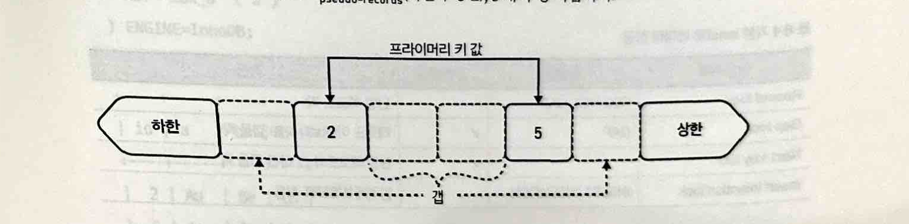

# 8장 트랜잭션
* MySQL에는 MyIAM과 같은 비트랜잭션 스토리지 엔진이 있으나 InnoDB가 기본값, 사실상 표준
* 사실상 모든 MySQL 쿼리는 단일 SELECT 문이라도 기본적으로 트랜잭션
## 8-1 로우 락
* 읽기는 행을 잠그지 않음 (select for share, select for update 제외)
* 쓰기는 행을 항상 잠금
* REPEATABLE READ 트랜잭션에서 InnoDB는 쓰는 행 말고도 훨씬 더 많은 행을 잠금
* 테이블은 인덱스이므로 행은 인덱스 레코드임
* 로우락은 인덱스 레코드 갭 때문에 로우락이 아니라 레코드 락 관점에서 논의됨
* 갭은 두 인덱스 레코드 사이의 값 범위임
  * 2개의 프라이머리키 레코드 (2,5)
  * 2개의 의사 레코드 (하한,상한)
  * 3개의 공백 (갭으로 표시된 부분)

* 레코드는 위 예에서 인덱스값이 2와 5인 실선 상자로 표시됨
* InnoDB의 모든 B-트리 인덱스에는 다음과 같은 2개의 의사 레코드 (하한, 상한)가 있음
  * 하한 : 최소 레코드 2 보다 작은 모든 인덱스값
  * 상한 : 최대 레코드 5 보다 큰 모든 인덱스값
* Unsigned 4byte 정수일때 3개의 갭 예시
  * 하한 [0,2)
  * (2,5)
  * 상한 (5, 4294967295)
* 애플리케이션은 행단위로 처리, 로우락은 레코드 단위로 처리함

### 레코드와 넥스트-키 락
아래의 테이블이 있다고 가정

PK를 사용하여 행을 일치시키는 elem 테이블에 대한 update 는 기본 트랜잭션 격리 수준인 repeatable read 에서 4개의 데이터 잠금을 획득함 (between 2 and 5)

2번째 select 쿼리의 결과는 아래 

* 첫번째 행  : lock_type 열에 표시된 대로 테이블락
* 두번째 행 : 프라이머리 키값 2에 대한 레코드락
  * lockmode X는 배타적 잠금, REC_NOT_GAP은 레코드락
* 세번째 행 : 의사 레코드의 넥스트 키 락
* 네번쨰 행 : 프라이머리 키값 5에 대한 넥스트-키 락
아래 그림으로 데이터 잠금의 영향 표현

* 3 을 삽입시도, 시간초과 발생, lock_data 열에 값 5가 나열되지만 레코드나 넥스트-키 락이 아니므로 이 레코드는 잠기지 않는다
* 특별한 유형의 갭 락인 삽입의도 잠금이므로 값 5 이전의 갭을 잠근다

두번쨰 insert 는 새 값 6이 현재 최대값 5보다 크기 떄문에 상한의사 레코드에서 넥스트키락을 획득하려고 시도할떄 시간이 초과되어 최대 레코드와 상한의사 레코드 사이에 삽입된다.

* InnoDB가 레코드락 대신 갭을 잠그는 넥스트키락을 사용하는 이유는 무엇일까?
* 트랜잭션 격리 수준이 REPEATABLE READ인 것은 답변의 일부분이다.
* 영향을 받는 레코드 앞의 갭을 잠그면 넥스트-키 락은 쿼리가 접근하는 레코드의 전체 범위를 격리한다.
  * 이는 트랜잭션이 이전에 읽지 않은 행을 나중에 읽을때 팬텀 행 현상을 방지한다.

READ COMITTED 격리수준은 넥스트 키-락을 포함하는 갭락을 비활성화 한다.

결과

READ COMMITED 트랜잭션의 동일한 UPDATE 문은 일치하는 행에서만 레코드 락을 획득한다

READ COMMITED에는 2가지 부작용이 있다.
* 동일한 읽기문을 실행하면 다른 행을 반환할 수 있다.
* 동일한 쓰기 문을 다시 실행하면 다른 행에 영향을 미칠 수 있다.
### 갭 락
갭 락은 다른 트랜잭션이 갭에 행을 삽입하는 것을 금지하려고 방지한다.

* 는 pk 3값을 select 쿼리 한 예시인데, 테이블엔 2와 5만 있음
* 행도 없고 잠금도 없을까? 그렇지 않다.
* READ REPEATABLE 과 SELECT..FOR SHARE 로 접근하면 단독 갭 락을 호출한다.
  * 단독 갭락 : 넥스트 키 락이나 삽입의도 잠금을 하지 않는다.

* 테이블 조건에서 5보다 큰 프라이머리 키 값을 제외할때, 5보다 큰 모든 상위의사 레코드를 잠그는 이유는 뭘까?
  * 아래내용..
    * 결론은 between 쿼리를 사용하면 갭에 접근하므로 갭을 잠근다로 이해

BETWEEN 쿼리를 사용한 경우

IN 절을 사용한 경우 (상한(supremum)을 잠그지 않음)

* BETWEEN은 갭에 접근하므로 넥스트-키 락을 사용하여 갭을 잠금
* IN은 갭에 접근하지 않으므로 레코드락을 사용함

READ COMMITED를 사용하면 갭락이 사용되지 않음

### 세컨더리 인덱스
REAPEATABLE READ 트랜잭션의 UPDATE 가 세컨더리 인덱스와 프라이머리 키의 레코드를 잠그는 방법

* UPDATE 는 두 행만 잉치하지만 전체 세컨더리 인덱스를 잠가 값을 삽입하지 못하게함
* Ar,5 튜플의 넥스트-키 락이 있음
  * Ar, 5 보다 먼저 정렬되는 Ar,1 튜플의 삽입을 방지함
* 일반적으로 InnoDB는 전체 세컨더리 인덱스를 잠그지 않음
  * 오직 2개의 인덱스 레코드만 있으므로 이러한 예에서만 발생
  * 선택도가 낮을수록 갭이 커짐
    * 고유하지 않은 인덱스 십만행에 고르게 분포된 5개의 고윳값이 있다면, 행당2만개의 레코드 또는 갭당 2만개의 레코드가 있음
* RAED COMMITETED 는 일치하는 행만 레코드 락으로 잠김

앞단에서는, BETWEEN 절을 IN 절로 변경하여 갭 락 방지했으나, 고유하지 않은 인덱스 (쎄컨더리) 에서는 갭 락 발생함

Au를 Go로 변경하면 InnoDB가 요구하는 데이터 잠금은 무엇일까?

* Au 값은 사라졌으나 여전히 튜플에 넥스트키락 Au,2 유지
* 새로운 Go 에는 레코드락이나 넥스트-키 락이 없으며 Go,2 앞에 갭 락만 있음

READ COMMITTED 로 변경해서 테스트

* READ COMMITTED 예상대로 갭 락이 비활성화됨, 새 Go 값에 대한 잠금은 없음
* 쓰기는 항상 행을 잠근다고 했으나 없음, 삽입 의도 잠금을 알아보며 이해하자
### 삽입 의도 잠금
* 다른 트랜잭션에 의해 잠기지 않을 때 트랜잭션이 갭에 행을 삽입함을 의미하는 갭락의 유형임
* 아래 그림과 같이 첫번째 트랜잭션에서 2-5 까지의 갭락이 있을때
* 두번째 트랜잭션에서 3을 삽입하면, 삽입 의도 잠금을 생성하고 대기함
  * 첫번째 트랜잭션이 커밋되면 갭이 잠금 해제
  * 두번째 트랜잭션이 행을 삽입

* 명시적 잠금과 암시적 잠금이 있다.
  * 명시적 잠금만 보고하고 있다는 것은 알려지지 않은 비밀.
* 다른 트랜잭션이 행을 잠그려고 하면 다음 3가지 조건을 탐지함.
  * 행이 커밋되지 않음
  * 행이 다른 트랜잭션에 속해 있음
  * 행이 명시적으로 잠겨 있음
  
## 8-2 MVCC와 언두 로그
* InnoDB는 다중버전 동시성 제어 (MVCC)와 언두로그를 사용하여 ACID의 A,C,I 속성을 수행함
* MVCC는 행에 대한 변경사항이 행의 새 버전을 생성함을 의미
* 언두로그는 변경사항을 이전 행 버전으로 롤백하는 방법을 기록함

* 변경 내역 각 지점에서 스냅숏을 보유하고 있는 트랜잭션이 없어도 버전 2,3,4가 여전히 존재하는 이유 
  * MySQL은 언두로그를 사용하여 이전 행 버전을 재구성하기 때문에 버전 1의 스냅숏을 유지하기 위해 존재한다.

위와 같은 언두로그를 만드는법은 아래와 같다. 
먼저 삽입후 select 문으로 commit 되지 않은 select 문 질의

autocommit 비활성화 후 update

* READ COMMITTED 트랜잭션에서 각 읽기는 새 스냅숏을 설정함
* 스냅숏은 읽기에만 영향을 미티며 쓰기에는 사용되지 않음
* 쓰기는 트랜잭션 격리 수준에 관계없이 트랜잭션이 끝날 때까지 유지되는 언두로그 생성
## 8-3 변경 내역 목록 길이
* 변경내역 목록길이는 제거 또는 플러시되지 않은 이전 행 버전의 양을 측정함
* 언두 로깅의 전체 구조가 복잡했기 때문에 HLL을 정의하기 어려웠음
* HLL의 가장 간단한 기능 단위는 변경
  * HLL값이 1만이면 1만개의 변경으로 읽을 수 있음
* 십만보다 큰 HLL은 문제이므로 무시하면 안됨
  * 트랜잭션 문제의 전조
* 20만 HLL에서 장애가 발생한 사례
  * HLL이 확인되지 않고 증가하면 성능이 눈에 띄게 느려지거나 MySQL이 충돌하는 문제가 발생함
## 8-4 일반적인 문제
### 대규모 트랜잭션(트랜잭션 크기)
* 대규모 트랜잭션은 과도한 수의 행을 수정함
* REPEATABLE READ에서 실행중이라면, 갭 락으로 인해 수정된 행보다 더 많은 수의 레코드를 잠금
  * 잠금 경합의 큰 원인이 됨
* 대규모 트랜잭션은 커밋 속도가 눈에 띄게 느릴 수 있음
  * 커밋은 MySQL이 데이터 변경을 유지하고 복제하기위해 중요한 작업을 수행할 때 계산됨
* 트랜잭션은 작을수록 좋다.
### 오래 실행되는 트랜잭션
* 오래 실행되는 트랜잭션은 완료하는데 너무 오래걸림
  * 애플리케이션 또는 사용자에게 허용되는 것 보다 긴것
  * 다른 트랜잭션과 문제를 일으킬 만큼 긴것
  * 변경 내역 목록 길이 경고를 발생시킬 만큼 긴것
* 원인
  * 트랜잭션을 구성하는 쿼리가 너무 느린 경우
  * 애플리케이션이 트랜잭션에서 너무 많은 쿼리 실행
### 지연된 트랜잭션
* 지연된 트랜잭션이 BEGIN 이후, 쿼리 사이 또는 COMMIT 이전에 너무 오래 대기하고 있음
  * 오래 실행되는 트랜잭션과의 차이는 쿼리 대기시간이 아니라 쿼리간 대기 시간 지연인것
* 대기는 애플리케이션에 의해 발생함
  * 트랜잭션 전후가 아니라 트랜잭션이 활성 상태인 동안 시간을 소모하는 애플리케이션 로직을 수행하기 때문

### 버려진 트랜잭션
* 2가지 주요 원인
  * 애플리케이션 연결 누수
  * 반쯤 닫힌 연결
    * MySQL 측을 닫지 않고 클라이언트 측 연결을 닫은 경우 - 반쯤 닫힌 연결
* 트랜잭션이 버려졌음을 알지 못하기에 일관된 스냅숏이나 데이터 잠금도 활성 상태로 유지됨
## 8-5 보고
### 활성 트랜잭션: 최신
1초보다 오래 활성화된 모든 트랜잭션에 대한 최신 쿼리 보고

* trx_event_id
  * 트랜잭션 이벤트 아이디
* isolation_level
  * 트랜잭션 격리 수준
* db
  * 쿼리의 현재 데이터베이스
* query
  * 실행되었거나 실행된 최신 쿼리
* rows_examined
  * query 로 검사한 전체 행의 개수
* rows_affected
  * query로 수정된 전체 행의 개수
* rows_sent
  * query 에서 보낸 전체 행의 개수
* exec_state
  * done : 쿼리 실행 트랜잭션 유휴 상태
  * query : 실행된 마지막 쿼리
* exec_time
  * 초 단위 쿼리 실행 시간
### 활성 트랜잭션: 요약
1초 이상 활성 상태인 모든 트랜잭션에 대해 실행한 쿼리 요약 보고

### 활성 트랜잭션: 쿼리 수행 내역
단일 트랜잭션으로 실행된 쿼리 내역 보고

### 커밋된 트랜잭션:요약
커밋된 트랜잭션에 대한 기본 메트릭 보고

## 요점 정리
* 트랜잭션 격리 수준은 로우락에 영향을 미침
* 기본 InnoDB 데이터 잠금은 다음과 같다
  * 레코드락
  * 넥스트-키 락
  * 갭 락
  * 삽입의도 잠금
* 기본 트랜잭션 격리 수준인 REPEATABLE READ 는 접근되는 행 범위를 격리하기 위해 갭 락을 사용
* READ COMMITTED 트랜잭션 격리 수준은 갭 락을 비활성
* InnoDB는 REPEATABLE READ 트랜잭션에서 일관된 스냅숏을 사용하여 다른 트랜잭션에 의한 행 변경에도 불구하고 읽기가 동일한 행을 반환
* 일관된 스냅숏을 위해서는 InnoDB가 언두 로그에 행 변경 사항을 저장하여 이전 행 버전을 재구성
* 변경 내역 목록 길이는 제거 또는 플러시 되지 않은 이전 행 버전의 양을 측정