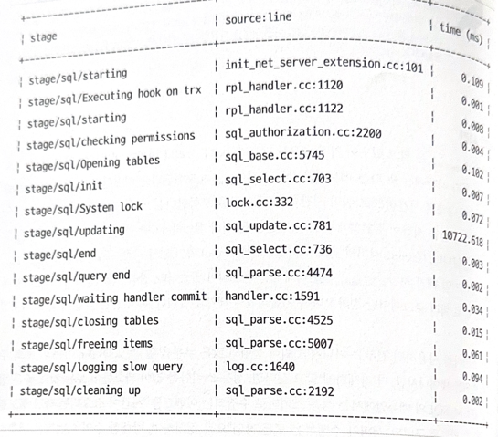

# 1장 : 쿼리 응답 시간

* 쿼리 응답 시간이란? 
  * Mysql 이 쿼리를 실행하는데 소요되는 시간
  * 쿼리 응답 시간은 여러 단계로 구성됨
* 대부분의 주요 문제는 장애 처리와 분석으로 드러남

## 1-1. 거짓 성능에 관한 실화

* 인덱스가 없는 단일 쿼리에 인덱싱을 하자 성능이 획기적으로 개선된 일화
* 고객은 추가 비용을 지출할 필요가 없어짐

## 1.2 핵심 지표

### 의미있는 것

시간이 의미있다. 쿼리 응답 시간은 누구나 진정으로 관심을 가지는 메트릭.

### 실행 가능한 것

쿼리 메트릭으로 Mysql이 수행하는 작업을 확인한 다음 느린 쿼리를 분석하고 응답시간을 단축해야 한다

## 1.3 쿼리 보고

* 쿼리 매트릭
  * 응답시간, 잠근시간, 조회된 행
  * 중요한 통찰력 제공
  * 그러나 의미있게 수집,집계,보고 해야하는 원시 값
* 쿼리 분석
  * 실제 수행할 작업
  * 쿼리 메트릭과 기타 정보 분석
  * 쿼리 보고서와 메타데이터 등 관련 정보로 분석

### 소스

* 쿼리 메트릭은 슬로 쿼리 로그, 성능 스키마에서 비솟됨
* 성능 스키마는 모든 버전과 배포 버전에 포함되어 있어 가장 좋은 소스
* Mysql
  * 슬로쿼리 로그는 log_slow_extra 를 활성화 하면 9가지 메트릭 중 6개 제공
    * Rows Effected, Select scan, Select_full_jin 은 누락
  * Mysql 5.7을 포함한 8 이전버전은 4가지 메트릭만 제공
  * 따라서 성능 스키마를 사용하는 것이 좋음
* MariaDB
  * Rows_affected 매트릭을 제공하지 않음
  * log_slow_verbosity 가 다르게 구성됨
* 슬로 쿼리 로그는 기본으로 비활성, 재시작 없이 활성화 가능
* 성능 스키마는 재시작이 필요함

### 집계

* 쿼리 메트릭은 쿼리별로 그룹회되고 집계된다
  * 사용자 이름, 호스트 이름, 데이터베이스 등
* 그룹화 하는 것이 응답 시간이 가장 느린 쿼리를 확인하는 최선
* 쿼리를 어떻게 하면 고유하게 식별하여 그룹화 할까?
  * 정규화된 SQL 문을 SHA-256 해시로 변환한다
  * 쿼리라는 용어는 다이제스트 텍스트와 동의어로 변경된다
* 대부분의 쿼리 메트릭 도구는 보안으로 인해 샘플은 폐기하고, 다이제스트 텍스트와 해시만 보고한다
* 사용자 입력에 따라 WHERE 절에 and 가 동적인 query criteria 는?
  * 논리적으론 같은 쿼리로 볼 수 있지만, 서로 다른 다이제스트로 보고되는 쿼리이다.

### 보고

쿼리 프로파일과 쿼리 보고서라는 2가지 수준의 계층 구조로 제공

### 쿼리 프로파일

* 쿼리 다이제스트와 함께 메트릭의 제한된 하위 세트를 제공하므로 프로파일이라 부름
* 정렬 메트릭이 쿼리 시간이 아니더라도 첫번째로 정렬된 쿼리가 가장 느린 쿼리
  * 평균적으로 전송된 행 수가 정렬 메트릭일 수 있다
  * 일반적으로 쿼리 시간이 기본 정렬 메트릭
* 일반적인 집계 종류
  * 쿼리 총시간
    * 실행시간의 총합, 가장 일반적
    * 1초 10번, 0.1초 천번, 후자를 느린 쿼리로 봄
  * 실행 시간 비율
    * 실행 총 시간을 비율로 나눠서 느린 쿼리를 봄
  * 쿼리 부하
    * 쿼리 총 시간을 클럭 타임으로 나눔
    * 부하는 시간과 관련 있지만, 동시성을 미묘하게 나타냄
    * 쿼리 부하가 1.0보다 크면 동시성을 나타냄 (쿼리부하 3.5=동시 인스턴스3.5)

### 쿼리 보고서

* 하나의 쿼리에 대해 알아야할 모든 것을 보여줌
  * 느린 쿼리, 모든 쿼리 메트릭과 메타데이터
* 쿼리 메트릭과 최소, 최대, 평균, 백분위수 등 기본 통계값
* 쿼리 샘플, EXPLAIN 계획, 테이블 구조 드으이 메타데이터

## 1-4 쿼리 분석

* 쿼리 분석의 목표는 느린응답 시간 해결 X 쿼리 실행을 이해하려는것
  * 느린응답시간 해결은 쿼리 분석 후 쿼리 최적화

### 쿼리 메트릭

* 소스에서 살펴본 것 처럼 쿼리 메트릭은 소스와 Mysql 배포 및 버전에 따라 다름
* 성능 스키마는 9가지 필수 쿼리 메트릭 제공

### 쿼리 시간

* 쿼리 시간에는 잠금 시간이 포함됨
* 잠금 시간은 의미 있지만 아쉽게도 슬로 쿼리 로그에서만 정확하다
  * 슬로쿼리엔 읽기 시간, 로우 락 대기 시간, 대기열 대기시간이 포함
* 성능 스키마로 수집된 이벤트는 다음과 같은 계층 구조로 구성됨
  * 트랜잭션
    * 명령문
      * 단계
        * 대기

* Update 문은 15단계로 실행됨, 실제 Update 문은 8단계 (stage/sql/updating) 에서 실행됨 

### 잠금 시간

* 쿼리를 실행하는 동안 잠금을 획득하여 사용한 시간
* 쿼리 시간의 40~50% 정도 차지
  * 너무 느려보이지만 그렇지 않음
  * 쿼리 시간 160us, 잠금 시간 80us, 데이터베이스는 2만 QPS 이상의 쿼리 실행
  * 쿼리 시간의 50% 이상이면 문제라 볼 수 있다
* 참고 : MySAM은 로우레벨 락이 되지 않는다
* 기술적 문제
  * 성능 스키마의 잠금 시간에는 로우 대기가 포함되지 않는다
  * 테이블과 메타데이터 락 대기만 포함한다
  * 슬로쿼리 로그에는 모든 락 대기가 포함된다
* 잠금은 주로 쓰기 (INSERT, UPDATE, DELETE) 에서 발생
  * 행에 대한 동시성이 0이면 잠금시간이 거의 없음
* 읽기는 비잠금 읽기와 잠금 읽기가 있다 (잠금 읽기는 2가지)
  * SELECT FOR UPDATE
  * SELECT LOCK IN SHARE MODE
  * 단, select 를 사용한 쓰기는 공유 row lock 을 획득한다
    * INSERT INTO ... SELECT
    * UPDATE ... WHERE ... IN (SELECT ...)
* 공유 잠금은 다른 공유 잠금과 호환된다
  * 배타적 잠금과 호환되지 않는다
  * 공유 잠금은 동일한 행에 대한 쓰기를 차단한다
* 비잠금 읽기는 메타데이터 락 (ALTER TABLE) 과 테이블 락은 획득한다
  * 따라서 잠금시간이 0이 아니다
* 쿼리와 트랜잭션 격리수준에 따라 트랜잭션이 커밋되기 전에 잠금이 해제될 수 있다

### 조회된 행

* 쿼리 조건절에 일치하는 행을 찾으려고 접근한 행의 수
* 쿼리와 인덱스의 선택도를 나타낸다
* 선택도가 높을수록 낭비 시간이 줄어든다
* 인덱스가 없으면 모두 조회한다

### 보낸 행

* 클라이언트에 반환된 행의 수를 나타낸다
* 보낸행 = 조회된 행
  * 보낸행과 조회된 행이 같고 보낸 행이 의심스러울 정도로 높으면 쿼리가 테이블 스캔을 유발한다는걸 암시
* 보낸행 < 조회된 행
  * 쿼리나 인덱스의 선택도가 좋지 않다는 신호
* 보낸행 > 조회된 행
  * 드문 경우, 쿼리를 최적화 할 수 있을때와 같은 특별한 조건에서 발생
  * 예를들어 카운트(id) 쿼리는 1개 행을 보내지만 0개 행을 조회함
* 보낸행 자체는 거의 문제되지 않는다

### 영향받은 행

* 삽입, 갱신, 삭제된 행의 수
* 해당하는 행에만 영향을 미치도록 주의해야함

### 셀렉트 스캔

* 첫번째로 접근한 테이블에서 수행한 전체 테이블 스캔 횟수
* 쿼리가 인덱스를 사용하지 않는다는 것을 의미, 성능이 좋지 않음
* 셀렉트 스캔이 0이 아니라면 쿼리 최적화 권장

### 셀렉트 풀 조인

* 조인된 테이블을 대상으로 전체 테이블을 스캔한 수
* 셀렉트 스캔과 유사하지만 더 나쁨, 항상 0이어야 함
* 테이블 조인 순서는 Mysql이 결정한다
  * 예제 1-4 에서 테이블 t3를 읽은 다음 t1을 조인하고 t2를 조인함
  * explain으로 확인 해야함
* 셀렉트 스캔은 조인 순서의 첫번째 테이블
  * 테이블 t3에 적용
* t1은 range scan 이기 떄문에 풀테이블 스캔이 아님
* 풀테이블 스캔은 t2이기 떄문에 t2가 셀렉트 풀 조인

### 디스크에 생성된 임시 테이블

* 디스크에 생성된 임시 테이블의 수
* 쿼리가 메모리에 임시 테이블을 만드는 것은 정상
* 메모리에 임시 테이블이 너무 커지면 디스크에 만듬, 훨씬 느려서 응답 시간에 영향
* 쿼리 최적화가 필요하거나 tmp_table_size 변수가 작거나

### 쿼리 카운트

* 쿼리 실행 횟수
* 쿼리 실행 횟수가 낮고 느리면 이상한 조합으로 조사 필요

## 메타데이터와 애플리케이션

* 메타데이터
  * 쿼리 분석에 쿼리 메트릭보다 많이 사용함
  * EXPLAIN 계획과 각 테이블의 구조, 이 2가지 메타 데이터는 쿼리 분석에 필수
* 애플리케이션
  * 쿼리가 어떤 용도로 사용되는지 알 때 비로소 이야기가 완성됨
  * 애플리케이션이 쿼리를 실행하는 이유가 쿼리 분석의 핵심

## 상댓값

* 각 쿼리 메트릭에서 객관적으로 긍정적인 유일한 값은 0
* 0이 아닌값은 항상 상대적
  * 보낸행이 천개 = 괜찮아 보임
    * 한행만 반환해야함 = 끔찍함

## 평균, 백분위수, 최대

* 쿼리 메트릭은 최소, 최대, 평균, 백분위수와 같은 단일 통계치로 출력됨
* 쿼리 응답 시간 관련하여 당황할 수 있음
  * 평균은 지나치게 낙관적임
  * 백분위수는 어디까지나 추정임
  * 최대는 최상의 표현임

### 평균

* 평균에 속으면 안됨
* 쿼리수가 적을때는 매우 크거나 작은 몇개의 값이 왜곡함
* 평균값 == 중앙값
  * 평균은 값의 하위 50%를 나타냄
  * 평균은 이들보다 더 빠른 응답시간
  * 이 경우 평균은 지나치게 낙관적
* 최악의 절반을 무시하면 대부분의 값이 낙관적

### 백분위수

* 평균이 갖는 문제를 보완함
* P95는 샘플의 95%가 이보다 작거나 같은 값
  * P95가 100ms 예시
    * 100ms 이하의 95%가 이보다 작거나 같음
    * 값의 95%를 나타낸다, 객관적인 면에서 평균보다 대표성을 띈다
* 백분위수는 추정이기도 하다
  * 추정에 그치지 말고 검증하는게 좋다

### 최대

* 백분위가 갖는 문제를 보완, 어떤값도 버리지 마라
* 해당 샘플로 재현, 재현을 못하거나 하는 일을 경험하게 됨

