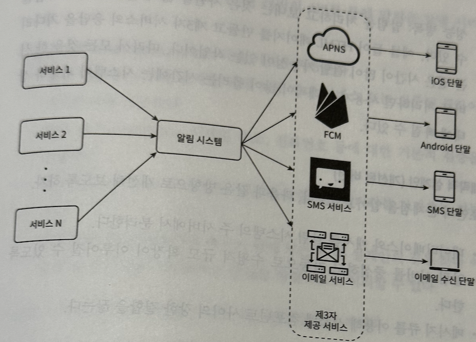

# 10장 - 알림 시스템 설계

## 1단계 : 문제 이해 및 설계 범위 확정
* 지원해야 하는 알림
  * 푸시, SMS, 이메일
* 실시간 시스템 여부
  * 약간의 지연은 허용함
* 단말 지원
  * iOS, 안드로이드, 랩톱/데스크톱
* 알림을 보내는곳
  * 클라이언트 애플리케이션, 서버 스케줄링
* 수신거부 설정 가능
* 하루에 보내야 하는 건수
  * 천만건의 푸시, 백만건의 SMS, 5백만건의 이메일

## 2단계 : 개략적 설계안 제시 및 동의 구하기

### 알림 유형별 지원 방안
* ios 푸시 알림
  * APNS 가 필요하고 (단말 토큰, 페이로드) 데이터가 필요하다.
* 안드로이드 푸시알림
  * APNS 대신 FCM 을 사용하는 점만 다르다.
    * (APNS 와 FCM 앞단의 사내 서비스 이용했음)
* SMS
  * 상용 서비스를 이용한다.
    * (알림톡과 함께 SMS 제공하는 외부 서비스를 이용했음)
    * 인포뱅크, LG CNS, CJ올리브네트웍스
* 이메일
  * 상용 서비스를 이용한다.

### 연락처 수집 절차
* user 테이블과, device 테이블 (1:N)
* 한 사용자가 여러 단말을 가질 수 있고, 모든 단말에 전송

### 개략적 설계
초기설계를 다음과 같이 함
<!-- {"width":556} -->
초기 설계는 아래의 문제가 있음
* SPOF 문제 : 서버가 하나, 호출하는 전체 서비스로 장애가 이어진다.
* 규모 확장성 : 서버가 하나, 데이터베이스나 캐시 등 중요 컴포넌트의 규모를 개별적으로 늘릴 수 없다.
* 성능 병목 : 서버가 하나, HTML 이메일을 만들고, 제 3자 서비스 응답을 기다리고.. 과부화 상태

따라서 다음과 같이 개선함
* DB와 캐시를 서버에서 분리한다.
* 알림 서버를 증설하고, 수평적 규모 확장이 이루어지도록 한다.
* 메시키 큐를 이용해 컴포넌트 사이의 강결합을 끊는다.
  

## 3단계 상세 설계
### 안정성
#### 데이터 손실 방지
* 어떤 상황에서도 알림이 소실되면 안됨.
* 알림 데이터를 DB에 보관하고 재시도 매커니즘을 구현 해야함
  * inbox, outbox 패턴
    <!-- {"width":469} -->

#### ex) 카카오 뱅크의 사례
<!-- {"width":651} -->
[카카오뱅크 - 알림서비스로 시작하는 서버 개발 Youtube](https://youtu.be/CmTO68I2HSc)

#### 알림 중복 전송 방지
* 같은 알림이 여러번 반복되는 것을 완전히 막는 것은 불가하다.
* 중복 탐지 매커니즘을 도입해야 한다.
* 이벤트 ID 를 검사하여 이전에 본 적이 있는 이벤트면 skip!
  * ex) 이벤트 ID 를 Redis 에 저장, key 가 존재하는지 확인
  * ex) db 에 unique key 지정

#### 추가로 필요한 컴포넌트 및 고려사항
* 알림 템플릿 : {name} 님 안녕하세요
* 수신 설정 : user_id, receivable
* 전송률 제한 : 너무 많이 보내면 사용자가 알림을 꺼버림
* 재시도 방법 : 재시도 전용 큐 구성
* 큐 모니터링 : 큐가 잘 소비되고 있는지.. 그라파나 연동
* 이벤트 추적 : 메세지 전송 상태
  * <!-- {"width":434} -->

#### 수정된 설계안
인증, 전송률제한, 재시도, 템플릿, 모니터링, 추적 시스템 반영

#대규모시스템설계기초