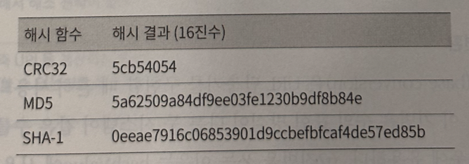

# 8장 - URL 단축기 설계

## 1단계 : 문제 이해 및 설계 범위 확정
* 동작 예제에 대한 질문
  * URL 이 주어지면 -> https://tinyurl.com/y7ke-ocwj 반환 -> 원래 URL로 리디렉션
* 트래픽 규모
  * 매일 1억개의 단축 URL 생성
* 단축 URL의 길이
  * 짧으면 짧을수록 좋다
* 단축 URL에 포함될 문자
  * 숫자, 영문자 가능 -> `0-9, a-z, A-Z`
* 지우거나 갱신할 수 있는지
  * 삭제나 갱신은 할 수 없도록 가정

### 개략적 추정
* 쓰기 연산 : 매일 1억개
* 초당 쓰기 : 1억/24/3600=`1,160`
* 읽기 연산 : `읽기:쓰기`를 `10:1` 로 가정함 -> `11,600`
* 저장 레코드 수 : 10년 운영 가정 -> `1억 * 365(일) * 10(년) = 3650억`
* 저장 용량 : 축약전 URL 평균길이 100으로 가정 -> `3650억 * 100바이트 = 36.5TB`

## 2단계 : 개략적 설계안 제시 및 동의 구하기
### API 엔드포인트
* POST /api/data/shorten
  * 인자 : {longUrl: String}
  * 반환 : 단축 URL
* GET /api/v1/shortenUrl
  * 반환 : 목적지 URL
### 리디렉션
* 301 Permanently Moved
  * HTTP 요청의 처리 책임이 영구적으로 Location 헤더에 반환된 URL로 이전되었다.
  * 브라우저는 이 응답을 캐시한다.
    * 같은 요청이 오면 브라우저에 캐시된 목적지 URL로 이동
      * 프론트쪽에서 301을 잘못사용한 Case 가 있었던.. 희미한 기억 (?)
        * 유저의 브라우저에 캐시된건 어떻게 할 수 없음 -> CS로 캐시 삭제 안내만 가능
* 302 Found
  * 일시적으로 Location 헤더가 지정하는 URL 에 의해 처리되어야 한다.
    * 같은 요청이 와도 단축 URL 에 목적지 URL 확인 후 이동

301이 서버 부하를 줄이지만 트래픽을 분석하기엔 302가 유리할 것이다.

### URL 단축
긴 URL 을 해시값으로 대응 시킬 해시 함수 fx 를 찾아보자.

### 3단계 : 상세설계

### 데이터 모델
관계형 DB 에 `id, shortenURL, longURL` 을 두는 것으로 가정

### 해시 함수
* hashValue (단축 URL) 은 `[0-9, a-z, A-Z]` 로 구성
  * 즉 `10 + 26 + 26 = 62개` 
* 3650억 개를 저장 해야한다.
  * `62^n>=3650억` n의 최솟값을 찾아야 한다.
  * n=6 이면 560억개라 부족하고 n=7 이면 3.5조개의 URL을 만들 수 있어 충족

#### 해시 후 충돌 해소 방법
CRC32, MD5, SHA-1 과 같이 잘 알려진 해시 함수로 이용하는게 쉽다.
<!-- {"width":667} -->
그렇지만 CRC32 도 7자보다 길다.
다음과 같이 DB를 이용해 충돌 후 해결할 수 있다.
<!-- {"width":972} -->
충돌을 해소 할 수 있지만 DB 쿼리 오버헤드가 크다.
DB 대신 블룸필터 검토해보는 방법
* [BloomFilter는 언제 쓰나요? : NHN Cloud Meetup](https://meetup.nhncloud.com/posts/192) 
  * Hbase, Redis 에서 활용 가능한 자료구조

#### base-62 변환
* 62진법을 쓰는 이유는? = hashValue 의 길이가 62개
* 10진법 16진법과 같은 원리
  * `[0-9, a-z, A-Z]`  으로 구성이 가능하다!
    * 0=0 ... 9=9
    * 10=a ... 35=z
    * 36=A .. 61=Z
* 예시)
  * http://naver.com 의 단축 URL 만들기
  * DB에 11157 번째 (ex: auto increment) 생성하는 단축 URL
    * 대규모 확장을 위해서는?
      * auto increment 보다 -> 이전장의 ID 생성 설계 참고
  * 11157 을 62진수로 변환하기
  * <!-- {"width":580} -->
  * DB에 저장
    * id : 11157
    * shortURL : 2TX
    * longURL : http://naver.com
  * http://naver.com  -> https://tinyurl.com/2TX 가 된다!
* 요약)
  <!-- {"width":651} -->
#### 비교
* 해시 후 충돌 해소
  * 단축 URL 길이가 고정됨
  * 유일성 보장 ID 생성기 필요 없음
  * 충돌 해소 전략 필요
  * 다음에 쓸 수 있는 URL을 알아내는것 불가능
* base-62 변환
  * 가변적임, ID 값이 커지면 같이 길어짐
  * 유일성 보장 ID 생성기 필요함
    * ex) DB가 auto increment 거나.. 해야함
  * 아이디가 유일해서 충돌 불가
  * 다음에 쓸 단축 URL 이 유출됨
    * DB가 auto increment 라면?
      * 100 번째 url과 101 번째 url 을 62진법으로 알아 낼 수 있다.

<!-- {"width":637} -->

#대규모시스템설계기초