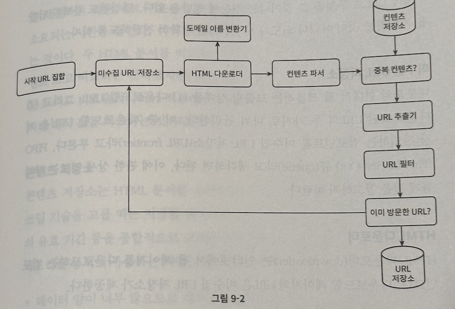

# 9장 - 웹 크롤러 설계

* 검색 엔진 인덱싱
* 웹 아카이빙
* 웹 마이닝 (주주총회 자료)
  * 커머스쪽은 가격 비교 및 대응으로 
* 웹 모니터링 (저작권 침해)
## 1단계 : 문제 이해 및 설계 범위 확정
* URL 집합이 주어지면, 해당 URL이 가리키는 모든 웹페이지를 다운로드한다.
* 다운받은 웹 페이지에서 URL들을 추출한다.
* 추출된 URL들을 다운로드할 URL목록에 추가하고 위의 과정을 처음부터 반복한다.

웹크롤러는 규모 확장성에 따라 설계 범위가 크게 달라진다.

질문으로 좁히자.
* 크롤로의 용도 : 검색엔진 인덱싱
* 얼마나 수집이 필요한지 : 매달 10억개
* 새로 만들어진 웹 페이지나 수정도 수집해야 하는지
* 수집된 웹페이지는 저장 필요한지 : 5년
* 중복된 콘텐츠 : 무시

주의가 필요한 부분
* 규모 확장성 : 수십억개의 웹페이지가 존재함, 병행성을 활용 해야함
* 안정성 : 악성코드, 잘못 작성된 HTML, 너무 느린 웹, 장애에 대응
* 예절 : 짧은 시간동안 너무 많은 요청을 보내서는 안됨
* 확장성 : 새로운 콘텐츠를 지원하기 쉬워야함 (ex: 이미지)

### 개략적 규모 추정
* 매달 10억개 웹 다운로드
  * QPS = 10억/30(일)/24(시간)/3600(초)= 초당 400 페이지
  * 최대 QPS = QPS * 2 = 800
* 웹 페이지의 크기 평균 500k
  * 1개월치 = 10억 페이지 * 500k = 500TB/월
  * 5년치 = 500\*12\*5=30PB

## 2단계 : 개략적 설계안 제시 및 동의 구하기
<!-- {"width":637} -->
* 시작 URL 집합 : 웹 크롤링 시작점 (ex: 네이버 메인에 연결된 모든 웹)
* 미수집 URL 저장소 : FIFO 큐 (다운로드 예정 URL 대기열)
* HTML 다운로더 : 웹페이지 다운로드 실행
* 도메인 이름 변환기 : URL -> IP 변환
* 콘텐츠 파서 : 웹 페이지 파싱 -> 밸리데이션 (이상한 웹페이지 무시)
* 중복 콘텐츠 확인 : 웹페이지 해시값 비교
* 콘텐츠 저장소 : HTML 문서 보관 (인기있는 콘텐츠는 메모리에)
* URL 추출기 : HTML 페이지를 파싱하여 링크 골라내기
* URL 필터 : 접근제외 URL 배제 역할
* 이미 방문한 URL : 서버 부하, 무한루프 방지
* URL 저장소 : 이미 방문한 URL 저장

## 3단계 : 상세 설계
#### BFS 사용 채택
* 웹은 그래프 자료구조에 적합함
* 페이지 -> node
* 하이퍼링크 -> edge
  <!-- {"width":500} -->

#### 미수집 URL 저장소
##### 예의
* 원칙 : 동일 웹사이트는 한번에 한페이지만 요청해야한다.
* 같은 웹사이트는 시간차를 두고 실행시킨다.
* 구현 방법
  * 큐 라우터 구성 (w/웹-큐 매핑 테이블)
    * 같은 웹사이트는 같은 큐로 보내도록 저장
      <!-- {"width":453} -->
##### 우선순위
* 큐 선택기 상위 레이어에 순위결정장치를 둠
* URL입력으로 신뢰도 높은사이트 (ex: apple.com) 면 우선순위 결정
* 큐선택기가 우선순위에 따라 선택
  <!-- {"width":420} -->

#### HTML 다운로더
##### Robots.txt
robots.txt 다운로드 받기 -> 규칙 파싱후 배제 필요
##### 분산 크롤링
여러 서버로 분산하여 다운로드 실행
##### 도메인 변환 캐싱
* DNS 요청 처리가 크롤링의 병목, 10ms~200ms
* DNS 처리중이면 다른 스레드의 DNS 요청은 모두 블록됨
* DNS 조회 결과를 캐싱해 놓고 크론으로 주기적 갱신이 도움됨

#### 안정성
* 안정해시 : 다운로더 서버를 쉽게 추가하고 삭제
* 크롤링 상태 및 수집 데이터 저장 : 장애가 발생해도 복구 가능하도록
  * 크롤링 상태와 수집 데이터를 기록, 재시작 가능하게
  * inbox, outbox 패턴
* 예외처리 : 예외가 발생해도 전체가 중단되지 않도록
* 데이터 검증 : 시스템 오류 방지

#### 확장성
콘텐츠 타입에 따라 확장 가능하도록
```kotlin
interface Downloader {
	fun download(): Contents
}

class HTMLDownloader : Downloader {}
class ImageDownloader : Downloader {}
```

#### 문제 있는 콘텐츠 감지 및 회피
* 중복 컨텐츠는 해시나 체크섬으로 비교
* 무한히 깊은 디렉토리 구조가 있는 링크면 무한루프에 빠짐
  * URL의 최대 길이를 제한하면 된다

## 여러분의 사례 궁금..
* 들은 사례로는 타 회사 가격 크롤링으로 사용
* 위와 같이 HTML 다운로드/파서로하면
  * 자바스크립트로 동적으로 동작되는 페이지는 크롤링이 안되서..
  * 가상 브라우저 (아마 셀레니움) 으로 띄웠던 기억
* IP가 주기적으로 차단되는 이슈
  * AWS에서 돌아가지만 IP는 제공해주는 업체를 통해 소싱


#대규모시스템설계기초