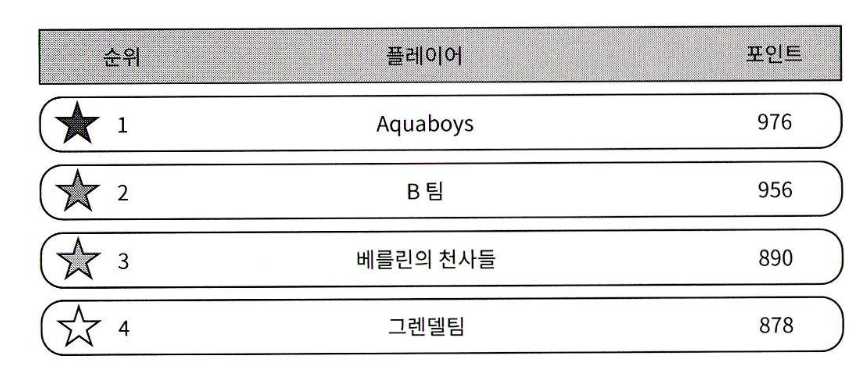

# 10장 : 실시간 게임 순위표
<!-- {"width":445} -->

## 1단계 : 문제 이해 및 설계 범위 확정
* 점수 계산 방식
  * 경기에서 승리하면 포인트 획득
  * 포인트로 점수 계산
  * 이길때마다 1점
* 모든 플레이어가 순위표에  포함
* 한 순위표의 생명 주기
  * 매달 새로운 토너먼트를 시작 할 때 마다 새 순위표
* 상위 10명의 사용자 표기
* 토너먼트 참가 사용자 수
  * DAU 500만명
  * MAU 2,500만명
* 평균 경기 수
  * 하루 평균 10경기
* 동점자의 순위는 동일함
* 순위표는 실시간 이어야함
### 기능 요구사항
* 순위표에 상위 10명 표시
* 특정 사용자의 순위 표시 
* 어떤 사용자보다 4순위 위와 아래에 있는 사용자 표시
### 비기능 요구사항
* 점수 실시간으로 순위표에 반영
* 확장성, 가용성 안정성
### 개략적 규모 추정
* DAU가 500만명인 경우 초당 평균 50명
* 피크타임에 몰리는걸 감안하여 5배, 250명으로 계산
* 사용자 점수 획득 QPS
  * 한 사용자가 하루 평균 10개의 게임을 플레이
  * QPS = 50명*10=500, 5배=2500
* 상위 10명 순위표 조회 QPS
  * 사용자가 게임을 열때만 표시로 가정, QPS 50
## 2단계: 개략적 설계안 제시 및 동의 구하기
* POST /v1/scores
  * 게임 승리시 호출, 내부 API
  * user_id
  * points
* GET /v1/scores
  * 상위 10명의 플레이어 가져오기
  * data  : [ ..., {user_id, user_name, rank, score}]
* GET /v1/scores/{:user_id}
  * 특정 사용자의 순위 가져오기
### 개략적 설계안
<!-- {"width":421} -->
### 클라이언트가 순위표 서비스와 직접 통신 하면?
* 사용자가 점수를 마음대로 변경하는 중간자 공격 이슈
### 게임 서비스와 순위표 서버 사이에 메시지 큐가 필요한가?
* 해당 데이터가 다른곳에 이용된다면?
  * 카프카가 합리적일 수 있음
    * 순위표, 분석, 푸시 알림 등의 소비자
    * 면접관이 요청한 사항이 아니기에 필요 없다
### 데이터 모델
### 관계형 데이터베이스
* 규모 확장성이 그다지 중요하지 않으면 RDS 사용
<!-- {"width":285} -->
데이터가 없는 사용자의 경우
```
INSERT INTO leaderboard (user_id, score) VALUEs ('mary1934', 1) ;
```
데이터가 존재하는 사용자의 경우
```
Update leaderboard set score = score + 1 where user_id='mary1934';
```
특정 사용자 순위 검색
```
SELECT 
	(@rownum := Grownum + 1) AS rank,
	 user_id, score 
FROM
	leaderboard
 Order By score DESC
```

* 레코드가 수백만개 정도가 되면 성능이 나빠짐
* 사용자의 순위를 파악하려면 모든 플레이어 순위표를 정렬해야함
* SQL 은 대량의 정보를 신속하게 처리하기 어려움
  * 실시간성에 부적합
* 캐시 도입 불가, 지속적인 변경이 있음
* 위 집계 쿼리에는 색인과 limit 절을 사용하는 것이 최선
  * 그렇지만 기본적으로 전체 테이블을 훌텅야 함
### 레디스
#### 정렬 집합
<!-- {"width":495} -->
* 정렬 집합에 저장된 원소는 점수에 연결되어 있음
* 집합 내 원수는 고유해야 하지만 같은 점수는 있을 수 있음
  * 점수는 오름차순 정렬에 사용
* 내부적인 자료 구조
  * 해시테이블과 스킵리스트 라는 두가지 자료구조 활용
  * 해시테이블
    * 점수 저장용
  * 스킵리스트
    * 특정 점수의 사용자 목록 저장용
    * 빠른 검색을 가능하게 함
    * 단방향 연결 리스트에 근간을 둠
    * 정렬된 연결 리스트에 다단계 색인을 둠
    * 새로운 색인을 추가할 때 마다 이전 차원의 노드를 하나씩 건너뜀
    * 아래는 45를 찾는 과정

* 정렬집합은 삽입이나 갱신 연산을 할때 모든 원소가 자동 배치
  * 새원소 추가, 기존 원소 검색은 O(log(n))의 빠른 연산
  * RDB 는 특정 사용자의 순위를 구하려면 중첩 질의
### 레디스 정렬 집합을 사용한 구현
* ZADD
  * 기존에 없단 사용자 집합 삽입 O(log(n))
* ZINCRYBY
  * 사용자 점수를 지정된 값만큼 증가
  * 집합에 없는 사용자는 0으로 가정 O(log(n))
* ZRANGE/ZREVRAGE
  * 점수에 따라 정렬된 사용자중, 특정 범위의 사용자 가져오기
  * O(log(n)+m)
    * m 은 가져올 항목 수
    * n은 정렬 집합의 크기
* ZRANK/ZREVRANK
  * 오름차순/내림차순 정렬시 특정 사용자의 위치를 가져오기 O(log(n))
### 정렬 집합을 사용한 구현 동작 원리
* 사용자가 점수를 획득한 경우
  * ZINCRY BY leaderboard_feb_2021 1 'userid'
* 사용자가 순위표 상위 10명을 조회하는 경우
  * ZREVRANGE leaderboard_feb_2021 0 9 WITHSCORE
* 사용자가 자기 순위를 조회하는 경우
  * ZREVRANK leaderboard_feb_2021 'userid'
* 특정 범위 이내의 사용자를 질의하는 경우
  * ZREVRANGE leaderboard_feb_2021 357 365
### 저장소 요구사항
* ID가 24자 문자열, 점수가 16비트로 가정
  * 순위표 항목당 26바이트
* 26바이트 * MAU 2500만 = 6억 5천만바이트
  * 약 650 MB 공간 레디스 필요
  * 레디스 서버 한대로 충분히 가능
* CPU 및 I/O 사용량
  * QPS 2500/초 감당 가능 판단
* 영속성
  * 레디스 노드에는 장애가 발생할 수 있음
  * 레디스는 디스크에 영속적으로 보관하는 옵션 있음
    * 그러나 재시작시 읽어야 해서 오래걸림
    * 읽기 사본을 두고, 주서버에 장애가 생길때 승격시킴
  * Mysql 인 경우 2개의 테이블 필요
    * 사용자 테이블
    * 점수 테이블
    * 인프라 장애시 레디스 순위표 복구에 활용
## 3단계: 상세 설계
### 클라우드 서비스 사용 여부
* 자체 서비스 이용
  * <!-- {"width":401} -->
  * 매월 정렬 집합 생성, 순위표 저장
    * 사용자 및 점수 정보 저장
  * MySQL
    * 사용자 세부 정보 저장
  * 캐시
    * 사용자 10명의 사용자 세부 정보 캐시
* AWS 이용
  * API 게이트웨이 호출 -> 람다 함수 호출
  * <!-- {"width":401} -->
  * 람다함수에서 레디스 호출 클라이언트 제공중
  * 람다로 DAU 성장세에 맞춰 자동으로 규모 확장
### 레디스 규모 확장
저장 용량 65GB, 25만 QPS 가정, 샤딩 필요함
#### 데이터 샤딩 방안
* 고정 파티션
  * 한달동안 획득 할 수 있는 점수 범위로 나누는 방안 (1~100점 ...)
  * 순위표 전반에 점수가 고르게 분포 되어야 함
  * 특정 사용자의 점수 입력/갱신시 해당 사용자가 어느 샤드에 있는지 알아야함
    * 사용자의 점수는 MySQL 질의 혹은, 사용자 ID-점수 캐시
  * 점수가 변경되면 다른 샤드로 옮겨야함
  * 특정 사용자의 순위를 알려면 모든 샤드의 모든 사용자 수를 알아야함
    * 샤드의 사용자수 info keyspace O(1)
* 해시 파티션
  * 레디스 클러스터를 사용하는 것
  * 사용자들의 점수가 과도하게 모여있을때 효과적
  * 각각의 키가 특정한 해시 슬롯에 속하도록 샤딩
    * 총 16384 개의 해시 슬롯
    * CRC16(key) %16384 연산 수행
  * <!-- {"width":430} -->
  * 점수를 갱신하려면 CRC16(key) %16384 연산으로 해당 사용자의 샤드를 찾아 점수를 변경 하기만 하면 됨
  * 상위 10명의 플레이어 검색은 까다로움
    * 모든 샤드에서 상위 10명을 받아 애플리케이션에서 재정렬 필요함
  * 문제점
    * 상위 k 개의 결과를 반환해야 하는데 k가 아주 큰 값인 경우
      * 각 샤드에서 많은 데이터를 읽고 재정렬 하는 지연 시간 소요
    * 가장 느린 파티션에서 다 읽은 뒤 질의 결과 계산 가능
    * 특정 사용자의 순위를 결정할 간단한 방법이 없다
    * 따라서 고정 파티션 방안 채택
#### 레디스 노드 크기 조정
* 쓰기 작업이 많은 애플리케이션엔 많은 메모리가 필요하다
  * 장애대비, 스냅숏 생성에 필요한 모든 쓰기 연산을 감당할 수 있어야 한다
* 성능 벤치마킹 도구
  * redis-benchmark
  * 주어진 하드웨어로 초당 얼마나 많은 요청 처리 측정 가능
## 대안: NoSQL
* 쓰기 연산에 최적화 되어 있다
* 같은 파티션 내 항목을 점수에 따라 효율적으로 정렬 가능하다
* 좋은 후보
  * 카산드라
  * MongoDB
  * DynamoDB (채택)
* DynamoDB
  * 기본키와 전역 보조 색인으로 효과적 질의
  * 테이블을 아래와 같이 비정규화 하여 설계한 경우
  * <!-- {"width":445} -->
    * 레코드가 많아지면 상위 점수를 찾기 위해 전체 테이블을 뒤져야함
  * 아래와 같이 게임의연월을 파티션키, 점수를 정렬키로 사용하면 전체를 읽는 일은 피할 수 있다
  * <!-- {"width":518} -->
  * 단 위와 같이 설계하면 최근1달의 데이터가 핫 파티션이 되어버림
  * 아래와 같이 데이터를 n개 파티션으로 분할하고, 파티션 번호를 파티션 키로 추가하기
    * 
    * 파티션 번호는 (user_id % 파티션갯수)
    * 읽기/쓰기 작업을 복잡하게 만들어서 트레이드 오프
      * 특정한 달의 데이터를 읽으려면 모든 파티션을 질의한 결과를 합쳐야함
      * 사용자의 순위를 구하기도 어려워짐
        * 상위 10~20%에 속한다는 정책적 결정으로 해결 가능
        * 크론 잡으로 미리 10-20% 가 어느 정도 점수인지 캐싱해두기
          * 10번째백분위수 = 점수<100
          * 2 0번째백분위수 = 점수 < 500
### 더 빠른 조회 및 동점자 순위 판정 방안
* 사용자 ID와 사용자 객체 사이의 대응 관계를 저장하기
  * DB 질의 하지 않고 빠르게 조회
* 동점자인 경우 먼저 점수를 받은 사람으로 순위 매기기
  * 사용자 ID와 마지막으로 승리한 경기의 타임 timestamp 대응 관계 저장하기
### 시스템 장애 복구
* 레디스 장애 대비용으로 저장해둔 Mysql 데이터
* 사용자별로 모든 레포트 조회, 레코드당 한번식 ZINCRY 를 호출, replay

끝 