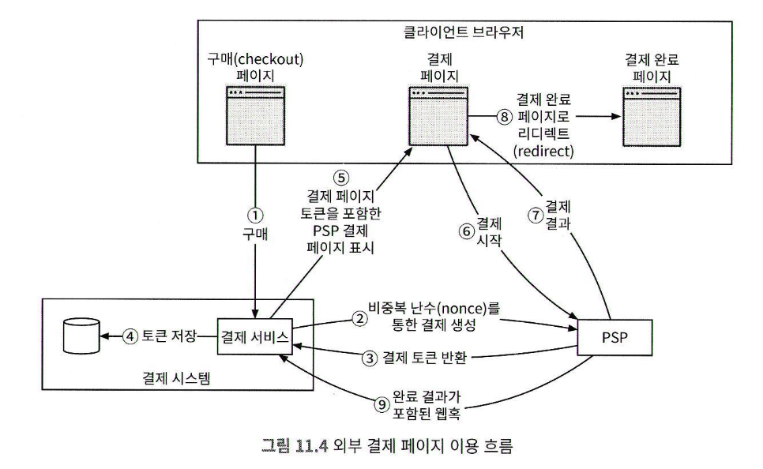

# 11장 결제 시스템

## 1단계 : 문제 이해 및 설계 범위 확정
* 어떤 결제 시스템?
  * 아마존 주문 결제 시스템
* 결제방법?
  * 우선 신용카드만 지원
* 직접 결제처리?
  * 스트라이프와 같은 전문 결제 서비스 업체 사용
* 신용 카드 데이터 저장?
  * 카드 번호는 저장하지 않는다.
* 전세계 대상?
  * 현재는 하나의 통화만 지원
* 하루에 몇건의 결제?
  * 백만건
* 판매자 대금 지급 절차 필요
* 주의사항
  * 내부 서비스, 외부 서비스와 연동함
  * 한 서비스에 장애가 발생하면 서비스간 상태가 달라지는 일이 벌어질 수 있음
    * 불일치 교정 작업 필요함
* 기능 요구사항
  * 대금 수신 : 고객 대금 결제
  * 대금 정산 : 판매자 정산
* 비기능 요구사항
  * 신뢰성 및 내결함성 : 결제 실패는 신중시
  * 시스템 간 불일치 비동기적 확인
* 개략적 규모
  * 하루 백만건 = TPS10
  * 일반적인 데이터베이스로 처리 가능
## 2단계: 개략적 설계안 제시 및 동의 구하기
### 대금 수신 흐름
* 결제 서비스
  * 결제 이벤트 수락, 결제 프로세스 조율
  * AML/CFT
    * 규정준수, 자금 세탁, 테러 자금 조달 점검
    * 보통 제 3자 제공업체를 이용함
* 결제 실행자
  * 결제 서비스 공급자를 통해 결제 주문 실행
  * 하나의 결제 이벤트에는 여러 결제 주문이 포함될 수 있다
* 결제 서비스 공급자 (PSP)
  * A 계정에서 B 계정으로 돈을 옮기는 역할 담당
  * 구매자의 신용카드 계좌에서 돈을 인출하는 역할
* 카드 유형
  * 비자, 마스터카드, 디스커버리
* 원장
  * 결제 트랜잭션에 대한 금융 기록
* 지갑
  * 판매자의 계정 잔액 기록
> 불일치 : PG timeout 으로 우리는 결제안됬는데 늦게 처리된경우
### 결제 서비스 API
* POST /v1/payments 결제 이벤트 실행
  * buyer_info : 구매자 정보
  * checkout_id : 고유 ID
  * credit_card_info : 신용카드 정보 또는 결제 토큰
  * payment_orders : 결제 주문 목록
    * seller_account
    * amount
      * double 이 아닌 string 으로 받음
      * 클라이언트/서버 마다 숫자 정밀도가 다를 수 있어 의도치 않은 오류 예방
    * currency
    * payment_order_id
      * 멱등키로 사용함, 고유한 ID
* GET /v1/payments/{:id}
  * 단일 결제 주문의 실행 상태 반환
### 결제 서비스 데이터 모델
* 결제 이벤트, 결제 주문 두개 테이블 필요
* 성능보다 안정성 우선 (다른 대형 금융 회사에서 사용되었는지?)
* 모니터링 및 데이터 탐사에 필요한 도구가 풍부한가?
* DBA 채용 시장이 성숙했는가?
* 일반적으로 ACID 트랜잭션을 지원하는 전통적 RDB 선호
* 결제 이벤트 테이블
  * checkout_id
    * 외래키
    * 한번의 결제 행위는 하나의 결제 이벤트
    * 하나의 결제 이벤트에는 여러 개의 결제 주문
  * buyer_info
  * seller_info
  * credit_card_info
    * 결제시에는 구매자의 카드정보만 필요
  * is_payment_done
    * 모든 결제 주문이 성공되면 TRUE 로 변경
    * (종결되지 않은 결제 주문 모니터링을 위해 스케줄링이 필요할 수 있다)
* 결제 주문 테이블
  * payment_order_id
  * buyer_account
  * amount
  * currency
  * checkout_id
  * payment_order_status
    * enum (NOT_STARTED, EXECTUING, SUCCESS, FAILED)
  * wallet_updated 
    * SUCCESS 상태가 될때 판매자 잔액을 업데이트
    * wallet_updated 필드 값을 true 로 변경
  * ledger_updated
    * 원장 서비스를 호출한뒤 ledger_updated true 로 변경
### 복식부기 원장 시스템
* 모든 거래 항목의 합계는 0이어야 함
  * 구매자 차감, 판매자 증가
* 누군가 1센트를 잃으면 누군가는 1센트를 가져가야 함
### 외부 결제 페이지
* 신용카드를 내부에 저장하면 복잡한 규정을 준수해야함
* PSP 제공 외부 페이지를 사용한다
### 대금 정산 흐름
* 타사 정산 서비스를 사용하여 판매자 은행 계좌로 돈을 이체함
* 티팔티 같은 외상매입금 지급 서비스 제공 업체 이용
## 3단계: 상세 설계
### PSP 연동
<!-- {"width":551} -->
* 결제버튼 클릭 
* 결제서비스가 결제 등록 요청을 PSP로 전송 (결제 금액, 요청 만료일, 리디렉션 URL)
  * 결제 주문이 정확히 한번만 등록될 수 있도록 UUID 필드를 둠
* PSP는 결제 서비스에 토큰을 반환함
  * 결제 요청을 유일하게 식별하는 PSP가 발급한 UUID
* 결제 서비스는 토큰을 DB에 저장함
* 클라이언트는 외부 결제 페이지 UI 출력 (토큰+리디렉션 URL)
* 사용자는 카드정보 입력후 결제
* 리디렉션 URL 페이지로 보내짐 (w/토큰)
* 토큰으로 결제 상태를 추출하여 결제 상태 업데이트
### 조정
매일밤 PSP/은행은 고객에게 정산 파일을 보내고 맞추는 작업

* 어떤 유형의 문제인지 알고 있으며 자동화 할 수 있는 경우
  * 불일치 분류와 조정 작업 자동화
* 자동화 할 수 없는 경우
  * 작업 대기열에 넣고 재무팀에서 수동 수정
* 분류할 수 없는 문제인 경우
  * 작업 대기열에 넣고 재무팀에서 조사
### 결제 지연 처리
* PSP 가 결제 요청의 위험성이 높다고 보고, 담당자 검토를 요구하는 경우
* 3D 보안인증 같은 추가 보호 장치를 요구하는 경우
* PSP의 처리
  * PSP는 결제가 대기 상태임을 클라이언트에 반환
  * 상태가 바뀌면 웹훅을 통해 PSP가 결제 서비스에 알림
  * PSP에 따라 웹훅 대신 polling 으로 구현됨
### 내부 서비스 간 커뮤니케이션
* 동기식 통신
  * 성능 저하
  * PSP 장애격리 불가, 클라이언트 응답 불가
  * 높은 결합도
  * 낮은 확장성
* 비동기 통신
  * 단일 수신자
    * 처리된 메시지는 바로 제거
  * 다중 수신자
    * 여러 수신자 또는 서버가 처리 (카프카)
    * 소비자가 수신한 메시지는 카프카에서 바로 사라지지 않음
    * 동일한 메시지를 여러 서비스가 받아 처리할 수 있음
### 결제 실패 처리
* 결제 상태 추적
  * 실패가 일어날 때 마다 결제 상태 파악
  * 재시도 또는 환불이 필요한지 결정
  * 결제 상태는 데이터 추가만 가능한 테이블에 보관
* 재시도 큐 및 실패 메시지 큐
  * retry queue : 일시적 오류는 재시도 큐
  * dead letter queue : 반복적으로 실패한 메시지는 실패 메시지 큐 (디버깅/격리)
### 정확히 한 번 전달
* 재시도
  * 클라이언트가 10달러 결제를 시도하지만 네트워크 상태 이슈
  * 결제 요청이 계속 실패하는 경우, 4번째 만에 성공
  * 전략
    * 즉시 재시도
    * 고정 간격
    * 증분 간격
    * 지수 백오프
    * 취소
  * 일반적인 지침 : 지수적 백오프, Retury-After 헤더 사용
  * 지나친 재시도 전략은 서비스 과부하 유발
* 멱등성
  * 결제를 두번 클릭하거나 네트워크 오류로 재시도 할 경우
  * 클라이언트가 생성하고 일정 시간이 만료되는 고유한 값(UUID) 멱등키로 사용
  * RDB 고유키 제약 조건 활용
  * PSP에서 발급한 토큰으로 유일 식별
* 일관성
  * 분산 시스템에서 서비스간 통신 실패로 불일치 발생 가능
  * 데이터를 다중화 하는 경우 복제 지연으로 사본데이터 불일치 문제
    * 주 DB 에서만 읽기와 쓰기 연산 처리 (확장성이 떨어짐)
    * 모든 사본이 항상 동기화되도록 함 (팩서스, 래프트같은 합의 알고리즘, 쿠커라치 같은 합의 기반 분산 DB)
### 결제 보안
* 요청 응답 도청 : HTTPS 사용
* 데이터 변조 : 암호화 및 무결성 강화 모니터링
* 중간자 공격 : 인증서 고정과 함꼐 SSL 사용
* 데이터 손실 : 여러 지역에 걸쳐 복제
* 디도스 : 처리율 제한 및 방화벽
* 카드 도난 : 토큰화, 실제 카드번호 대신 토큰
* PCI 규정 준수 : 보안 표준
* 사기 : 주소 확인, 카드 확인번호, 사용자 행동 분석 

끝