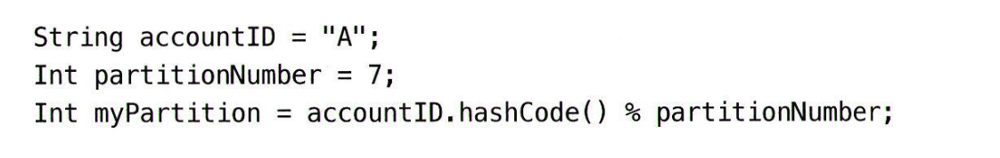

# 12장 전자지갑

## 1단계: 문제 이해 및 설계범위 확정
* 설계 범위 : 지갑사이의 이체에만 집중
* TPS : 1,000,000TPS 가정
* 정확성 : DB의 트랜잭션 보증 정도의 수준
* 정확성 증명
  * 내부 기록과 은행 명세서 비교 (조정)
    * 깨졌다는 사실만 할 수 있다
  * 재현성을 갖춘 시스템을 설계하는것이 목표 (재생)
* 가용성 : 99.99%
* 환전 : 필요없음
### 개략적 추정
* DB 노드당 1,000TPS 지원 가정
* 1백만 TPS 지원을 위해 천개의 노드 필요
* 이체 명령을 실행하려면 두번의 연산 필요 (입출, 입금)
  * 사실은 2천개의 노드 필요
  * 연산에 따라 노드 개수가 천차만별
* 이번장의 목표 : 단일 노드 처리 트랜잭션 수 높이기

## 2단계 : 개략적 설계안 제시 및 동의 구하기
### API 설계
`POST /v1/walllet/balance_transfer`
* Request Body
  * from_account: String
  * to_account: String
  * amount: String
  * currency: String
  * trancsaction_id (UUID)
* Response
  * status
  * transaction_Id
### 인메모리 샤딩
* 지갑 애플리케이션은 모든 사용자 계정의 잔액을 유지함
  * <사용자, 잔액> 에는 map 자료구조 적합 (키, 값 저장소)
* 인메모리 저장소로 인기 있는 선택지는 레디스
* 레디스 한대로 백만 TPS 벅참
  * 클러스터 구성, 균등 분산 필요
  * 파티셔닝 또는 샤딩
* 고르게 분배하는 방법
  * 키의 해시값을 계산
  * 파티션의 수 n으로 나누기

* 레디스 노드의 파티션 수 및 주소는 한군데 저장
  * 주키퍼
* 이체 명령 처리 서비스 (지갑 서비스)
  * 이체 명령 수신
  * 유효성 검증
  * 두 계정의 잔액 갱신

* 3개의 레디스 노드 A,B,C
* 계정 잔액 정보는 균등하게 분산되어 있음
  * A 노드엔 1달러 차감, B 노드엔 1달러 증감 명령
* 문제 
  * A이체 후 B갱신 전에 노드가 죽을 수 있음
  * 하나의 원자적 트랜잭션이 되어야함
### 분산 트랜잭션
#### 데이터베이스 샤딩
원자적으로 수행하기 위해 각 레디스 노드를 RDB 노드로 교체

한 이체 명령이 서로 다른 두 DB 서버를 업데이트, 동시 처리 보장이 없음
#### 분산 트랜잭션: 2단계 커밋

* 조정자는 여러 데이터베이스에 읽기 및 쓰기 작업 수행
  * 데이터베이스 A와 C에는 락이 걸림 
* 애플리케이션이 트랜잭션을 커밋하려 할 때
  * 조정자는 모든 데이터베이스에 트랜잭션 준비를 요청
* 조정자는 모든 데이터베이스의 응답을 받음
  * 모든 데이터베이스가 예 라고 응답하면 각각 커밋 요청
  * 하나라도 아니요를 응답하면 중단

> ChanindTransactionManger
> XADataSource 

* 위 방안이 저수준 방안인 이유, 모든 DB가 X/Open XA 표준을 만족해야 함
* 2PC의 가장 큰 문제는, 락이 오랫동안 잠긴 상태로 남을 수 있음, 성능 이슈
* 조정자가 SPOF가 됨

#### 분산 트랜잭션: TC/C
두단계로 구성된 보상 트랜잭션
1. 조정자는 모든 데이터베이스에 트랜잭션에 필요한 자원 예약 요청
2. 조정자는 모든 DB로부터 회신을 받음
   1. 모두 예라고 응답하면, 작업 확인을 요청함 (Try-Confirm)
   2. 하나라도 아니요, 취소 요청 (Try-Cancel)
2PC의 두 단계는 한 트랜잭션, TC/C 에서는 각 단계가 별도 트랜잭션

* 첫번째 단계
  1. 조정자는 A의 잔액을 1달러 감소 트랜잭션 시작
  2. C가 속한 DB엔 아무 작업도 하지 않음
* 두 번째 단계 (두 DB가 예라고 응답)
  * 확인 단계에서 계정 C의 잔액에 $1 추가

* 두 번째 단계 (취소 케이스의 경우)
  * C 계정은 불법 계정일 수 있음, 분산 트랜잭션 취소, 자원 반환
  * 다른 트랜잭션에서 A 계정에 1달러 재추가

**2PC vs TC/C 차이점**

* TC/C는 보상 기반 분산 트랜잭션으로도 부름
  * (undo 를 로직으로 구현하는 고수준 해법)
* 장점
  * 특정 DB에 구애 받지 않음
* 단점
  * 애플리케이션 계층의 비즈니스 로직에서 세부 사항 관리
##### 단계별 상태 테이블
* TC/C 실행 도중에 지갑 서비스가 재시동 되는 경우 복구 불가
* 각 상태 정보를 트랜잭션 DB에 저장하면 된다
* 테이블 컬럼
  * 분산 트랜잭션의 ID와 내용
  * 각 DB에 대한 시도 단계의 상태
  * 두번째 단계의 타입 (Confrim, Cancel)
  * 두번째 단계의 상태
  * 순서가 어긋났음을 나타내는 플래그
<!-- {"width":490} -->
##### 불균형 상태
분산 트랜잭션 실행 도중에는 항상 데이터 불일치가 발생함. (첫번째 단계: 1달러 차감상태)
<!-- {"width":649} -->
유효한 연산 순서
<!-- {"width":306} -->
선택 2는 먼저 이체해버리는 위험, 선택3은 둘중 하나가 실패하는 위험이 있음, 선택 1만 유효함

네트워크 문제로 시도보다 취소가 먼저 도착할 수 있음
<!-- {"width":482} -->
* 취소 명령이 먼저 도착하면, 플래그 저장
* 시도명령이 도착했을때 취소 플래그 확인 -> 실패 처리

#### 분산 트랜잭션: 사가
연산이 실패하면 실패한 연산부터 역순으로 보상 트랜잭션을 통해 롤백
<!-- {"width":370} -->

연산 실행 순서 조율 방법
1. 분산 조율 (코레오그래피) : 모든 서비스가 다른 이벤트를 구독하여 직접 실행
2. 중앙 집중형 (오케스트레이션) : 하나의 조정자가 모든 서비스가 올바른 순서로 실행하도록 조율
일반적으로 중앙 집중형 선호, 탈중앙은 관리가 어려워지는 문제

##### TC/C vs 사가
사가는 보상 트랜잭션이 롤백 단계에서 실행됨
<!-- {"width":649} -->

사가는 연산 순서대로 실행, TC/C는 병렬로 실행 가능
* 지연 시간 요구사항이 없거나 송금처럼 복잡하지 않으면?
  * 아무거나 혹은 일반적인 사가
* 지연시간에 민감하다면?
  * TC/C

### 이벤트 소싱
외부감사의 질문
* 특정 시점의 계정 잔액을 알 수 있는지?
* 과거 및 현재 계정 잔액이 정확한지 어떻게 아는지?
* 코드 변경 후에도 로직이 올바른지 어떻게 검증 하는지?

#### 정의
* 명령 command
  * 외부에서 전달된, 의도가 명확한 요청
  * A -> B 계정 이체 명령
  * 이벤트 소싱은 순서가 중요, FIFO 큐에 저장
* 이벤트 event
  * 이벤트는 검증된 사실 (실행이 끝난 상태)
    * 명령 : A에서 C로 $1 송금
    * 이벤트 : A에서 C로 $1 송금 완료하였음
  * 하나의 명령으로 여러 이벤트가 만들어 질 수 있다
  * 이벤트 생성 과정에는 같은 명령에 동일한 이벤트가 만들어지는 보자잉 없다
  * 이벤트도 순서 중요, FIFO 큐에 저장
* 상태 state
  * 이벤트가 적용될때 변경되는 내용
  * 보통 키-값 저장소 사용 <계정이름, 잔액>
* 상태 기계 state machine
  * 이벤트 소싱 프로세스 구동
  * 명령의 유효성 검사, 이벤트 생성
  * 이벤트 적용, 상태 갱신
  * 무작위성 불허, 항상 같은 결과 보장
<!-- {"width":417} -->
#### 지갑 서비스 예시
명령 큐
<!-- {"width":424} -->
명령이 A -> $1 -> C 라면 상태 기계는 `A: -$1`  `C: +$1` 를 만든다
<!-- {"width":649} -->
#### 재현성
* 이벤트 소싱의 중요한 장점은 재현성
* 이벤트를 처음부터 다시 재생하면 과거 잔액 상태는 언제든 재구성 가능
* 이벤트 리스트는 불변, 상태 기계 로직은 결정론적
* 이벤트 이력을 재생하여 만들어낸 상태는 언제나 동일
#### 명령-질의 책임 분리 (CQRS)
* 이벤트 소싱은 계정 잔액을 공개하는 대신 모든 이벤트를 외부에 보낸다
* 이벤트를 수신하는 외부 주체가 직접 상태를 재구축 할 수 있다
* 이런 설계 철학을 CQRS라고 함
* 상태 기록을 담당하는 상태 기계는 하나
* 읽기 전용 상태 기계
  * 여러개 일 수 있다. 
  * 상태 뷰를 만들고 이 뷰는 질의에 이용된다.
  * 결과적 일관성 모델을 따른다.
    * ex) 특정한 기간 동안의 계정 상태 복원, 조회
<!-- {"width":518} -->

* 민감한 데이터 (상품노출) 은 구분해서 바로 master DB 질의
* productId -> API coupon/member -> **zero payload**
  * 장애 경험 : 발행시점이 DB 들어간 뒤에 보내야되는데, 동시에 보내야되거나.. ㅅ

* CQRS의 장점은 뭘까? - 명확한 책임 분리
  * 모듈 레벨의 CQRS
  * DB/서비스 레벨의 CQRS
* CQRS + 이벤트 소싱 짬뽕

## 3단계: 상세 설계
### 고성능 이벤트 소싱
#### 파일 기반의 명령 및 이벤트 목록
* 카프카 같은 원격 저장소가 아닌 로컬 디스크에 저장
* 이벤트 목록은 추가 연산만 가능한 자료 구조에 저장
* 운영체제는 순차적 읽기 및 쓰기 연산에 엄청난 최적화, HDD에서 잘 작동
* 최근 명령과 이벤트를 메모리에 캐시하는 방안도 있음
* 구체적인 구현 방법
  * mmap : 로컬 디스크에 쓰는 동시에 최근 데이터 자동 캐시
    * 디스크 파일을 메모리 배열에 대응시킴
    * 운영체제는 파일의 특정 부분을 메모리에 캐시함
    * 추가만 이뤄지면 필요한 모든 데이터는 거의 항상 메모리에 있음
    
#### 파일 기반 상태
* 상태 정보를 로컬디스크에 저장
* 로컬 RDB SQLite, 로컬 파일 기반 키-값 저장소 Rocks DB
* RokcsDB는 LSM을 사용하기에 쓰기 작업에 최적화
<!-- {"width":453} -->
#### 스냅숏
* 스냅숏은 과거 특정 시점의 상태, 변경 불가
* 스냅숏을 저장하도 나면 최초 이벤트에서 시작할 필요 없음, 스냅숏 시점부터 시작
* 지갑과 같은 서비스는 00:00 에 스냅숏을 찍어 당일의 모든 거래 확인
* 스냅숏은 거대한 이진 파일, HDFS 같은 객체저장소에 저장
* 아래는 파일 기반 이벤트 소싱 아키텍처, 모든 것이 파일일때 I/O 처리량 최대 활용

### 신뢰할 수 있는 고성능 소싱
#### 합의
높은 안정성을 제공하려면 이벤트 목록을 여러 노드에 복제
1. 데이터 손실 없음
2. 로그 파일 내 상대적 순서는 모든 노드에 동읠
위 목표에는 합의 기반 복제 방안이 적합함
* 래프트 (Raft) 알고리즘
  * 노드 절반 이상이 온라인 상태면 모두에 보관된 추가 전용 리스트는 같은 데이터를 가짐
  * 5 노드가 있을때 3개 노드만 온라인 상태면 정상 동작
  * 리더, 후보, 팔로어로 구성
* 고신뢰성 솔루션

* 세개의 이벤트 소싱 노드가 있음
  * 래프트 알고리즘으로 이벤트 목록 동기화
* 리더
  * 명령 요청을 받아 이벤트로 변환, 로컬 이벤트 목록에 추가
  * 새로운 이벤트를 모든 팔로어에 복제
* 팔로어
  * 이벤트 목록을 처리, 상태를 업데이트
  * 리더와 팔로어가 동일한 이벤트 목록을 갖도록 함
* 리더에 장애
  * 나머지 정상 노드 중에 새 리더 선출
  * 명령을 수신할 책임을 진다, 한 노드가 다운되어도 클러스터 서비스 가능
  * 리더 장애가 명령 목록이 이벤트로 변환되기 전에 발생할 수 있음
    * 시간 초과 또는 오류 응답을 보냄
    * 클라이언트는 새 리더에게 같은 명령을 다시 보내야함
* 팔로어  장애
  * 해당 팔로어 요청은 실패, 죽은 노드가 다시 시작되거나 새 노드로 대체될 떄 까지 재시도
#### 분산 이벤트 소싱
* CQRS 시스템에서는 요청/응답 흐름이 느릴 수 있다.
  * 업데이트 시점을 알 수 없어서 폴링에 의존해야 한다
* 단일 래프트 그룹의 용량은 제한되어 있다
  * 데이터를 샤딩하고 분산 트랜잭션을 구현해야 한다
##### 풀 vs 푸시
* 풀은 외부 사용자가 읽기 전용 상태 기계에서 주기적으로 실행 상태를 읽는다.	
* 실시간이 아니며, 읽는 주기를 짧게 하면 과부화 가능성
<!-- {"width":656} -->
* 역방향 프록시를 추가하면 개선할 수 있음.
* 외부 사용자는 프록시에 명령을 보냄
  * 프록시는 명령을 이벤트 소싱 노드로 전달
  * 주기적으로 실행 상태 질의
  * 읽기 전용 상태 기계를 수정하여 응답 속도를 높임
<!-- {"width":604} -->
* 읽기 전용 상태 기계가 이벤트를 수신하자마자 실행 상태를 역방향 프락시에 푸시하도록 변경
* 실시간 응답이 이루어지는 느낌을 받는 푸시 모델로 개선
<!-- {"width":687} -->
#### 분산 트랜잭션
모든 이벤트 소싱 노드 그룹이 동기적 실행 모델을 채택하면, TC/C나 사가 같은 분산 트랜잭션 솔루션을 사용할 수 있다.

<!-- {"width":656} -->

<!-- {"width":590} -->
<!-- {"width":590} -->

## 4단계 마무리
* 초당 백만건 이상의 결제 명령 설계
* 수천개 노드가 필요하다는 결론 
* 설계안 정리 
  * 레디스 저장소
    * 빠르지만 내구성이 없다
  * 트랜잭션 데이터베이스
    * 분산 트랜잭션을 위해 2PC, TC/C, 사가
    * 데이터 감사가 어렵다
  * 이벤트 소싱
    * 외부 DB와 큐를 사용 - 성능이 좋지 않다
    * 로컬 파일에 저장하도록 개선 - SPOF가 된다
    * 이벤트 소싱에 CQRS 개념 도입
      * 비동기 -> 동기식을 위해 역방향 프록시 추가
      * TC/C 내지는 사가 프로토롤을 사용하여 여러 노드에 명령 실행을 조유하는 방법