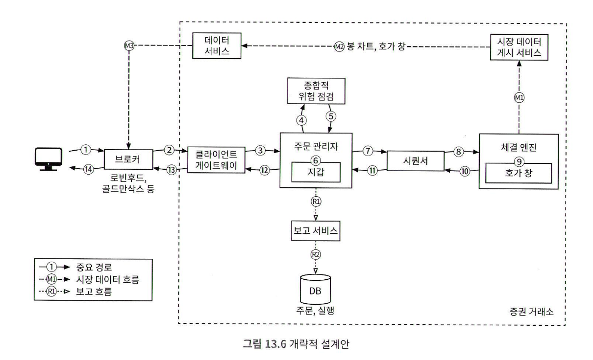

# 13장 증권 거래소
## 1단계: 문제 이해 및 설계 범위 확정
* 어떤 증권을 거래 하는지? 주식, 옵션, 선물
  * 주식으로 한정
* 주문 유형 지원 범위? 새 주문, 주문 취소, 주문 교체
  * 새 주문, 주문 취소, 지정가 주문만 가능
* 시간 외 거래가 가능한지?
  * 시간 내 거래만 처리
* 기본 기능
  * 새로운 지정가 주문 접수
  * 기존 주문 취소
  * 주문 체결 실시간 확인
  * 호가창 실시간 갱신
  * 최소 수만명 동시 거래
  * 최소 100가지 주식 거래
  * 하루에 수십억건의 주문
  * 위험성 점검 가능
    * ex) 애플 주식을 백만주 이하로 제한하는 규칙
  * 사용자 지갑 관리
    * 주문 전 충분한 자금이 있는지 확인
    * 아직 체결되지 않은 주문의 자금 사용불가 처리
### 비기능 요구사항
* 가용성: 99.99%
* 결함 내성: 결함 내성과 빠른 복구 매커니즘
* 지연시간 : 왕복 지연시간은 밀리초 수준, p99 중요
* 보안: KYC, DDoS 방지
### 개략적 규모 추정
* 100가지 주식
* 하루 10억건 주문
* 하루 총 6.5 시간의 영업시간
* QPS = 10억/6.5*3600 = 43500
* 최대 QPS = 43500 * 5  = 315,000 (장 시작/마감 시점)
## 2단계: 개략적 설계안 제시 및 동의 구하기
* 브로커
  * 개인 고객은 브로커 시스템을 통해 거래소와 거래함
    * 찰스 슈왑, 로빈후드, E트레이드, 피델리티
* 기관 고객
  * 전문 증권 거래 Sw로 대량 거래함
    * 연기금 : 안정적 수익 목표
      * 거래 빈도는 낮지만 거래량이 많다
      * 주문 분할 같은 기능이 필요함
    * 헤지 펀드 : 수수료 리베이트를 통해 수익을 얻음
      * 아주 낮은 응답시간으로 거래 필요
      * 웹페이지/앱으로 확인하고 싶지 않아함
* 지정가 주문
  * 가격이 고정된 매수/매도 주문
  * 체결이 즉시 이루어지지 않을 수 있고, 부분 체결 가능
* 시장가 주문
  * 가격을 지정하지 않는 주문
  * 시장가로 즉시 체결, 체결 보장 비용 손해
* 시장 데이터 수준
  * 가격정보 등급
  * L1
    * 최고 매수 호가, 매도 호가, 수량
  * L2
    * 더 많은 정보, 깊이
  * L3
    * 각 주문 가격에 체결을 기다리는 물량 정보
* 봉 차트
  * 특정 기간 동안의 주가
  * 시작가, 종가, 최고가, 최저가 표시
* FIX
  * 금융 정보 교환 프로토콜
### 개략적 설꼐안

* 거래 흐름 관점
  * 고객이 브로커의 웹 또는 모바일 앱으로 주문
  * 브로커가 주문을 거래소에 전송
  * 주문이 클라이언트 게이트웨이를 통해 거래소에 들어감
    * 게이트 키핑
      * 입력 유효성 검사
      * 속도 제한
      * 인증
      * 정규화
  * 위험 관리자가 설정한 규칙에 따라 위험성 점검
  * 주문 관리자는 지갑에 주문 처리 자금 검증
  * 주문이 체결 엔진으로 전송됨
    * 매수측과 매도측에 하나식 집행 기록 생성
    * 시퀀서는 주문 및 집행기록을 일정 순서로 정렬
      * 나중에 재생할때 결정론적 동일한 결과 보장
  * 주문 집행 사실을 클라이언트에 전송
* 시장 데이터 흐름 관점
  * M1
    * 체결엔진은 주문이 체결되면 집행 기록 스트림을 만듬
    * 시장 데이터 게시 서비스로 전송
  * M2
    * 시장 데이터 게시 서비스는 집행 기록/주문 스트림으로 얻은 데이터를 시장 데이터로 사용
    * 봉 차트와 호가 창 구성
    * 데이터 서비스로 보냄
  * M3
    * 시장 데이터는 실시간 분석 전용 스토리지에 저장
    * 브로커는 데이터 서비스를 통해 실시간 시장 데이터를 읽음
    * 브로커는 이 시장 데이터를 고객에게 전달
* 보고 흐름 관점
  * 보고 서비스는 주문 및 실행 기록에서 보고에 필요한 모든 필드값을 모은 다음, 종합해 만든 레코드를 DB에 기록
### 거래 흐름
#### 체결 엔진
* 주문서, 호가창을 유지 관리함
  * 주문서 또는 호가 창은 특정 주식에 대한 매수 및 매도 주문 목록
* 매수 주문과 매도 주문을 연결함
* 집행 기록 스트림을 시장 데이터로 배포함
#### 시퀀서
* 체결 엔진을 결정론적으로 만드는 핵심 구성 요소임
* 체결 엔진에 주문을 전달하기 전에 순서 ID를 붙여 보냄
* 체결 엔진이 처리를 끝낸 모든 집행기록 쌍에도 순서 ID를 붙임
  * 즉, 입력 시퀀서와 출력 시퀀서 두가지가 있음
* 시퀀서 ID는 누락된 항목을 쉽게 발견 가능한 일련번호로 생성
* 시의성 및 공정성, 빠른 복구 및 재생, exactly-once 보장
* 메시지 큐 역할도 함
  * 주문과 집행 기록을 위한 이벤트 저장소
#### 주문 관리자
주문 상태를 관리하는 역할, 클라이언트 게이트웨이를 통해 주문 수신후 다음의 과정 실행
* 종합적 위험 점검 컴포넌트에 주문을 보내 위험성 검토
* 충분한 자금 확인
* 주문을 시퀀서에 전달
주문의 **현재 상태**를 유지 관리, 다양한 상태변화를 관리해야 하여 복잡함
#### 클라이언트 게이트웨이
* 거래소의 문지기, 클라의 주문을 주문관리자에게 보냄
* 중요 경로에 놓이며 지연 시간에 민감
* 일반적인 원칙은 게이트웨이에 기능 구현 X, 각 컴포넌트에 담당
<!-- {"width":384} -->
#### 시장 데이터 흐름
* 체결 엔진에서 집행 기록을 수신
* 집행 기록 스트림에서 호가 창과 봉 차트를 만듬
  * 이를 시장 데이터라고 한다

#### 보고 흐름
* 거래 이력, 세금 보고, 규정 준수 여부 보고, 결산 등의 기능 제공
* 효율성과 짧은지연보다 정확성과 규정준수 핵심
* 두가지 출처에서 오는 정보 병합
  * 들어오는 새 주문 - 주문 세부 정보
  * 나가는 집행 기록 - 주문 ID, 가격, 수량, 집행 상태 정보

#### API 설계
* 주문
  * POST /v1/order
  * 인자
    * symbol : 주식을 나타내는 심벌
    * side : 매수, 매도
    * price : 지정가 가격
    * orderType : 지정가, 시장가
    * quantity : 주문 수량
  * 응답
    * id : 주문 ID
    * creationTime 주문 생성시간
    * filledQuantity 집행 완료 수량
    * remainingQuantity 미체결 수량
    * status : new/canceled/filled
* 집행 정보 질의
  * GET /v1/execution
  * 인자
    * symbol: 주식 심벌
    * orderId : 주문 ID
    * startTime: 질의 시작 epoch
    * endTime : 질의 종료 epoch
  * 응답
    * exectutions : 집행기록 배열
    * id
    * orderId
    * symbol
    * side
    * price
    * orderType
    * quantity
* 호가 창/주문서 질의
  * GET /v1/marketdata/orderBook/L2
  * 인자
    * symbol 
    * depth : 호가 깊이
    * startTime
    * endTime
  * 응답
    * bids : 가격과 수량 배열
    * asks : 가격과 수량 배열
* 가격 변동 이력(봉 차트) 질의
  * GET /v1/marketdata/candles
  * 인자
    * symbol
    * resolution
    * startTime
    * endTime
  * 응답
    * candles : 각 봉의 데이터를 담은 배열
    * open : 봉의 시가
    * close : 봉의 종가
    * high : 봉의 고가
    * low : 봉의 저가
#### 데이터 모델
* 상품 : 거래 대상 주식이 가진 속성
  * 자주 변경되지 않으며 주로 UI 표시를 위함
* 주문 : 매수 또는 매도 실행 명령
  * 집행 기록은 체결이 이루어진 결과, fill 로도 불림
  * 모든 주문이 집행되지 않는다
  * 체결엔진은 하나의 주문 체결에 관여한 매수/매도 행위를 나타내는 두개의 집행 기록을 결과로 출력함
<!-- {"width":397} -->
* 주문과 집행기록을 DB에 저장하지 않는다
  * 메모리에서 거래를 체결하고 하드나 공유 메모리를 활용하여 주문과 집행 기록을 저장하고 공유한다
  * 주문과 집행 기록은 빠른 복구를 위해 시퀀서에 저장한다
  * 데이터 보관은 장 마감 후에 실행한다
* 보고 서비스는 DB에 주문 및 집행기록을 저장한다
* 집행 기록은 호가 창 주문서와 봉 차트 데이터 재구성에 쓰인다
#### 호가 창
* 매수 및 매도 주문 목록, 가격 수준별로 정리됨
* 요구사항
  * 일정한 조회 시간
  * 빠른 추가/취소/실행 속도
  * 빠른 업데이트
  * 최고 매수 호가/최저 매도 호가
  * 가격 수준  순회

호가창 예시 코드

* 주문 추가/취소 시간 복잡도가 O(1)이 아니어서 요구사항 불만족
  * private List<Order> orders
* 이중 연결 리스트로 변경해야함
  * DoubleLinkedList<Order> orders
  * 이전노드를 알고 있어서 삭제시 순회X, O(1)

#### 봉 차트
하나의 봉이 커버하는 시간 범위가 경과하면 다음 주기를 커버할 새 Candelstick 클래스 객체를 CandlestickChart 객체 내부 연결 리스트에 추가 한다

봉차트에서 많은 종목의 다양한 시간 간격을 사용해 추적하려면 메모리가 많이 필요함. 최적화 필요.
* 미리 메모리를 할당해 둔 링 버퍼에 봉 보관, 새 객체 할당 횟수 줄이기
* 메모미레 두는 봉의 개수를 제한, 나머지는 디스크 보관
## 3단계: 상세 설계
### 성능
지연시간을 줄이는 방법
* 중요 경로에서 작업수 줄이기
  * 필요한 요소만 두기, 로깅도 빼기
* 각 작업의 실행 시간 경감
  * 네트워크 통신 컴포넌트가 많으면 네트워크 지연 시간은 한 자릿수 밀리초 까지 늘어남
  * 순차적 쓰기의 이점을 활용해도 디스크 액세스 지연시간은 여전히 수십 밀리초
  * 모든것을 동일한 서버에 배치하여 네트워크 구간 없애기
    * 컴포넌트간 통신은 이벤트 저장소 mmap 사용

* 애플리 케이션 루프는 while 순환문을 통해 실행할 작업을 계쏙 폴링함
  * 단일 스레드, 특정 CPU 고정
    * 따라서 컨텍스트 스위치가 없다
    * 스레드 락을 사용할 필요 없음, 잠금 경합도 없음
    * 코딩이 복잡해짐
* mmap
  * 파일을 프로세스의 메모리 매핑하는 unix 시스템 콜
  * 프로세스간 고성능 메모리 공유 매커니즘
  * 메시지 전송에 마크로초 미만이 걸림, 지연시간이 낮은 마이크로서비스 구축
#### 이벤트 소싱
<!-- {"width":423} -->
* 비 이벤트 소싱
  * 일반적 스키마
  * 현재 상태에 도달하는 방법에 대한 정보가 없음
* 이벤트 소싱
  * 모든 이벤트 추적, 순서대로 재생시 복구 가능
  * mmap 으로도 구현 가능

* 카프카 펍섭 모델과 아주 비슷함, 지연시간에 대한 요구사항만 없었으면 카프카를 사용할 수 있음
* NewOderEvent 수신
  * 유효성 검사, 내부 주문 상태 추가, 주문은 처리 담당 CPU 코어로 전송
* 주문이 체결되면 OrderFilledEvent 생성
* 보고서비스 같은 요소는 이벤트 저장소 구독, 이벤트를 받을때마다 적절히 처리
* 주문관리자
  * 체결 엔진에도 있고 보고서비스에도 있다
  * 이벤트 소싱 아키텍처에서는 재사용 가능 라이브러리다
  * 중앙화된 주문 관리자를 사용하면 지연시간이 길어짐
* 시퀀서
  * 이벤트 소싱 아키텍처를 따르게 되면 모든 메시지는 동일한 이벤트 저장소를 사용한다
  * 이벤트 항목엔 시퀀스 필드가 있다, 이 필드의 값은 이벤트 저장소에 있는 시퀀서가 넣는다
  * 각 이벤트 저장소에는 하나의 시퀀서만 있다
    * 락 경합에 낭비할 시간이 없다
    * 이벤트 저장소에 보내기 전에 시퀀서가 이벤트를 순서대로 정렬하는 유일한 쓰기 주체이다

### 고가용성
* 99.99% 가용성, 서비스가 다운되면 즉각 복구 해야함
* SPOF 를 식별 해야 한다, 다중화
* 장애 감지 및 백업 인스턴스로의 장애 조치 결정이 빨라야함
* 주문관리자나 체결 엔진처럼 stateful 컴포넌트는 사본간에 상태 데이터를 복사할 수 있어야함
* 
  * 부 체결 엔진이 동일한 이벤트를 수신하고 처리
  * 주 인스턴스가 다운되면 부 인스턴스가 지위 승계
* 문제 감지 매커니즘
  * 일반적 하드웨어 프로세스 모니터링 바안
  * 체결엔진과 박동 메시지를 주고 받는 방안
* 주/부 체결 엔진 설계안의 문제, 단일 서버 안에서만 동작
  * 여러 서버 또는 데이터 센터 전반으로 확장해야함
  * UDP를 사용하여 부서버에 이벤트 메시지 브로드캐스트
### 결함 내성
해야하는 질문들
1. 주서버 다운시 부서버 자동전환 결정을 어떻게?
2. 부서버중 새로운 리더는 어떻게?
3. 복구 시간 목표는?
4. 어떤 기능을 복구해야 하는지?
고려할 부분들
1. 잘못된 경보를 받으면 불필요한 장애 극복 절차, 부시스템 자동 전환
2. 코드의 버그로 인해 주 서버가 다운되었다면, 부 서버로 자동전환되더라도 같은 버그 떄문에 부서버까지 다운

새 시스템을 처음 출시할 때는 수동으로 장애 복구해서 경험 쌓기
* 카오스 엔지니어링

* 리더 재선출 하기
  * 리더 선출 알고리즘, 래프트
  * 작업 수행 최소 투표수  n/2+1
  * 5개의 서버가 있는 래프트 클러스터인 경우
    * 최소 투표수 5/2+1=3
  * 팔로어가 RPC 를 통해 리더로부터 새 이벤트 수신하는 과정
    
  * 일정 기간 동안 박동 메시지를 받지 못한 팔로어
    * 새 리더 선출 선거 타이머 시작
  * 가장 먼저 타임아웃된 팔로어는 후보가 됨
    * 나머지 팔로어에게 투표 요청
    * 과반수 이상이 표를 받으면 새로운 리더
  * 첫번째 팔로어의 임기 값이 새 노드보다 짧으면 리더가 될 수 없다 
  * 여러명의 팔로어가 동시에 후보가 되는 경우 분할 투표라고 한다
    * 기존 선거의 타임아웃을 선언하고, 새로운 선거를 시작한다
  * 복구시간
    * 복구시간목표, 증권은 2등급 RTO 달성 해야함
    * 자동 복구가 반드시 가능해야함
      * 성능 저하 전략 고려
    * 데이터 손실이 허용될 수 있는 범위 파악
      * 증권은 RPO가 거의 0
      * 래프트를 사용하면 사본은 많다
      * 모든 클러스터 노드가 같은 상태
### 체결 알고리즘
* 책의 의사코드는 FIFO 체결 알고리즘을 사용한다
  * 먼저 들어온 주문이 먼저 체결
* FIFO에 LMM을 결합한 알고리즘도 있다
  * FIFO보다 LMM에 먼저 일정 수량 할당
  * LMM 회사가 거래소와 협상
### 결정론
* 기능적 경정론
  * 이벤트 소싱 아키텍처, replay 보장
  * 시간은 대체로 중요하지 않고 순서가 중요
  * 단 이벤트간 타임스탬프가 짧을수록 재생과 복구가 빠르다
* 지연시간 결정론
  * 각 거래의 처리 시간이 거의 같다
  * p99의 지연 시간을 재기, p99 지연시간이 낮다는 것은 모든 거래에 안정적 성능
  * 지연 시간 변동 폭이 커지면 조사
    * 예를들어 핫스팟 JVM의 Stop-the-World 쓰레기 수집 알고리즘 문제
### 시장 데이터 게시 서비스 최적화
* L3 호가 창 데이터를 보면 시장을 더 잘 파악할 수 있다
* 시장 데이터 게시 서비스는 체결 엔진의 체결 결고라르 받아 호가 창과 봉 차트를 재구축, 게시한다
* 아래 설계안은 링 버퍼를 활용
  * 원형 버퍼라고도 하는 링 버퍼는 앞과 끝이 연결된 고정 크기 큐
  * 생산자는 계속 데이터를 넣고, 하나 이상의 소비자는 데이터를 꺼낸다

### 시장 데이터의 공정한 배포
* 규제를 바든 거래소의 경우 모든 수신자가 동시에 볼 수 있어야함
* 구독자 순서에 따라 먼저 게시되면 안됨
* 안정적 UDP를 사용하는 멀티캐스트는 한번에 많은 참가자에게 업데이트를 브로드캐스트 하기 좋음
* 무작위 순서의 구독자에게 배포하는 방법도 잇음
* 멀티캐스트
  * 유니캐스트
  * 브로드캐스트
  * 멀티캐스트
    * 거래소 설계에 보편적으로 이용되는것은 멀티캐스트
    * 같은 멀티캐스트는  수신자는 이론적으로 동시에 데이터 수신
    * UDP는 신뢰 성이 낮은 프로토콜, 모든 수신자에게 도달하지 못할 수 있음
### 코로케이션
많은 거래소가 헤지 펀드 또는 브로커의 서버를 거래소와 같은 데이터 센터에 둘 수 있도록 하는 코로케이션 서비스를 제공
### 네트워크 보안
* 공개 서비스와 데이터를 비공개 서비스에서 분리, DDos 공격이 클라이언트에 영향을 미치지 않도록함.
* 자주 업데이트 되지 않는 데이터는 캐싱
* URL 을 강화, 무차별 대입 공격
* 효과적 화이트/블랙 리스트
* 처리율 제한

## 마무리
* 실제 일부 거래소는 위 방식을 따른다
* 일부 암호화폐 프로젝트는 AMM 개념을 기반으로 호가창도 없다

