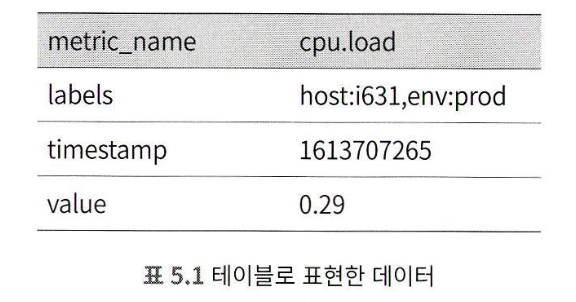

# 지표 모니터링 및 경보 시스템
## 1단계: 문제 이해 및 설계범위 확정
* Q : 시스템의 고객은 누구인지? (내부시스템 OR 데이터독같은 SaaS)
* A : 회사 내부에서 사용
* Q : 어떤 지표를 수집할지?
* A: CPU 부하, 메모리 사용률, 디스크 사용량, RPS, 사업지표는 아님
* Q : 모니터링 대상 인프라 규모
* A : DAU 1억명, 천개 서버풀, 풀마다 100개의 서버 하드웨어
* Q : 지표 데이터 유지 기간
* A : 1년
* Q : 장기 보관 저장소 -> 지표의 해상도 낮춰도 되는지
* A : 7일간 보관, 7일 뒤에는 1분단위 데이터로 만들어 30일 보관, 그뒤 1시간 단위 데이터
* Q : 경보 채널
* A : 이메일, 전화, 페이저듀티, 웹훅
* Q : 에러로그나 액세스로그 등에 대한 수집 기능 제공
* A : X
* Q : 분산 시스템 추적 기능
* A : 필요 없음
### 비기능 요구사항
* 규모 확장성 : 지표수와 경보의 양에 맞게 확장
* 낮은 응답 지연 : 대시보드와 경고를 신속 처리, 질의에 대한 낮은 응답 지연
* 안정성 : 높은 안정성, 중요 경보
* 유연성 : 유연하게 변경 가능한 파이프라인
* 고려하지 않을것
  * 로그 모니터링
  * 분산 시스템 추적
## 2단계 : 개략적 설계안 제시 및 동의 구하기
### 기본적 사항 (컴포넌트)
* 데이터 수집
* 데이터 전송
* 데이터 저장소
* 경보
* 시각화
### 데이터 모델
* 시계열 데이터 형태로 기록
* 값집합에 타임스탬프
* 레이블을 붙이기도 함
#### 사례1
특정 인스턴스의 20:00 시점의 CPU 부하를 알고 싶을 경우의 데이터
<!-- {"width":306.66315789473686} -->
#### 사례2
지난 10분간 us-west 지역의 모든 서버의 CPU 부하 평균
* 지표이름 : CPU.load
* 레이블 : us-west
위의 평균값울 구하면됨
<!-- {"width":400} -->
* 값이 마지막인 위의 데이터 형식 : 행 프로토콜 (프로메테우스에서도 사용)
* 모든 시계열 데이터는 아래로 구성됨
<!-- {"width":440} -->
### 데이터 접근 패턴
<!-- {"width":480} -->
* y축에 붙은 레이블은 하나의 시계열 데이터
* x 축에 붙은 레이블은 시간
* 쓰기
  * 쓰기 부하는 막대함, 매일 천만개 운영 지표 기록
  * 발생 빈도 높음
* 읽기
  * 일시적으로 치솟았다 사라짐
  * 시각화와 경보 서비스
### 데이터 저장소 시스템
* 저장소 시스템을 직접 설계하거나 Mysql 같은 범용 저장소 시스템 비추
* 관계형 DB는 시계열 데이터를 대상으로 통상적으로 수행하는 연산에 최적화되어 있지 않음
  * ex) 시계열 데이터의 지수이동 평균값을 갱신하는 Mysql 쿼리
  * 태그, 레이블에 대한 질의를 지원하려면 태그마다 인덱스 지정
  * 쓰기 연산 성능 감당 어려움
* NoSQL
  * 카산드라, 빅테이블은 시계열 데이터 처리 가능
  * 시계열 DB를 사용하면 됨, NoSQL 은 굳이라고 함
* OpenTSDB
  * 하둡/HBase 에 기반하고 있어서 구성과 운영이 복잡함
  * InfluxDB와 프로메테우스가 가장 대중적임
    * 다량의 시계열 데이터를 저장
    * 빠른 실시간 분석
    * 메모리 캐시와 디스크 저장소 함께 사용
    * InfluxDB, 8cpu 32gb 램 - 초당 25만회 쓰기 연산 처리 가능
### 개략적 설계안
<!-- {"width":656} -->
* 지표 출처 : 지표 데이터가 만들어지는곳 (애플리케이션, DB, MQ 등등)
* 지표 수집기 : 지표 수집, 시계열 데이터 기록
* 시계열 DB : 지표 데이터를 시계열 데이터형태로 보관, 다량의 시계열 데이터 분석, 요약 질의
* 질의 서비스 : 시계열  DB에 보관된 데이터를 질의하고 가져오는 서비스
* 경보 시스템 : 경보 알림 전송 
* 시각화 시스템 : 그래프/차트로 시각화
## 3단계: 상세 설계
### 지표 수집
데이터가 소실되어도 심각한 문제는 아님, ACK=0
#### 풀 vs 푸시 모델
##### 풀 모델
* 지표 수집기는 데이터를 가져올 서비스 목록을 알아야함
* 모든 서비스 엔드포인트의 DNS/IP 정보를 담은 파일
  * 대규모 운영환경에서 어려움
  * etcd나 주키퍼 같은 Service Discovery 기술 활용
* 각 서비스는 디스커버리(SDS)에 기록, SDS 는 변화를 지표 수집기에 통보
<!-- {"width":521} -->
* 여러 지표 수집기 서버가 같은 출처에서 데이터를 중복해서 가져올 가능성이 있음
  * 중재 매커니즘 필요, 안정 해시 링 사용
<!-- {"width":464} -->
##### 푸시 모델
* 웹서버에 에이전트 설치, 해당 장비에서 실행
* 지표 데이터를 받아 모은 다음 수집기에 전달, 간단한 카운트는 직접 집계
* 에이전트는 내부의 버퍼에 일시적으로 보관 후 나중에 재전송 할 수 있음
  * (단 서버가 죽으면 소실될 수 있음)
* 지표 수집기도 오토 스케일링 설정해 두는게 바람직
<!-- {"width":500} -->

##### 풀 모델 vs 푸시 모델
* 풀 : 프로메테우스
* 푸시 : 클라우드와치, 그래파이트
답이 없는 문제지만 많은 조직이 두 모델 지원중
<!-- {"width":513} -->
### 지표 전송 파이프라인의 규모 확장
* 개략적 설계안에서 지표 수집기는 단순 서버였음
* 엄청난 양의 데이터를 처리해야하며, 장애인경우 데이터 소실
* 아래와 같이 카프카와 같은 대규모 스트림 큐 시스템을 사용해 가용성 높이기


### 카프카를 통한 규모 확장
* 대역폭 요구사항에 따라 파티션의 수 설정
* 지표 이름에 따라 어떤 지표를 어느 파티션에 배치할지 결정
* 소비자는 지표 이름에 따라 데이터 집계
* 태그/레이블에 따라 세분화된 파티션 사용
* 중요 지표 처리, 지표 분류 및 우선순위 지정
### 카프카의 대안
* 메세지 큐 없이 원할 수 있음
* 페이스북 메모리 기반 시계열 DB 고릴라
  * 일부에 네트워크 장애가 발생해고 높은 수준의 쓰기 연산 가용성
### 데이터 집계 지점
* 수집 에이전트가 집계하는 방안
  * 클라이언트에서는 복잡한 집계는 어렵다
* 데이터 수집 파이프라인에서 집계하는 방안
  * 저장소에 기록하기 전에 집계, 플링크 같은 스트림 프로세싱 엔진
  * DB에 기록할것이 줄어든다
  * 늦게 도착하는 지표 데이터 처리가 어렵다
  * 원본 데이터 손해를 본다
* 질의시점에 집계하는 방안
  * DB에 날것으로 저장
  * 질의할때 필요한 시간 구간에 맞게 집계
  * 질의를 처리한느 순간 계산, 속도는 느리다
### 질의 서비스
질의 서버 클러스터, 시계열 DB를 통해 처리하는 역할 담당
질의 서비스를 따로 두면, 클라이언트와 시계열 DB 사이의 결합도 낮출 수 있음, 다른제품 교체 가능
#### 캐시 계층
질의 결과 저장할 캐시 서버 도입, DB 부하를 낮출 수 있음

* 널리 사용되는 시계열 DB를 위한 플러그인 있는 경우
  * 질의 서비스와 캐시를 두지 않는게 좋을때도 있음
### 시계열 데이터베이스 질의어
지수이동 평균을 SQL로 작성한다면? 복잡함
```
select id , temp
avg(temp) over ( partition by group_r order by time_read )
as rolling_avg from (
select i d , temp r
   time_read,
   interval_group,
   id - row_number () over ( partition by interval_group order by time_read ) as group_r
from (
select id ,
time_read,
"epoch":: timestamp + "900 seconds":: interval * (extract (
epoch from time_read ):: int4 / 900) as interval_group, temp
from readings ) t1
) t2
order by time_read;
```

시계열 DB 분석에 최적화된 플럭스 라는 언어로 작성하면 다음과 같이 간단해짐

```
from(db:"telegraf")
  [> range (start:-1h)
  [> filter(fn: (r) >= r._measurement = = "foo") 
  [> exponentialMovingAverage(size:-10s)
```

### 저장소 계층
* 운영데이터 저장소에 대한 징의중 85%는 지난 26시간 내에 수집된 데이터 대상
* 이 점을 활용해서 시계열 DB를 고르면 성능 측면에서 큰 이득
#### 데이터 인코딩 및 압축
<!-- {"width":542} -->
* 1610087371 과 1610087381 은 그림처럼 딱 10초만 다른값
* 타임스탬프 하나 표현 =32 비트, 10을 표현 =4비트
* 기준값과의 차이를 저장한다
#### 다운샘플링
* 7일 이내 : 샘플링 X
* 30일 이내 : 1분단위
* 1년 이내 : 1시간 단위
10초 해상도 데이터를
<!-- {"width":464} -->
30초 해상도 데이터로 집계
<!-- {"width":542} -->
#### 냉동 저장소
비활성화 상태 데이터 보관, 저장 비용이 가장 낮음
### 경보 시스템
<!-- {"width":552} -->
* 설정 파일 : 경보 규칙
* 경보 관리자 : 경보 설정 내역 캐시에서 가져옴
  * 경보관리자는 시간 주기마다 질의 서비스 호출
  * 임계값 넘어가면 경보 이벤트 생성
  * 경보 필터링, 병합, 중복제거의 일도 함
  * 접근 제어 : 특정 개인만 경보 관리 가능하도록
  * 재시도 : 알림이 최소 한번은 전달됨 보장
* 경보 저장소
  * 카산드라 같은 형태의 키-값 저장소
  * 알림이 적어도 한 번 이상 전달되도록 보장
* 경보 이벤트 카프카 전달
* 경보 소비자는 카프카에서 이벤트를 읽음
* 경보 소비자는 읽은 경보를 이벤트 처리, 이메일이나 다양한 채널에 전송

### 시각화 시스템
가능하면 상용품 사용, 그라파나

## 4단계: 마무리
* 풀모델 vs 푸시 모델
* 카프카를 활용한 규모 확장
* 최적 시계열 DB 선정 방법
* 다운 샘플링 방법
* 경보 시각화 시스템 : 구현 vs 구입