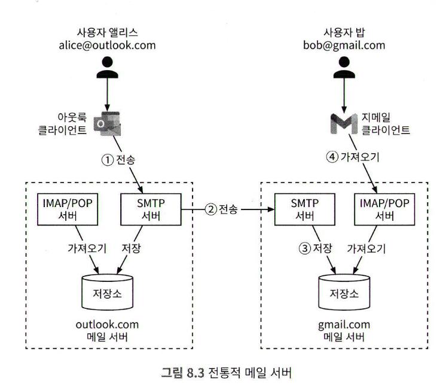

## 1단계: 문제 이해 및 설계범위 확정
* DAU 10억명
* 핵심기능
  * ~~인증~~
  * 이메일 발송/수신
  * 모든 이메일 가져오기
  * 읽음 여부에 따른 이메일 필터링
  * 제목, 발신인, 메일 내용에 따른 검색
  * 스팸 및 바이러드 방지
* 메일서버 프로토콜
  * HTTP 사용으로 가정
  * 보통의 방식
    * SMTP
    * POP
    * IAMP
### 비기능 요구사항
* 안정성 : 소실되면 안된다
* 가용성 : 여러 노드에 자동으로 복제하여 가용성을 보장해야 한다
* 확장성 : 사용자 수가 늘어도 감당할 수 있어야 한다
* 유연성과 확장성 : 새 컴포넌트를 더하여 쉽게 기능을 추가하고 성능을 개선할 수 있어야 한다
### 개략적인 규모 추정
* 송신
  * 10억명의 사용자, 하루에 10건, QPS 십만
* 수신
  * 하루 수신 40건, 하나당 50kb, 첨부파일 제외
  * 10억명 * 하루40건 * 365일 * 50kb = 730PB
  * 첨부파일
    * 첨부파일의 이메일의 비율은 20%, 평균 500kb
    * 10억명 * 40개 * 365일 * 20% * 500kb = 1460PB
* 많은 데이터 처리를 위해 분산 데이터베이스 솔루션이 필요하다.

## 2단계: 개략적 설계안 제시 및 동의 구하기
* 이메일 프로토콜
  * SMTP : 이메일을 한서버에서 다른 **서버로 보내는** 표준 프로토콜
  * 이메일을 가져오는 프로토콜은 주로 POP/IMAP
  * POP
    * 단말로 다운로드 된 이메일은 서버에서 삭제됨
    * 이메일을 일부만 읽을 수 없음, 용량이 큰 첨부파일 이메일은 시간이 오래 걸림
  * IMAP
    * 클릭하지 않으면 메시지는 다운로드 되지 않음, 메일 서버에서 지워지지 않음
    * 여러 단말에서 이메일을 읽을 수 있음
    * 가장 널리 사용되는 프로토콜
    * 인터넷이 느려도 잘 동작, 메일을 열기 전에는 헤더만 다운로드
  * HTTPS
    * 메일 전송 프로토콜은 아님, 웹 기반 이메일 시스템의 메일함 접속에 이용됨
    * MS 아웃룩은 HTTPS 기반 자체 프로토콜을 통해 모바일 단말과 통신 처리
* DNS
  * 메일 교환기 레코드 검색에 이용
  * gmail.com 의 DNS 레코드 검색, MX 레코드 표시
    * 예시
      * gmail-smtp-in.l.google.com
      * alt1.gmail-smtp-in.l.google.com
    * 우선순위 값 낮은순, 첫번째 실패하면 두번째로 연결 시도
* 첨부 파일
  * Base64 인코딩을 사용함, 보통 첨부파일 크기 제한 있음 (20~25MB)
### 전통적 메일 서버
<!-- {"width":478} -->
* 과정
  * 보내기 버튼 클릭
    * 이메일은 아웃룩 메일 서버로 전송됨
    * 아웃룩 클라이언트와 메일 서버 사이의 통신은 SMTP
  * 아웃룩 메일 서버
    * DNS 질의로 수신사 SMTP 서버 주소를 찾은뒤 해당 메일 서버로 SMTP 전송
  * 지메일 서버
    * 이메일을 저장하고 수신자인 밥이 읽어갈 수 있게 함
    * 지메일에 로그인하면 지메일 클라이언트는 IMAP/POP 서버를 통해 새 이메일 가져옴
* 저장소
  * 전통적 서버는 파일 시스템의 디렉토리에 저장함
  * 수십억개의 이메일을 검색하고 백업하기에 곤란함, 디스크 I/O 병목
  * POP, IMAP, SMTP는 검색/스레드 등의 기능을 지원하기 어려움
### 분산 메일 서버
* POST /v1/messages
  * 수신자에게 메세지 전송
* GET /v1/folders
  * 이메일 계정의 모든 폴더 반환
* GET /v1/folders/{folderId}/messages
  * 폴더 아래의 모든 메시지 반환
* GET /v1/messages/{messageId}
  * 특정 메시지에 대한 모든 정보 반환
<!-- {"width":456} -->'
* 웹 메일 : 웹브라우저
* 웹서버 : 로그인, 가입, 사용자 프로파일, 폴더 목록 확인, 폴더 내 모든 메시지 확인
* 실시간 서버 : 새로운 이메일 polling, 웹 소켓
  * 브라우저 호환성 문제로, 롱 폴링 백업으로 사용
* 메타데이터 데이터베이스 : 이메일 제목, 본문, 발신인, 수신인 목록
* 첨부 파일 저장소
  * 아마존 S3, 첨부파일 25MB
  * 카산드라 같은 NoSQL DB는 어울리지 않음
    * 1MB 이상의 파일을 지원하지 못함
    * 파일을 DB에 저장하면 레코드 캐시를 사용하기 어려움
* 분산 캐시
  * 최근에 수신된 이메일은 자주 읽을 가능성이 높음
  * 리스트 같은 다양한 기능을 제공하는 레디스 활용
* 검색 저장소
  * 분산 문서 자장소, 고속 텍스트 검색을 지원하는 역 인덱스 자료구조 사용
### 이메일 전송 절차
<!-- {"width":579} -->
* 전송 버튼을 누르면 로드밸런스로 전송됨
* 로드 밸런서는 rate limit 를 처리함
* 웹서버
  * 기본적 이메일 Validation (이메일 크기 한도 등)
  * 수신자 도메인 == 송신자 도메인 검사
    * 같다면 스팸여부와 바이러스 검사
    * 검사통과
      * 보낸편지함과 수신인의 받은 편지함에 저장
* 메시지 큐
  * 외부 도메인 전송 큐로 사용, 검증 실패시 에러 큐에 보관
* 외부 전송 SMTP 프로세스
  * 외부 전송 큐에서 꺼내어 스팸 및 바이러스 검사
  * 보낸 편지함에 저장
  * 수신자의 메일 서버로 전송 

### 이메일 수신 절차
<!-- {"width":590} -->
* 이메일이 SMTP 로드밸런서에 도착
* 트래픽을 여러 SMTP 서버로 분산
* SMTP 연결에는 이메일 수락 정책을 구성하여 적용
  * 유효하지 않은 이메일은 반송하도록 구성하면, 불필요한 이메일 처리 절감
* 첨부파일이 너무 크면 S3에 보관
* 이메일을 수신 이메일 큐에 보관
  * 갑자기 수신되는 이메일의 양이 폭증하는 경우 버퍼 역할
* 메일 처리 작업 프로세스
  * 스팸 메일을 걸러내고 바이러스를 차단 하는 등 다양한 역할
* 이메일을 메일 저장소, 캐시, 객체 저장소에 등에 보관
* 수신자가 온라인 상태인 경우 실시간 전달
* 실시간 서버는 실시간으로 수신받기 위한 웹소켓 서버
* 오프라인 상태 사용자의 이메일은 저장소 계층에 보관

## 3단계: 상세 설계
### 메타데이터 데이터베이스
* 특성
  * 헤더는 일반적으로 작음, 빈번하게 이용
  * 본문의 크기는 작은것부터 큰 것 까지 다양함, 사용 빈도 낮음
  * 이메일 가져오기, 읽은 메일로 표시, 검색 등의 작업은 사용자별 격리 수행
  * 사용자는 보통 최근 메일만 읽음, 만들어진지 16일 이하 읽기 질의율 82%
  * 높은 안전성 보장 필요, 데이터 손실 용납 불가
* DB 선정
  * RDB
    * 이메일을 효율적으로 검색
    * 헤더와 본문 인덱스만 만들어 두면 빠르게 처리 가능
    * 데이터 크기가 작을때 적합
    * BLOB 은 검색 질의 성능이 좋지 않음, 디스크 I/O
    * RDB는 바람직하지 않다
  * 분산 객체 저장소 (s3)
    * 이메일의 읽음 표시, 키워드 검색, 스레드 기능 불가
  * NoSQL
    * 카산드라가 좋을 수 있으나, 사용 레퍼런스가 없음
  * 완벽한 DB는 없다
### 데이터 모델
* User_id 를 파티션 키, 특정 사용자의 데이터는 항상 같은 샤드
  * 문제점 : 여러 사용자와 공유 불가
    * 면접 요구사항과 관련 없음
* 기본키는 파티션 키, 클러스터 키로 구성
  * 파티션키 : 데이터를 여러 노드에 분산
  * 클러스터키 : 같은 파티션에 속한 데이터를 정렬
* 데이터 질의 종류
  * 주어진 사용자의 모든 폴더를 구하기
    * <!-- {"width":221} -->
    * 파티션 키는 user_id
    * 어떤 사용자의 모든 폴더는 같은 파티션에 있다
  * 특정 폴더 내의 모든 이메일 표시
    * 사용자의 폴더는 최근 이메일 순으로 정렬되어 표시됨
    * 같은 폴더에 속한 모든 이메일이 같은 파티션에 속하게 하려면
      * <user_id, folder_id> 복합 파티션 설정 필요
      * <!-- {"width":234} -->
      * email_id 는 TIMEUUID 로 시간순 정렬위해 클러스터 키로 사용
  * 메일 상세 조회
    * SELECT* FROM emails_by_user WHERE email _id = 123;
  * 이미 읽은 메일 전부, 읽지 않은 메일 전부 가져오기
    * where user_id = '' and folder_id = '' and is_read=true|false
    * 본 설계안은 NoSQL 임
      * is_read 는 파티션키, 클러스터 키가 아니어서 질의 불가
      * 어플리케이션에서 필터링 해야함
      * 보통 테이블을 비정규화 하여 해결함
        * read_emails, unread_emails 테이블로 분할
        * 읽으면 unread_emails 에서 삭제하고 read_emails 추가
        * 관리는 까다롭지만 대규모 서비스에 적합
  * 이메일 스레드 전부 가져오기
    * 스레드는 JWZ 같은 알고리즘으로 구현함
      * 3가지 필드만 있으면 됨
      * 
* 일관성 문제
  * 정확성이 중요해서 반드시 primary 사본을 통해 서비스 된다고 가정 해야함
  * 장애 발생시 클라이언트는 다른 사본을 통해 주 사본이 복원될 때 까지 동기화/갱신 불가
  * 일관성을 위해 가용성 희생
### 이메일 전송 가능성
메일 가운데 50%가 스팸으로 구분됨, 스팸으로 보내지지 않을 가능성 높이기
* 전용 IP 사용
* 범주화 : 범주가 다른 이메일은 다른 IP 주소로 보내기
  * 마케팅 메일은 다른 메일에서 발송
* 발신인 평판
  * 새로운 이메일 서버의 IP 주소는 사용 빈도를 서서히 올리기
  * 급격하게 대량발송하면 스팸으로 분류됨, 보통 2-6주 정도 후에 정상 발송 가능
* 스팸 발송자 차단
  * 내 메일서버에서 스팸 뿌리는 사용자 내보내기
* 피드백 처리
  * 피드백을 쉽게 받아 처리할 경로 만들기 (스팸 신고, 잘못된 이메일, 자원 부족)
* 이메일 인증
### 검색
* 방안 1 : 엘라스틱서치
  * <!-- {"width":428} -->
  * 사용자는 검색 버튼을 누른 다른 결과 수신까지 대기
    * 동기
  * 이메일 전송, 수신, 삭제는 처리 결과를 클라이언트로 전달 할 필요 없음
    * 비동기
  * 색인 작업
    * 백그라운드에서 처리
  * 엘라스틱 서치를 쓰면 주 이메일 저장소와 동기화 문제
* 방안 2 : 맞춤형 검색 솔루션
  * 검색 엔진 자체 개발
  * 주요 과제 : 디스크 I/O 병목 문제
    * 메타 데이터와 첨부 파일은 페타바이트 수준
    * 하나의 메일 계정에 오십만개 넘는 메일이 흔함
    * 색인 서버의 병목은 디스크 I/O
    * 색인은 다량의 쓰기 연산, LSM 트리를 사용
    * <!-- {"width":428} -->
      * 우선 메모리 캐시로 구현되는 0번 계층 추가
      * 임계치가 넘으면 다음 계층으로 병합
* <!-- {"width":471} -->
  * 소규모에는 엘라스틱서치 적합, 대규모에는 구축 검토
### 규모 확장성 및 가용성
* 여러 데이터 센터데 다중화, 사용자는 물리적으로 가까운 서버와 통신
* 네트워크 파티션이 생기면, 다른 데이터센터에 보관된 메시지 이용
<!-- {"width":388} -->

끗