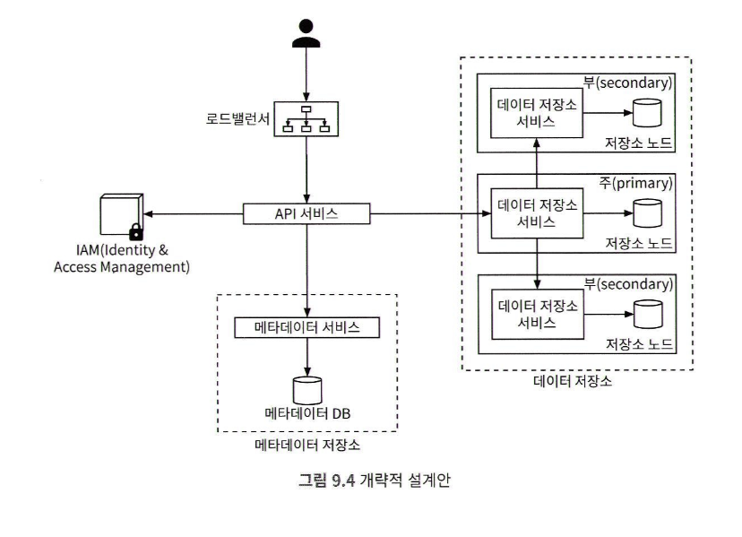
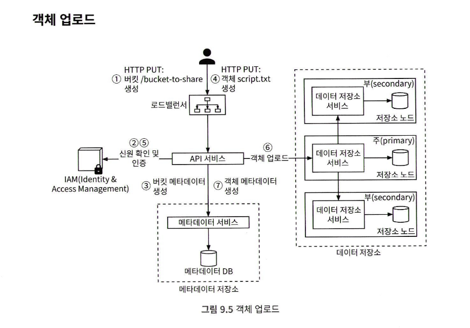
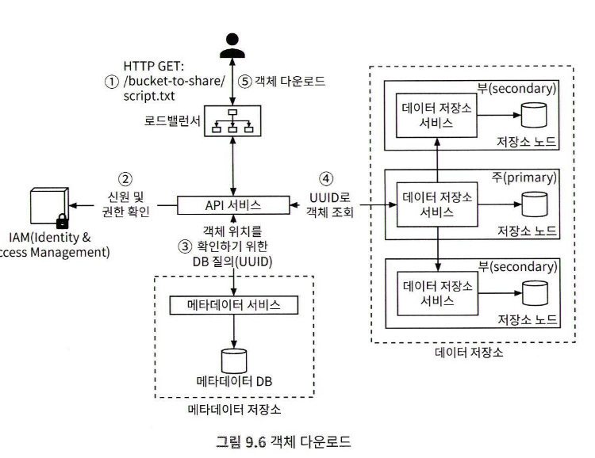
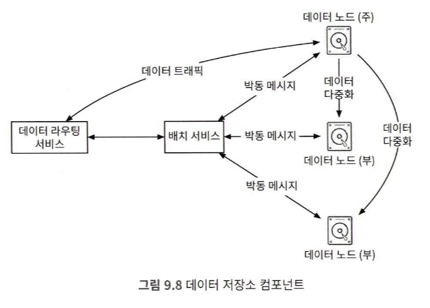
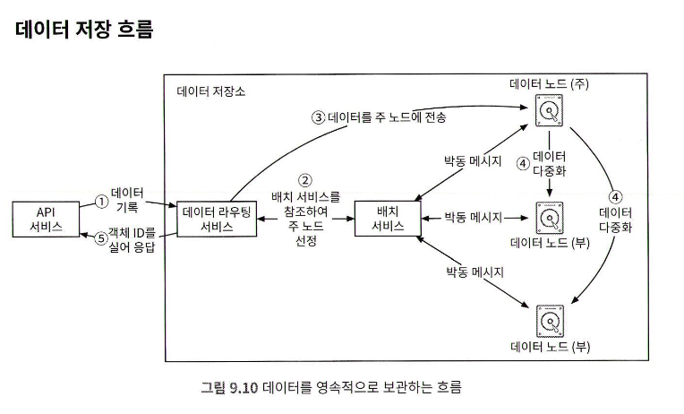

# S3와 유사한 객체 저장소
## 저장소 시스템 101
* 블록 저장소
  * HDD, SDD 처럼 서버에 물리적으로 연결되는 형태의 드라이브
  * 네트워크를 통해 연결되는 블록 저장소
  * DB나 가상 머신 엔진 같은 애플리케이션은 원시 블록을 직접 제어하여 최대한의 성능을 끌어냄
* 파일 저장소
  * 블록저장소 위에 구현됨
  * 더 높은 수준의 추상화 제공
  * SMB/CIFS, NFS 같은 파일 수준 네트워크 프로토콜을 사용하면, 하나의 저장소를 여러 서버에 붙일 수 있다
  * 파일 저장소는 블록을 직접 제어하데 신경 쓸 필요 없다
* 객체 저장소
  * 데이터의 영속성을 높이고, 대규모 애플리케이션을 지원한다
  * 비용을 낮추기 위해 의도적으로 성능을 희생한다
  * Rest API 제공
  * cold storage 에 초점을 맞춘다
  * 계층적 디렉터리 구조는 제공하지 않는다
  * 다른 유형의 저장소에 비해 느리다
### 용어 정리
* 버킷
  * 객체를 보관하는 논리적 컨테이너
  * 전역적으로 유일한 이름
  * 데이터를 S3에 업로드 하려면 버킷부터 만들어야 함
* 객체
  * 버킷에 저장하는 개별 데이터
  * 메타데이터를 가짐 (이름-값 쌍)
* 버전
  * 한 객체의 여러 버전을 같은 버킷 안에 두는 기능
* URI
  * 각 객체는 API URI를 통해 고유하게 식별 가능
* SLA
  * AWS의 경우 여러 가용성 구역에 걸쳐 99.99999% 의 객체 내구성 제공
  * 연간 99.9% 가용성 제공
  * 하나의 AZ가 소실되도 복원 가능
## 1단계: 문제 이해 및 설계 범위 확정
* 기능 요구사항
  * 버킷 생성
  * 객체 업로드 다운로드
  * 객체 버전
  * 버킷 객체 목록 출력 (aws s3 ls)
* 비기능 요구사항
  * 수 GB 객체와 다량의 소형 객체를 효율적으로 저장
  * 매년 추가되는 데이터
    * 100PB
  * 99.9999% 의 데이터 내구성과 99.99%의 서비스 가용성
  * 높은 수준의 안전성과 성능, 낮은 저장소 비용
* 대략적 규모 추정
  * 디스크 용량
    * 객체 가운데 **20%**는 그 크기가 1MB 미만의 작은 객체
    * **60%** 정도는 1~64MB 정도 크기의 중간 크기 객체
    * 나머지 **20%** 정도는 64MB 이사으이 대형 객체
  * IOPS
    * SATA 인터페이스, 7200rpm 하드 디스크 하나가 -> 초당 100~150회의 임의 데이터 탐색 지원 가정
    * 100~150 IOPS
  * 계산 과정
    * 계산을 쉽게 하기 위해 유형별 중앙값 사용
      * 소형 : 0.5MB
      * 중형 : 32MB
      * 대형 : 200MB
    * 40% 저장 공간 사용률 유지 가정
    * 100PB = 10^11 MB
    * (10^11 * 0.4) / (0.2 * 0.5MB + 0.6 * 32MB + 0.2 * 200MB)  = 6억 8천만개 객체
## 2단계: 개략적 설계안 제시 및 동의 구하기
* 객체 저장소의 특성
  * 객체 불변성
    * 변경이 불가능함
    * 삭제한다음 새 버전 객체로는 대체 가능
  * 키-값 저장소
    * 해당 객체의 URI를 사용하여 데이터를 가져올 수 있음
* 데이터 접근 패턴
  * 저장은 1회, 읽기는 여러번
  * 95% 가량이 읽기 요청
  * 소형 및 대형 객체 동시 지원
* UNIX 파일 시스템 철학과 비슷한 면
  * 파일을 로컬 시스템에 저장하면, 파일의 이름과 데이터는 iNode 라는 자료 구조로 디스크의 다른 위치에 저장
  * 아이노드에 기록된 메타 데이터를 읽어서, 포인터 목록을 확보한 다음, 데이터를 일겅야함
  * 객체 저장소도 메타데이터 저장소가 나뉜 점이 비슷함
  * 파일 블록 포인터 대신 객체 ID로 네트워크 요청
  * **파일을 삭제할때 iNode 만 삭제된다, 실제로 삭제되지 않음**
* 데이터는 불변, 메타데이터는 변경가능

> TMI 카프카 inote 개수 제한이 걸린적이 있따. 디스크를 키우면 늘어나더라 
> 광고 스크립트를 1뎁스 폴더로 서버 안에 저장, 파일이 너무 많아질수록 쭉 떨어진 기억
> 그래서 여러 계층으로 저장했따

### 개략적 설계안

* 로드밸런서 : 요청 분산
* API 서비스
  * IAM 서비스, 메타 데이터 서비스에 대한 호출을 조율하는 역할
  * 무상태 서비스, 수평적인 규모 확장
* IAM 서비스
  * 인증, 권한부여, 접근제어를 중앙에서 맡아 처리함
* 데이터 저장소
  * 실제 데이터를 보관, 데이터 관련 연산은 객체 ID를 통함
* 메타데이터 저장소
  * 객체 메타데이터를 보관
* 메타데이터와 데이터저장소는 논리적인 구분일 뿐, 독립적으로 둘 필요는 없음
### 객체 업로드

1. 클라이언트는 버킷 생성 HTTP PUT 요청
2. API 서비스는 IAM을 호출 (쓰기 권한 확인)
3. API 서비스는 메타 데이터 저장소 호출, 버킷정보 생성, 클라이언트에 응답
4. 클라이언트는 객체 생성 HTTP PUT 요청
5. API 서비스는 쓰기 권한 확인
6. API 서비스는 HTTP PUT 요청 body에 실린 객체 데이터를 데이터 저장소로 보냄
   * 데이터 저장소는 해당 데이터를 객체로 저장, UUID 반환
7. API 서비스는 메타 데이터 호출, 새로운 항목 등록
   * 객체id, 버킷id, 객체name 정보 포함

> 네트워크 비용이 비쌈, 반복하지 않게 하기 위한 노력, 메타데이터 전송만, URI 분할 
> 1MB도 큰 파일이다, 멀티파트를 사용하는게 좋다, 유럽의 경우는 느림
> 나라별로 성향이 다름, 사진 사이즈가 큰 나라는 동영상 비율이 높다, 낮은나라는 동영상이 낮다
> 한국의 경우는 사진 6 동영상 4 유럽은 8 2
> 
> 한국이 되게 크게 사용하는
> 메타데이터 저장 서버가 따로, 파일서버가 따로 있다.
> API 서버가 바이너리가 흐르면 스케일이 감당이 안된다.

> 중복 파일을 줄이는 내용이 없다.
> 줄이는게 엄청나게 비용을 아낌
> P2P 같은 경우 해시값만 체크해서 바로 업로드 된것 처럼 처리함

> 유효기간을 아주 짧게 준다

## TMI
[Pre-Signed URL 이란?](https://velog.io/@soshin_dev/Pre-Signed-URL-%EC%9D%B4%EB%9E%80) 
객체를 인코딩, 디코딩, 클래스에 유저아이디 iam 정보가 들어있따
사용자가 그냥 패스워드 정보를 보내는거라고 보면됨
**presinged 는 sdk라서 비용이 안듬**
> 합치는 동작 간단.. header 랑 eol 를 붙이고 붙이고
> range 헤더로 본다..
> http header range : 0-
> http header range : 0-10
> http header range : 11-20
> 
> 업로드는 파일을 완성하는 과정, 다운로드는 분할다운로드+합치는건 구현이 어려움, 잘 안함
> 다운로드가 유료임, 기본적으로 스트리밍, 스트리밍과 분할 다운로드는 다르군

https://stackoverflow.com/questions/55231229/does-generating-a-pre-signed-url-to-an-s3-object-using-the-aws-sdk-cost-anything
이건 aws presigned url no cost라는 stackoverflow 답변

### 객체 다운로드
* 버킷은 계층 구조를 지원하지 않지만, 폴더 구조를 흉내내는 논리적 계층을 만들 수 있음
* 객체 이름을 `bucketname/text.txt` 로 지으면 됨

1. 클라이언트는 GET 으로 요청
2. API 서비스는 IAM 을 질의하여 버킷 READ 권한 확인
3. 권한이 있으면 API 서비스는 UUID를 메타데이터 저장소에서 가져옴
4. API 서비스는 해당 UUID로 데이터 저장소에서 객체 데이터를 가져옴
5. API 서비스는 GET 요청에 대한 응답으로 해당 객체 데이터 반환함

## 3단계: 상세 설계 
### 데이터 저장소
* API 서비스는 다른 내부 서비스들을 호출함
* 객체를 저장하거나 가져오는 역할은 데이터 저장소

* 데이터 라우팅 서비스
  * 데이터 노드 클러스터에 접근하기 위한 Restful 또는 gRPC 서비스 제공
* 배치 (placement) 서비스
  * 어느 데이터 노드에 저장할지 결정
  * 주 노드와 부 노드가 있고 내부적으로 가상 클러스털르 유지함
  * 데이터 사본을 물리적으로 다른 위치에 놓이게 함
  * 데이터 노드 상호간 박동 메세지를 주고 받으며 모니터링
  * 팩서스나 래프트 같은 합의 프로토콜 사용 권장
    * 건강한 노드 수가 절반 이상이면 서비스 지속 보장
* 데이터 노드
  * 실제 객체 데이터가 보관되는곳
  * 여러 노드에 데이터를 복제함
  * 박동 메세지 서비스 데몬 동작함
    * HDD/SDD 드라이브 수, 데이터 양이 박동 메세지에 포함됨
  * 새로운 노드에서 박동 메세지 발생
    * 노드에 ID 부여, 가상 클러스터 지도에 추가됨

### 데이터 저장 흐름

* API 서비스는 객체 데이터를 데이터 저장소로 포워딩
* 데이터 라우팅 서비스
  * 해당 객체에 UUID 할당
  * 배치서비스에 객체 보관 노드 질의, 주 노드 반환
  * 저장할 데이터를 UUID와 함께 주 데이터 노드에 전송
    * **디스페처 패턴? 찾아보자**
* 주 데이터 노드
  * 자기 노드에 지역적 저장, 외부 데이터 노드에 다중,화 데이터 라우팅 서비스에 응답
* 객체의 UUID를 API 서비스에 반환

* 배치서비스는 안정 해시를 사용함
  * 다중화 그룹이 추가되고, 삭제되는 경우에도 유지
* 강력한 일관성 보장
  * 응답을 반환하기 전에 모든 부 노드에 다중화, 지연 시간 손해

### 데이터는 어떻게 저장 되는가
* 작은 파일이 많아지면 낭비 블록이 늘어난다
  * 디스크 블록의 크기는 전부 같음, 보통 4KB
  * 4KB보다 작아도 4KB 점유
* 아이노드 용량 한계를 초과하는 문제
  * 
    * **TMI) 리눅스 한계 65만개? 단일폴더 기준? 전체? 찾아보기**
    * 아무튼 inode 는 한계가 많은 시스템이다
  * 작은 파일의 수가 수백만에 달하면 아이노드가 전부 소진됨
  * WAL와 같이 객체를 저장할 때 이미 존재하는 파일에 추가하는 방식
    * 임계치에 도달할때 읽기 전용으로 바꾸고, 새로운 파일을 만들기
    * 코어별로 전담 읽기/쓰기 파일을 두어야 한다
      * 객체는 파일에 일렬로 저장됨
      * 쓰기를 병렬로 할때 여러 객체가 섞이면 안됨

### 객체 소재 확인
데이터 노드가 uuid 로 객체 위치를 찾는 방법
<!-- {"width":423} -->
* **HDD를 써야함, SDD 는 너무 비쌈**

* 저장소
  * RocksDB 같은 파일 기반 키-값 저장소 방안
    * SSTable 기반, 쓰기는 좋음, 읽기가 느림
  * 관계형 DB를 이용하는 방안
    * B트리 기반, 읽기는 좋음, 쓰기가 느림
* 읽기 패턴이 높은 저장소
  * RDB  추천
* 노드간 객체 위치 데이터가 공유될 필요가 없다
  * **SQLite를 노드별로 설치하는 방법 채택**
    * 좋은 생각!

### 데이터 저장 흐름 개선안

* API 서비스는 데이터 노드 서비스에 저장 요청
* 데이터 노드 서비스는 읽기/쓰기 파일의 마지막 부분에 추가
* 해당 객체에 대한 새로운 레코드를 테이블에 추가 
* 데이터 노드 서비스는 API 서비스에 객체 ID 반환

### 데이터 내구성
* 하드 디스크의 장애는 피할 수 없음
* 회전식 드라이브 연간 장애율 0.81% 가정
  * **실 운영시 체감은 더 높은 장애**
  * 3중 복제하면 내구성 1-0.0081^3=0.999999
  * 99.9999% 내구성 달성
* 장애 범위 
  * 랙 내의 모든 서버는 네트워크 스위치와 파워 서플라이 공유
  * AZ의 단위는 다른 데이터센터와 인프라를 공유하지 않는 독립적 IDC
  * 다중 AZ로 복제 해야함, 대규모의 정전 등 방지
> **TMI) 콜드 스토리지에서는 쓸법하다??. 느려도 되니까**

#### 소거 코드
데이터를 작은 단위로 분할, 다른서버에 배치, 일부가 소실될때 복구하기 위한 패리티라는 정보를 만들어 중복성을 확보

* 최대 4개의 노드에 장애가 발생해도, 원본데이터 복원 가능
* 단점 : 소거 코드를 사용하면 최대 8개의 노드에서 데이터를 가져와야함
  * 응답 지연이 높아짐, 내구성 향상
* 장단점
  * 응답 지연이 중요하면 다중화
  * 저장소 비용이 중요하면 소거 코드
    * 설계는 어려움
<!-- {"width":511} -->

### 정확성 검증
메모리의 데이터가 망가지는 문제 대비
<!-- {"width":389} -->
원본 데이터와 새로 계산한 체크섬이 다르면 망가진것으로 간주
<!-- {"width":342} -->
객체 데이터 끝에 체크섬 배치, 수신할때 반복해서 계산/검증
<!-- {"width":462} -->

### 메타데이터 데이터 모델
* 객체 이름으로 ID 찾기
* 객체 이름으로 객체 삽입/삭제
* 버킷 내 모든 객체 목록 확인

* 버킷 테이블의 규모 확장
  * 백만명 고객, 고객당 10개의 버킷, 한 레코드 10KB 가정
  * 10GB의 저장공간 필요, 서버 한대에 저장 가능
  * 읽기 요청에 한대 처리는 무리하다면 read replica
  * **TMI) 중요한정보를 하나에 담을때 안전할까?** 
* 객체 테이블의 규모 확장
  * 한대로 불가, 샤딩으로 규모 확장
  * 버킷 아이디로 같은 샤드에 배치
    * 버킷 안에 수십억개의 객체가 있으면 핫스팟 문제
  * 객체 ID로 샤딩
    * 질의 1과 2 패턴으로 성능이 떨어짐
  * 버킷 이름과 객체 이름으로 샤딩하기로 채택
    * 대부분의 연산이 객체 URI를 기준으로 하기 때문
### 버킷 내 객체 목록 확인
* 객체 저장소는 수평적 구조로 저장함
* 접두어로 계층적 비슷하게 흉내 가능
  * abc/d/e/f/file.txt 의 경우 접두어는 abc/d/e/f
### 단일 데이터베이스 서버
단순한 질의 실행 가능
<!-- {"width":549} -->
### 분산 데이터 베이스
* 모든 샤드별로 위 질의를 돌리고 취합해야함
* **페이징 구현이 불가능에 가까움**
* 목록 데이터를 비정규화 하는 방법이 있음
* 2와 3 사이에 삽입될수 있고..
  * 페이징 사이에 추가/삭제..
### 객체 버전
* 객체의 기존 버전을 삭제하지 않기 위해, 새로운 레코드로 object_Version 값을 추가함
* 삭제할때는 soft delete 처리만 하고 404 응답 처리

### 큰 파일의 업로드 성능 최적화
* 멀티파트 업로드 - 대용량 객체를 작게 쪼개서 독립적으로 업로드
* 클라이언트의 대용량 업로드 요청시, upload ID 를 바로 응답
* 클라이언트가 파일을 N조각으로 나누고 같은 uploadID 에 올림
  * 조각이 업로드 될 때 마다 Etag 반환, 조각 해시 체크섬
* 업로드 완료시 클라이언트의 업로드 종료 요청, Etag 목록 전달
* 데이터 저장소는 조각 번호 목록을 사용해 복원, 클수록 느림
<!-- {"width":492} -->

[Spring Boot에서 S3에 파일을 업로드하는 세 가지 방법 | 우아한형제들 기술블로그](https://techblog.woowahan.com/11392/)

### 쓰레기 수집
* 객체의 지연 삭제 : 삭제했다고 표시만 해둔 객체 
* 갈곳 없는 데이터 : 취소된 멀티파트 업로드
* 훼손된 데이터 : 체크섬 실패
* 바로 지우지 않고 주기적으로 실행해서 지움
* 주 저장소 뿐 아니라 부 저장소도 지움

끝