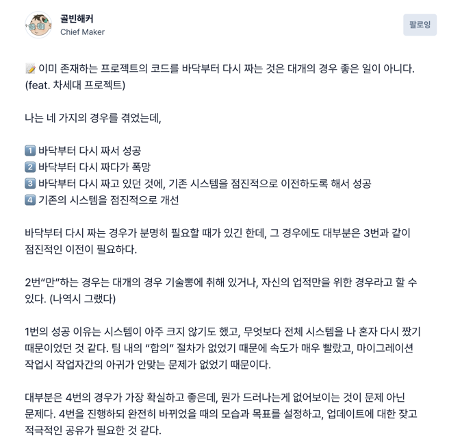

# 챕터25 : 오늘의 1달러가 내일의 1달러보다 크다

* 많고 적음의 의미는 "시점" 과 "확실성" 에 따라 달려 있음
* 오늘의 1달러보다 내일 1달러를 주는 약속의 가치가 떨어짐
  * 지금 사용할 수 없음
  * 지금 투자할 수 없음
  * 내일 실제로는 돈을 주지 않을 수 있음
* 소프트웨어의 가치 평가
  * 지불시스템으로 가정 - 140만줄의 코드로 구성된 시스템 - 구매자에겐 중요하지 않음
  * 돈이 어떻게 흘러가는지가 중요
* 연습문제
  * 더 가치있는 시스템은?
    * 향후 10년동안 1천만 달러의 비용을 들여 2천만 달러를 버 시스템
    * 1천만 달러의 비용을 들여 1천2백만 달러를 버는 시스템
  * 함정 : 향후 10년동안은 불확실하다.
    * 10년간의 긴장속 유지보수가 필요
* 이책의 권유사항
  * 코드 정리는 먼저 하기보다 나중에 하는것을 권장
  * 지금 당장 돈을 벌고, 나중에 돈을 쓰기

